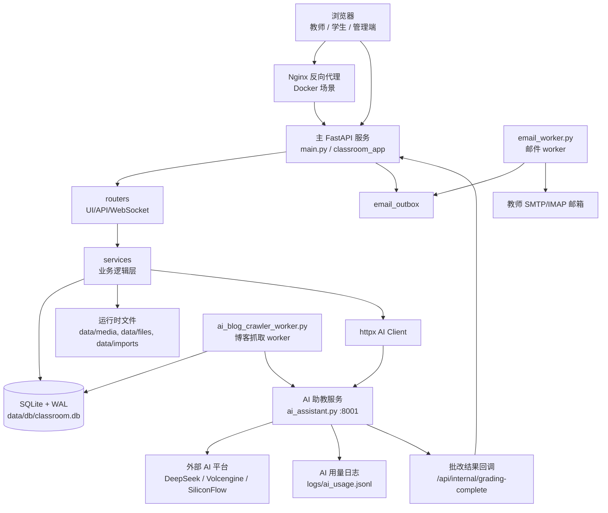
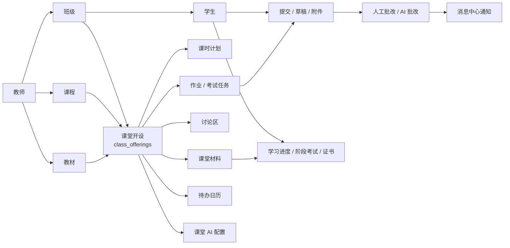

# LanShare 课堂互动与 AI 教学平台

LanShare 是一个面向真实课堂的本地优先教学协作平台。它从早期的局域网文件分发工具演进为多教师、多班级、多课程的课堂系统，覆盖课前建课、课堂资源、作业与考试、实时讨论、AI 助教、学生学习进度、消息中心、邮件通知、课程博客和反馈闭环。

当前代码以 FastAPI + Jinja2 + SQLite 为核心，前端使用原生 HTML/CSS/JavaScript，AI 能力拆成独立服务，通过 OpenAI 兼容接口、DeepSeek、硅基流动和火山方舟等平台调度模型。系统可以在教师个人电脑、机房局域网服务器、Windows 主机或 Docker Compose 环境中运行。

## 适用目标人群

- 需要在机房或局域网内给学生分发资料、收作业、组织课堂讨论的教师。
- 需要同时管理多个班级、课程、学期、教材、课时和考试的课程负责人。
- 希望把 AI 生成作业、AI 出卷、AI 批改、AI 助教问答接入课堂流程的教学团队。
- 需要本地保存课堂数据、文件和学生提交，不希望完全依赖外部 SaaS 的学校或培训机构。
- 需要在课堂中跟踪学习进度、待办、学生登录与提交情况，并通过站内消息或邮件触达学生的管理员。

## 当前核心能力

- 多教师账号体系：教师账号由超管教师创建，支持教师资料、头像、邮箱配置和超管管理。
- 班级与课程管理：班级名单导入、课程/教材/学期维护、课堂开设、课时计划和课堂首页聚合。
- 课堂工作台：任务区、课程材料、共享文件、实时讨论、AI 助手、私信、学习进度和待办日历。
- 文件与材料：大文件分块上传、SHA-256 全局去重、流式下载、材料库、材料分配、Git 仓库材料同步。
- 作业与考试：作业生命周期、截止时间、重新提交、教师代交、附件提交、考试编辑、JSON 导入、学生考试作答。
- AI 能力：作业生成、试卷生成、聊天问答、材料解析/优化、讨论区 @AI、作业/考试 AI 批改、软件信息联网补全。
- 消息中心：通知、私信、黑名单、AI 私信回复、作业/提交/批改/学习进度/反馈提醒。
- 邮件通知：教师侧邮箱配置、邮件队列和独立 mailer worker。
- 学习成长：学习材料阅读进度、阶段状态、阶段考试、证书、学生成长称号和教师洞察。
- 课堂行为与画像：前端批量行为上报、异步写入、课堂行为状态和 AI 画像调度。
- 博客与反馈：课堂博客、评论点赞收藏、AI 博客管家、应用反馈和超管通知。

## 快速入口

本地默认端口：

- 教师登录：`http://127.0.0.1:8000/teacher/login`
- 学生登录：`http://127.0.0.1:8000/student/login`
- 主服务健康检查：`http://127.0.0.1:8000/api/internal/health`
- AI 服务健康检查：`http://127.0.0.1:8001/api/internal/health`

重要文件：

- 主应用入口：[main.py](main.py)
- FastAPI 应用装配：[classroom_app/app.py](classroom_app/app.py)
- 全局配置：[classroom_app/config.py](classroom_app/config.py)
- 数据库初始化：[classroom_app/database.py](classroom_app/database.py)
- AI 助教服务：[ai_assistant.py](ai_assistant.py)
- Docker 编排：[docker-compose.yml](docker-compose.yml)
- Docker 环境变量模板：[docker.env.example](docker.env.example)

## 系统架构示意图



## 业务模型示意图



## 代码分层

```text
lanshare/
├─ main.py                         # 主服务启动器：加载 .env、建目录、初始化 DB、启动 uvicorn
├─ ai_assistant.py                 # 独立 AI 服务：模型路由、流式输出、批改任务和用量日志
├─ email_worker.py                 # 邮件队列 worker
├─ ai_blog_crawler_worker.py       # AI 博客抓取 worker
├─ classroom_app/
│  ├─ app.py                       # FastAPI 装配、生命周期、健康检查、中间件、路由注册
│  ├─ core.py                      # app/templates/ai_client 全局对象
│  ├─ config.py                    # 路径、端口、上传、SQLite、下载、安全、站点备案配置
│  ├─ database.py                  # SQLite 连接、WAL 参数、建表、兼容迁移、初始超管
│  ├─ dependencies.py              # JWT、Cookie、会话、角色鉴权
│  ├─ storage_paths.py             # data/ 新布局与旧目录兼容策略
│  ├─ routers/                     # 页面/API/WebSocket 路由
│  └─ services/                    # 业务服务、文件、材料、消息、学习进度、AI 辅助逻辑
├─ templates/                      # Jinja2 页面模板
├─ static/                         # CSS、原生 JS、字体、vendor 资源
├─ data/                           # 推荐运行时数据根目录
├─ tools/                          # 迁移、恢复、压测、mock AI 工具
├─ docker-compose.yml              # app / ai / mailer / blog-crawler / nginx
├─ Dockerfile
└─ DockerfileBase
```

## 路由与功能模块

主服务在 `classroom_app/app.py` 中注册这些路由模块：

- `ui.py`：登录、仪表盘、课堂页、作业页、考试页、管理页、提交详情页。
- `manage.py`：班级、课程、学期、教材、课堂开设、AI 配置、系统管理、超管与密码重置。
- `files.py`：共享文件、分块上传、下载、讨论附件、WebSocket 课堂讨论。
- `homework.py`：作业、提交、草稿、附件、考试卷库、JSON 导入和试卷分配。
- `ai.py`：主服务侧 AI 功能编排，包括生成作业/试卷、聊天、批改回调、任务状态。
- `materials.py`：课程材料库、材料查看、内容读取/编辑、AI 解析优化、Git 仓库操作。
- `message_center.py`：通知中心、私信、私信附件、黑名单、AI 私信任务。
- `profile.py`：个人中心、头像、密码、邮箱通知配置。
- `learning.py`：学习进度、培养阶段、课堂待办、阶段考试。
- `blog.py`：课堂博客、评论、点赞、收藏、图片、用户入口。
- `feedback.py`：应用反馈、附件、超管查看与通知。
- `emoji.py`：课堂表情面板与自定义表情。
- `behavior.py`：课堂行为批量上报。
- `session.py`：会话查看、强制下线、当前会话信息。

AI 服务在 `ai_assistant.py` 中暴露：

- `/api/internal/health`
- `/api/ai/generate-assignment`
- `/api/ai/generate-exam`
- `/api/ai/chat-stream`
- `/api/ai/chat`
- `/api/ai/software-info`
- `/api/ai/submit-grading-job`

## 核心原理

### 1. 多租户课堂模型

系统不是按“单次课堂”存数据，而是按教师拥有的班级、课程、学期、教材和课堂开设组织。`class_offerings` 是关键中间实体，它把 `teacher + class + course + semester/textbook/schedule` 连接成一次可进入的课堂。课堂页再聚合作业、考试、材料、讨论、AI 配置、学习进度和消息。

### 2. 认证与权限

教师使用邮箱和密码登录，账号由超管教师在系统管理中创建。首次部署建议通过 `INITIAL_SUPER_ADMIN_EMAIL` 和 `INITIAL_SUPER_ADMIN_PASSWORD` 创建初始超管。学生由教师导入班级名单，支持姓名/学号首次身份校验、密码设置、常规密码登录和找回密码申请。

登录后系统签发 JWT，写入 `access_token` Cookie；会话同时落库到 `user_sessions`，并绑定角色、会话 ID、IP 和过期时间。页面和 API 通过 `get_current_user`、`get_current_teacher`、`get_current_student` 等依赖做角色校验。

### 3. SQLite 与本地数据

SQLite 使用 WAL、`busy_timeout`、`synchronous=NORMAL` 和缓存参数来提高课堂并发读写能力。数据库初始化会创建或补齐几十张表，覆盖教师、学生、课程、课堂、作业、提交、考试、材料、消息、邮件、学习进度、博客、反馈和行为事件等领域。

默认推荐把可变数据放在 `data/` 下。旧目录仍保持兼容，方便从早期版本升级。

### 4. 文件存储

课程共享文件、博客图片、讨论附件、材料文件等走 SHA-256 内容寻址存储。新文件默认落到：

```text
data/media/blobs/sha256/<hash-prefix>/<hash-prefix>/<sha256>
```

课程文件表只保存元数据和 hash 引用，同一份文件可以被多个课程或功能复用。大文件上传使用分块协议，下载使用流式响应，并可通过下载策略限制低带宽服务器上的大文件下载。

### 5. 作业、考试与批改

教师创建作业或把试卷分配到课堂后，系统生成 `assignments`。学生提交答案和文件，服务端会校验提交窗口、文件类型、文件数量和附件清单。教师可以人工评分、打 0 分给未交学生、允许重新提交、代学生线下提交，也可以把提交送入 AI 批改队列。

考试卷库支持页面/题目 JSON，题型包括单选、多选、填空和问答。问答题可以声明附件要求和绘图能力。AI 批改会把答案、附件、题目要求、评分标准和隐藏学生画像上下文交给 AI 服务，AI 完成后回调主服务更新提交状态并写入消息通知。

### 6. 实时讨论

课堂讨论使用 `/ws/{class_offering_id}` WebSocket，每个课堂是独立房间。消息会写入 `chat_logs` 表，同时兼容旧的 JSONL 文本日志迁移。讨论支持附件、表情、引用、昵称切换、@成员通知和 @AI 助教回复。

### 7. AI 调度

主服务不直接调用外部模型，而是通过 `classroom_app/core.py` 中的 `httpx.AsyncClient` 调用本地 AI 服务。AI 服务根据任务类型和能力需求选择模型：

- 快速文本：常规问答、轻量生成。
- 深度文本：作业生成、试卷生成、推理型批改。
- 轻量多模态：图片或材料理解。
- 深度多模态：带图或复杂文档的批改和推理。

平台优先级由 `AI_PLATFORM_PRIORITY` 控制。每个平台还有自己的启用开关、API Key、模型名和并发上限。AI 服务会记录平台、模型、请求规模、响应规模、状态和用量到 `logs/ai_usage.jsonl`，默认不保存原始 prompt/response 正文。

### 8. 消息与邮件

站内消息统一写入 `message_center_notifications`，作业发布、学生提交、批改完成、AI 反馈、学习进度、待办、讨论 @、应用反馈等都复用这个通知中心。私信和黑名单也在同一模块下。

邮件发送采用队列模式：主应用写入 `email_outbox`，`email_worker.py` 独立消费并按教师配置的 SMTP/IMAP 发送，避免课堂请求被邮件网络延迟阻塞。

## 运行时数据布局

推荐的新布局：

```text
data/
├─ db/classroom.db                         # SQLite 主库
├─ media/blobs/sha256/                     # hash 文件池
├─ files/submissions/                      # 作业/考试提交附件
├─ files/legacy_shared/                    # 旧共享文件入口兼容目录
├─ files/textbook_attachments/             # 教材附件
├─ imports/rosters/                        # 班级名单导入源
├─ imports/attendance/                     # 考勤/导出兼容数据
├─ logs/chat_logs/                         # 聊天文本日志兼容输出
├─ runtime/runtime_state.json              # 运行时状态
└─ tmp/chunked_uploads/                    # 分块上传临时目录
```

仍兼容的旧目录：

```text
attendance/
chat_logs/
homework_submissions/
logs/
rosters/
shared_files/
storage/
```

迁移检查：

```powershell
.\venv\Scripts\python.exe tools\migrate_data_layout.py --verify
```

非破坏性迁移到新布局：

```powershell
.\venv\Scripts\python.exe tools\migrate_data_layout.py --apply --verify
```

## 本地部署：Windows / PowerShell

以下步骤适合当前仓库的直接本地运行。当前本地虚拟环境使用 CPython 3.14.3；Docker 基础镜像使用 Python 3.12。新环境建议使用 Python 3.12 或更高版本，Windows 上优先 Python 3.14。

### 1. 准备 Python 环境

```powershell
cd .\lanshare

py -3.14 -m venv venv
.\venv\Scripts\python.exe -m pip install --upgrade pip
.\venv\Scripts\python.exe -m pip install -r requirements.txt
```

如果系统没有 `py -3.14`，可以换成你实际安装的 `python`：

```powershell
python -m venv venv
.\venv\Scripts\python.exe -m pip install --upgrade pip
.\venv\Scripts\python.exe -m pip install -r requirements.txt
```

### 2. 创建 `.env`

不要把真实密钥提交到仓库。可以先生成一个 `SECRET_KEY`：

```powershell
.\venv\Scripts\python.exe -c "import secrets; print(secrets.token_urlsafe(48))"
```

在项目根目录新建 `.env`，最小配置如下：

```dotenv
# 基础服务
SECRET_KEY=替换为上一步生成的长随机字符串
MAIN_HOST=0.0.0.0
MAIN_PORT=8000
AI_HOST=127.0.0.1
AI_PORT=8001
AI_ASSISTANT_URL=http://127.0.0.1:8001
MAIN_APP_CALLBACK_URL=http://127.0.0.1:8000/api/internal/grading-complete

# 本地数据目录；本地运行建议使用相对路径或留空使用默认 data/
LANSHARE_DATA_ROOT=data
APP_TIMEZONE=Asia/Shanghai
TZ=Asia/Shanghai

# 首次部署的超管教师。密码至少 8 位。
INITIAL_SUPER_ADMIN_EMAIL=teacher@example.com
INITIAL_SUPER_ADMIN_NAME=系统超管
INITIAL_SUPER_ADMIN_PASSWORD=请换成至少8位的强密码

# 文件与并发
TOTAL_UPLOAD_MBPS=100.0
MAX_UPLOAD_SIZE_MB=2048
MAX_SUBMISSION_FILE_COUNT=500
SQLITE_BUSY_TIMEOUT_MS=30000
GLOBAL_AI_CONCURRENCY=8
AI_QUEUE_MAX_PENDING=200

# AI 平台优先级：至少启用一个平台后 AI 功能才可用
AI_PLATFORM_PRIORITY=deepseek,volcengine,siliconflow
AI_USAGE_LOG_ENABLED=true
AI_USAGE_LOG_TO_STDOUT=true
AI_USAGE_LOG_PATH=logs/ai_usage.jsonl
```

### 3. 配置 AI API Key

你可以只启用一个平台，也可以启用多个平台让系统按优先级和任务类型调度。

DeepSeek 示例：

```dotenv
DEEPSEEK_ENABLED=true
DEEPSEEK_API_KEY=sk-你的DeepSeek密钥
DEEPSEEK_MODEL_STANDARD=deepseek-v4-flash
DEEPSEEK_MODEL_THINKING=deepseek-v4-pro
DEEPSEEK_MODEL_FAST_TEXT=deepseek-v4-flash
DEEPSEEK_MODEL_DEEP_TEXT=deepseek-v4-pro
DEEPSEEK_MAX_CONCURRENT_REQUESTS=8
```

火山方舟示例：

```dotenv
VOLCENGINE_ENABLED=true
ARK_API_KEY=你的火山方舟API密钥
VOLCENGINE_OPENAI_BASE_URL=https://ark.cn-beijing.volces.com/api/v3
VOLCENGINE_MODEL_STANDARD=doubao-seed-2-0-lite-260428
VOLCENGINE_MODEL_THINKING=doubao-seed-2-0-pro-260215
VOLCENGINE_MODEL_VISION=doubao-seed-2-0-pro-260215
VOLCENGINE_MODEL_TEXT_FAST=doubao-seed-2-0-lite-260428
VOLCENGINE_MODEL_TEXT_DEEP=doubao-seed-2-0-pro-260215
VOLCENGINE_MODEL_MULTIMODAL_LIGHT=doubao-seed-2-0-lite-260428
VOLCENGINE_MODEL_MULTIMODAL_DEEP=doubao-seed-2-0-pro-260215
VOLCENGINE_MAX_CONCURRENT_REQUESTS=4
```

硅基流动示例：

```dotenv
SILICONFLOW_ENABLED=true
SILICONFLOW_API_KEY=sk-你的SiliconFlow密钥
SILICONFLOW_MODEL_STANDARD=deepseek-ai/DeepSeek-V2
SILICONFLOW_MODEL_THINKING=deepseek-ai/DeepSeek-V2.5
SILICONFLOW_MODEL_VISION=deepseek-ai/deepseek-vl2
SILICONFLOW_MAX_CONCURRENT_REQUESTS=2
```

没有 API Key 时，主应用仍可启动，班级、文件、作业、考试、讨论等非 AI 功能可用；AI 生成、AI 聊天、AI 批改、材料 AI 解析等功能会失败或提示 AI 服务不可用。

### 4. 启动服务

打开两个 PowerShell 窗口。

窗口 1：启动 AI 服务。

```powershell
cd .\lanshare
.\venv\Scripts\python.exe ai_assistant.py
```

窗口 2：启动主服务。

```powershell
cd .\lanshare
.\venv\Scripts\python.exe main.py
```

启动后访问：

- 教师端：`http://127.0.0.1:8000/teacher/login`
- 学生端：`http://127.0.0.1:8000/student/login`

如果要让同一局域网内学生访问，把教师电脑或服务器的局域网 IP 发给学生，例如：

```text
http://192.168.1.20:8000/student/login
```

确保 Windows 防火墙允许 Python 或 8000 端口入站。

### 5. 验证

```powershell
Invoke-RestMethod http://127.0.0.1:8000/api/internal/health
Invoke-RestMethod http://127.0.0.1:8001/api/internal/health
```

主服务返回 `service=main`，AI 服务返回 `service=ai` 即表示服务正常。健康检查中还会包含数据库路径、时区、服务器本地时间、行为写入队列和邮件 worker 状态。

### 6. 首次业务配置

1. 使用 `.env` 中的 `INITIAL_SUPER_ADMIN_EMAIL` 和 `INITIAL_SUPER_ADMIN_PASSWORD` 登录教师端。
2. 进入管理中心创建或维护教师账号。
3. 在班级管理中导入学生名单。名单支持 `.xlsx`、`.xls`、`.csv`，至少包含“学号”和“姓名”；可选列包括“性别”“邮箱”“手机号”等。
4. 创建课程、教材、学期和课堂开设。
5. 进入课堂页，上传共享文件或课程材料，创建作业/考试，配置课堂 AI。
6. 学生通过学生入口使用身份校验或密码登录进入自己的课堂。

## Docker Compose 部署

当前 Compose 拓扑包含 `app`、`ai`、`mailer`、`blog-crawler` 和 `nginx`。`nginx.conf` 默认是面向 `guardianangel.net.cn` 的 HTTPS 配置，并挂载 `tools/guardianangel.net.cn_nginx` 证书目录；本地纯 HTTP 测试更推荐使用上面的直接 Python 启动方式，或按自己的域名/证书调整 Nginx 配置。

### 1. 构建基础镜像

`Dockerfile` 使用 `lanshare_base` 作为基础镜像。首次部署先构建：

```powershell
docker build -f DockerfileBase -t lanshare_base .
```

### 2. 准备 Docker 环境变量

```powershell
Copy-Item docker.env.example docker.env
notepad docker.env
```

至少修改：

- `SECRET_KEY`
- `INITIAL_SUPER_ADMIN_EMAIL`
- `INITIAL_SUPER_ADMIN_NAME`
- `INITIAL_SUPER_ADMIN_PASSWORD`
- 需要启用的 AI 平台和 API Key
- `PUBLIC_SITE_BASE_URL`
- `SITE_DISPLAY_NAME`、`SITE_OWNER_NAME`、ICP备案展示信息

如果 `docker.env.example` 中没有某个 `INITIAL_SUPER_ADMIN_*` 字段，直接在 `docker.env` 末尾新增即可。

Docker 中 `docker-compose.yml` 会注入服务间地址：

- app 使用 `AI_ASSISTANT_URL=http://ai:8001`
- ai 使用 `MAIN_APP_CALLBACK_URL=http://app:8000/api/internal/grading-complete`
- 默认数据根目录为 `/app/data`

### 3. 启动

```powershell
docker compose up -d --build
docker compose ps
```

默认发布端口：

- `LANSHARE_HTTP_PORT` 默认 `80`
- `LANSHARE_HTTPS_PORT` 默认 `443`

临时改 HTTP 端口示例：

```powershell
$env:LANSHARE_HTTP_PORT = "8080"
docker compose up -d --build
```

### 4. 日志和健康检查

```powershell
docker compose logs -f app ai nginx
docker compose exec app python -c "import urllib.request; print(urllib.request.urlopen('http://127.0.0.1:8000/api/internal/health').read().decode())"
docker compose exec ai python -c "import urllib.request; print(urllib.request.urlopen('http://127.0.0.1:8001/api/internal/health').read().decode())"
```

### 5. 停止与升级

```powershell
docker compose down
docker compose build --pull
docker compose up -d --remove-orphans
```

Compose 会挂载这些持久目录：

```text
./data
./attendance
./chat_logs
./homework_submissions
./logs
./rosters
./shared_files
./storage
```

升级代码前建议备份 `data/` 和旧持久目录。升级后可运行：

```powershell
docker compose exec app python tools/migrate_data_layout.py --verify
```

## 常用配置速查

| 配置项 | 说明 |
| --- | --- |
| `MAIN_HOST` / `MAIN_PORT` | 主服务监听地址和端口，默认 `0.0.0.0:8000` |
| `AI_HOST` / `AI_PORT` | AI 服务监听地址和端口，默认 `127.0.0.1:8001` |
| `AI_ASSISTANT_URL` | 主服务访问 AI 服务的地址 |
| `MAIN_APP_CALLBACK_URL` | AI 批改完成后回调主服务的地址 |
| `LANSHARE_DATA_ROOT` | 新运行时数据根目录，默认 `data` |
| `SECRET_KEY` | JWT 签名密钥，生产环境必须替换 |
| `INITIAL_SUPER_ADMIN_*` | 首次部署超管教师账号 |
| `TOTAL_UPLOAD_MBPS` | 上传/文件策略中的总体带宽参考值 |
| `MAX_UPLOAD_SIZE_MB` | 课程共享文件最大上传大小 |
| `MAX_SUBMISSION_FILE_COUNT` | 单次提交最大文件数 |
| `SQLITE_BUSY_TIMEOUT_MS` | SQLite 锁等待时间 |
| `GLOBAL_AI_CONCURRENCY` | AI 服务全局并发 |
| `AI_PLATFORM_PRIORITY` | AI 平台优先级 |
| `AI_USAGE_LOG_PATH` | AI 用量日志路径 |
| `CLASSROOM_DOWNLOAD_LIMIT_ENABLED` | 是否限制课堂共享文件/材料下载 |
| `PUBLIC_SITE_BASE_URL` | 邮件通知中使用的站点外部地址 |
| `EMAIL_WORKER_*` | 邮件 worker 拉取、重试和限流参数 |

## 运维与排障

健康检查：

```powershell
Invoke-RestMethod http://127.0.0.1:8000/api/internal/health
Invoke-RestMethod http://127.0.0.1:8001/api/internal/health
```

查看 AI 用量：

```powershell
Get-Content logs\ai_usage.jsonl -Tail 20
```

检查数据布局：

```powershell
.\venv\Scripts\python.exe tools\migrate_data_layout.py --verify
```

数据库恢复工具：

```powershell
.\venv\Scripts\python.exe tools\recover_classroom_db.py --help
```

并发冒烟或压测工具：

```powershell
.\venv\Scripts\python.exe tools\high_concurrency_smoke.py --help
.\venv\Scripts\python.exe tools\full_stack_load_test.py --help
```

常见问题：

- 教师登录失败：确认账号是邮箱，不是旧版 `teacher` 用户名；首次部署请配置 `INITIAL_SUPER_ADMIN_EMAIL` 和 `INITIAL_SUPER_ADMIN_PASSWORD`，或确认数据库已有活跃教师账号。
- AI 健康检查正常但调用失败：确认至少一个平台 `*_ENABLED=true`，并填写对应 API Key；再检查 `AI_PLATFORM_PRIORITY` 是否包含启用的平台。
- AI 批改无回调：本地运行时确认 `MAIN_APP_CALLBACK_URL=http://127.0.0.1:8000/api/internal/grading-complete`；Docker 中应为 `http://app:8000/api/internal/grading-complete`。
- 学生名单无法导入：名单必须包含“学号”和“姓名”列；CSV 建议使用 UTF-8。
- 局域网学生打不开：确认主服务监听 `0.0.0.0`，访问服务器局域网 IP，防火墙放行 8000 端口。
- 数据升级后文件丢失：先运行 `tools/migrate_data_layout.py --verify`，不要急着删除旧的 `storage/`、`homework_submissions/`、`shared_files/` 等目录。

## 开发约定

- 路由层只做请求解析、权限入口和响应组织，复杂逻辑优先放到 `classroom_app/services/`。
- 文件读写应优先使用 `classroom_app/storage_paths.py` 和 `classroom_app/services/file_service.py` 的路径策略，不要在路由中硬拼旧目录。
- AI 调用优先通过主服务的 `ai_client` 到 `ai_assistant.py`，不要在业务路由里直接散落外部模型调用。
- 课堂讨论页由 `templates/classroom_main_v4.html`、`static/js/chat.js`、`static/js/classroom_private_messages.js` 和 `static/css/classroom.css` 共同维护，改动时要保留现有 WebSocket、附件、表情、引用、AI mention 和私信流程。
- 修改数据库字段时优先在 `init_database()` 中保持向后兼容迁移，避免破坏已有部署。
