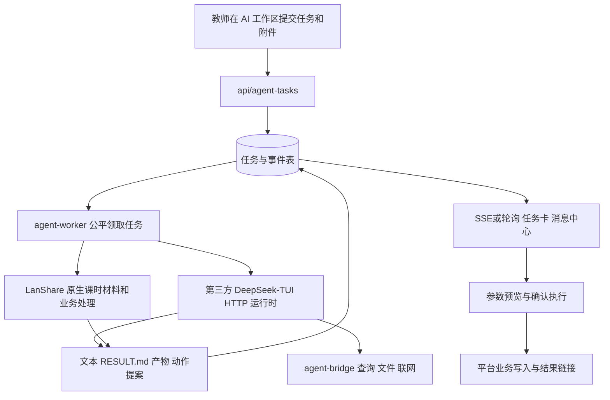
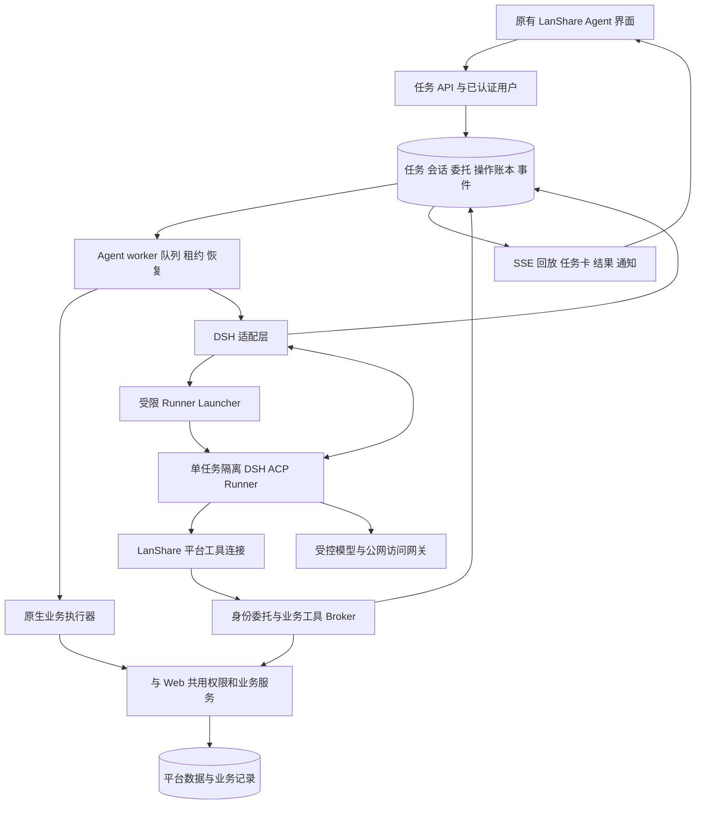
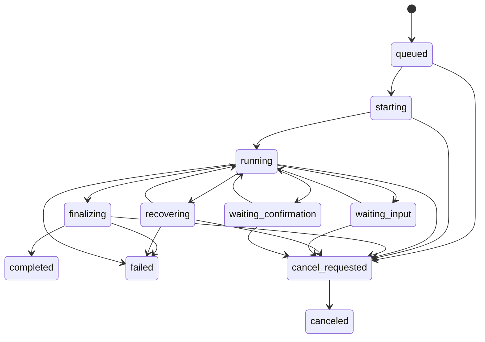

# LanShare Agent：DeepSeek-TUI 拆分、官方 DSH 接入与用户数字分身改进计划

日期：2026-09-10。状态：按用户“开始全力推进”指令实施中。本文保留调查基线和完整验收目标，实际进度见末尾实施记录；“拟新增”“目标”“验收”不能视为已经部署或测试通过。

最初调查完成了生产只读核验、代码与权限链路审查、官方资料核验及两项本地合成验证；该时点尚未安装 DSH 或更改生产配置。调查快照见同目录 `agent-dsh-audit-baseline-2026-09-10.json`，不能代替后续实施与部署证据。

## 1. 目标、范围与关键决策

最终结果是：用户继续使用 LanShare 原有 Agent 入口，DSH 承担理解、规划和工具编排；LanShare 根据当前用户真实身份执行平台业务。教师、学生和管理员均获得自己本来拥有的查询与操作能力，任务有进度、有结果、有可核对的业务记录，失败、取消和重试都有明确出口。

七项需求对应如下：

| 用户需求 | 实施结果 | 完成判断 |
|---|---|---|
| 拆除、分离全部 DeepSeek-TUI 功能和代码 | 移除第三方运行镜像、HTTP 协议适配、旧配置写入、启动脚本、活跃依赖与说明；保留平台任务能力 | 发布产物和服务器无可执行 TUI 依赖，旧历史仍可读 |
| 部署官方 DSH | 使用 DeepSeek 官方仓库与固定发行版本构建隔离 runner，经平台适配层接入 | 真实 DSH 在服务器完成端到端任务，并有版本与镜像摘要 |
| 必要插件安装和激活 | 版本化插件配置、平台工具、文件与检索、文档分析、规划与受限子代理 | 不以“已安装”为完成；逐项验证发现、调用、权限、结果 |
| 接入现有 Agent | 保留入口、API、队列、事件、历史、附件、追问、订阅、消息通知、原生业务处理 | 既有功能回归通过，新旧历史共存 |
| 当前用户同等权限 | 平台建立身份委托，执行时复用同一套业务授权，覆盖教师、学生、超管 | Web 与 Agent 对同一用户、同一对象、同一动作的授权结果一致 |
| 合理改进 | 修复桥接越权边界、取消和重启恢复、幂等、密钥生效、附件交付与输入丢失 | 对应缺陷回归和故障演练通过 |
| 业务闭环 | 每次写入形成业务回执；异步操作跟踪最终状态；全量能力有覆盖台账 | 不能用“模型说完成”代替实际落地 |

采用以下决策：

1. **保留 LanShare 产品界面和业务服务。** 不把 DSH Web UI 嵌入平台作为新的主入口，不让现有 FastAPI 进程承载模型生成的 Shell。
2. **优先采用官方 ACP，通过隔离 runner 的 stdio 连接。** 在 LanShare 与 DSH 之间建立窄适配层，接口和能力以固定版本实测为准。
3. **先建立身份与工具授权边界，再扩大写能力。** “同等权限”由平台代码保障；系统提示词只能帮助使用工具。
4. **按任务运行隔离，按平台主体授权。** 默认每个活跃任务一个 runner，同一主体同时一个任务；会话恢复由平台映射，用户不能指定底层路径或 session ID。
5. **全量业务覆盖分批交付，但最终验收覆盖全部有权业务。** 首批六个动作或教师场景通过，只能称阶段完成。
6. **普通可逆操作继承用户已表达的任务授权。** 不给每一步增加确认。平台原有二次认证要求和未获授权的破坏性、公开发布、外发等操作，使用具体预览或预先明确的规则授权。

## 2. 调查基线与事实

### 2.1 生产环境

2026-09-10 14:10–14:12（北京时间）通过 SSH 只读检查容器元数据、资源快照和只读数据库事务：

| 项目 | 核验结果 | 对计划的影响 |
|---|---|---|
| 当前发布 | `20260910-012744-d83074a36d06` | 实施前再次核验，不能用本次快照替代切换前检查 |
| Agent 运行时 | `ghcr.io/hmbown/deepseek-tui:latest`；digest `sha256:f70c436f72c84dfd1e8fde779a3433b2ad6bbf06d6752a06dbef180e837c7a98` | 是第三方 TUI；仓库没有其 vendored 源码 |
| 可用性 | `/health`、`/v1/usage` 均 HTTP 200 | 说明当前服务能响应，不能说明权限和复杂业务正确 |
| 队列 | 全局/worker 默认并发 2；当时活跃任务 0 | 可规划排空切换；切换时必须重新检查 |
| 历史 | 共 7 条：完成 5、失败 2；TUI 来源 3 条 | 样本很小，不据此宣称可靠性或计算目标提升幅度 |
| 原生业务来源 | `lanshare-business-agent` 3 条；`lanshare-session-material` 1 条 | 这些并非 TUI 功能，必须保留 |
| 服务器 | 2 CPU，内存 3659 MiB，当时 available 1946 MiB，磁盘可用约 28G | 先单 DSH 灰度，负载验证后最多恢复双并发 |
| 运行时隔离 | 共享整个 `data/agent_tasks`，未配置容器 CPU/内存硬上限 | 必须改为独立 workspace、资源预算和受限网络 |
| 配置暴露 | runtime 加载 `docker.env`，确认存在 DB URL、DB 密码、平台 SECRET_KEY 和模型 Key | 只检查存在性，未输出值；新 runner 禁止继承整份配置 |
| Agent 数据 | 目录约 21M，一个激活的 DeepSeek Key | 保留数据、加密密钥及历史检测记录，重做运行时生效机制 |

本地基线提交为 `3c6e330e4094574c95a3d246f3fcb08d709c8272`。已比对 compose、worker、config、task service、bridge service、action registry、task router 共七份文件的 SHA256，均与生产文件相同；不将该结果扩大为全仓库一致。

### 2.2 当前业务流程

主要代码位置（行号为本次基线，仅用于导航）：

| 业务层 | 位置 | 现状 |
|---|---|---|
| 前端 | `static/js/ai_workspace_widget.js:941,1361,1534,2144` | 成品/提案、SSE、提交附件 |
| 页面入口 | `templates/partials/ai_workspace_widget.html:2,26` | 仅教师开放任务中心 |
| API | `classroom_app/routers/agent_tasks.py:39` | 创建、列表、详情、订阅、事件、下载、续问、重试、动作、取消、删除 |
| 队列和历史 | `classroom_app/services/agent_task_service.py:821,1307,2174` | PostgreSQL 锁与 SKIP LOCKED，用户详情隔离 |
| 运行时 | `agent_task_worker.py:73,250` | 直接依赖 `/v1/tasks` 创建和轮询 |
| 原生业务 | `classroom_app/services/agent_platform_actions.py:1260,1444,1453` | 课时材料生成并绑定、公文等本地执行器 |
| 轻量聊天查询 | `classroom_app/services/chat_platform_query_service.py:20` | 最多两轮白名单工具，属于普通聊天能力 |
| 配置与密钥 | `classroom_app/services/agent_key_service.py:283,526` | TUI TOML 写入、TUI 用量接口 |
| 运行部署 | `docker-compose.yml:138`；`deployment/deploy_remote.ps1:541,611` | TUI 容器、目录权限和环境初始化 |

旧 `docs/agent-improvement-goals.md` 的 G1–G10 多数已经落地：SSE、追问、提案确认、附件、双并发、三类订阅、统一检索、近期历史/no_history、聊天轻查询、分类重试及失败产物挽救。本计划以这些为回归基线，不重复从零实现。运行中补充目前主要是可见事件，尚不能据此宣称运行时已经收到纠偏。

### 2.3 必须纳入迁移的问题

| 编号 | 已核验的问题 | 证据与结论边界 | 优先级 |
|---|---|---|---|
| R1 | `/query` 未按任务主体过滤资源，结果脱敏按返回列名判断 | `agent_bridge.py:109`、`agent_bridge_service.py:137,205`；内存合成 SQLite 已复现别名绕过脱敏及读到合成他人任务；未查询生产隐私 | P0 |
| R2 | `/file` 只校验目录；整个任务目录属于可读根目录 | `agent_bridge_service.py:69,273`，`agent_bridge.py:147`；`BRIDGE.md` 含任务 bearer，形成跨任务凭据读取风险，未对生产进行越权探测 | P0 |
| R3 | token 仅绑定任务号和到期时间，部分路由不查任务 | `agent_bridge_service.py:83`、`agent_bridge.py:47`；缺少完成、取消、停用、降权的即时撤销 | P0 |
| R4 | 公共嵌套上下文可进入 runtime thread_id | `agent_task_service.py:574,817`、`agent_task_worker.py:119`；本地无 DB/无网络调用已证实参数传播，未验证第三方运行时实际跨用户续聊 | P0 |
| R5 | Agent API、schema、通知均绑定 teacher，动作只有六项 | `agent_tasks.py:49`、`schema_classroom_activity.py:673`、`agent_action_registry.py:44`；不能支撑所有用户和全部有权操作 | P1 |
| R6 | 部分博客动作自行写 SQL，绕开常规可见范围检查及副作用 | `agent_platform_actions.py:379,448` 对照 `blog_service.py:1637,2309`；需统一业务服务 | P0 |
| R7 | 提案执行先查 JSON、后操作、再标记，无持久并发占位 | `agent_tasks.py:497`、`agent_task_service.py:2065`；存在重复执行与部分提交风险，尚未做生产并发写试验 | P0 |
| R8 | worker 没有持久租约、重启接管；取消不检查 runtime 响应 | `agent_task_worker.py:50,295,543`；可能留下运行任务或错误标为取消 | P1 |
| R9 | runtime 结束不等于业务有交付 | `agent_task_worker.py:169`；缺结果时仍可能标 completed | P1 |
| R10 | 密钥写配置、激活状态与真正生效之间没有完整回执 | `agent_key_service.py:283`；写配置后还需重启旧 runtime | P1 |
| R11 | 提交失败可能丢失输入；普通产物缺直接下载链接 | `ai_workspace_widget.js:993,2173,2211` | P1 |
| R12 | 通用组织 loader 在全部成员停用后可能回退旧组织字段 | `organization_scope_service.py:142–186`；对照 `signature_service.py:104–119` 已有更严谨处理 | P0 |

顶层创建参数已有 `origin/priority/extra_context/parent_task_id` 等过滤（`agent_tasks.py:190`），须保留。R4 应通过嵌套 DTO 白名单解决，不能误写成这些顶层字段目前全部失守。

## 3. 官方 DSH 选型与接入条件

DSH 指 **DeepSeek Harness**，官方 npm 包为 `@deepseek-ai/dsh`，官方源码为 `deepseek-ai/deepseek-harness`，MIT 许可。官方产品页明确其采用插件架构、处于开发者预览阶段。[官方介绍](https://www.deepseek.com/harness/)

本次候选基线为 `dsh-v0.1.5-rc.1`，commit `183f08e9c6dde7e36cd2318eaee70b0da08fb35e`，2026-09-10 发布且标记 prerelease。该版本变更了会话格式和生命周期；不能自动跟随 latest，也不能假定新版会话可以被旧版读取。[固定版本发布说明](https://github.com/deepseek-ai/deepseek-harness/releases/tag/dsh-v0.1.5-rc.1)

该 tag 根配置要求 Node `^22.19.0 || >=24.0.0`，开发包管理器为 `pnpm@11.7.0`。构建候选使用 Node 24 的明确维护版本及镜像摘要，依赖安装使用锁文件；运行版本必须与构建验证一致。[官方 package.json](https://github.com/deepseek-ai/deepseek-harness/blob/dsh-v0.1.5-rc.1/package.json)

官方说明尚未完成安全审计，不能将其自身沙箱当作唯一隔离边界。因此本计划把 DSH 限制在外部隔离环境中，平台身份、凭据、权限与审计留在 LanShare。[官方安全说明](https://github.com/deepseek-ai/deepseek-harness/blob/dsh-v0.1.5-rc.1/SAFETY.md)

### 3.1 接入方式比较

| 方案 | 本次判断 | 使用范围 |
|---|---|---|
| 直接启动 `dsh web` 并公开 DSH Web/RPC | 不是现有任务 API 的替代品；会引入另一套界面和权限面 | 仅开发诊断，经运维专用通道访问，不进入用户业务链 |
| 官方 headless 单次 CLI | 适合启动、模型、文件工具冒烟；单靠最终 stdout 无法满足任务交互 | 构建验证和离线评测 |
| 官方 SDK stdio | 当前文档列出取消、逐 prompt 结果和 server-to-client 请求等限制 | 不作为本次默认业务协议 |
| **官方 ACP** | 有会话、prompt、取消和权限请求，适合映射现有任务生命周期 | **优先方案，经 P2 PoC 后冻结** |
| 自定义 Cordis transport 插件 | 官方 ACP 无法满足特定事件时的扩展点 | 只补明确缺口，独立包，不复制或修改 DSH 核心 |

官方 ACP 提供 `initialize`、会话创建/恢复/关闭、prompt、取消、permission 请求等。它不替平台认证用户，且不能依赖它提供全部历史回放、原始 token 增量或所有 UI 交互。因此平台承担事件回放和身份授权，缺少的交互通过小型扩展补齐。[ACP 固定版本文档](https://github.com/deepseek-ai/deepseek-harness/blob/dsh-v0.1.5-rc.1/packages/acp/acp/README.md)

SDK 的限制和 ACP 不同，不能把两者混用为“DSH 已支持完整服务端任务 API”。[SDK Server](https://github.com/deepseek-ai/deepseek-harness/blob/dsh-v0.1.5-rc.1/packages/sdk/server/README.md)、[SDK Client](https://github.com/deepseek-ai/deepseek-harness/blob/dsh-v0.1.5-rc.1/packages/sdk/client/README.md)

### 3.2 接入前必须实测的 PoC

使用脱敏夹具和测试 Key，逐项保存命令、协议事件、退出码和产物，不触碰正式用户数据：

1. 固定版本离线可重复构建；确认 Node 运行要求、目标 Linux 架构、系统工具和镜像大小。
2. ACP 握手 → 新建 session → 中文 prompt → 平台测试工具 → 结果 → 正常关闭。
3. 当前配置模型可用；显式选择普通/深入模型与推理档位，不能沿用 TUI 的 `model=auto` 假设。
4. permission 请求能呈现给 LanShare，批准、拒绝、超时、取消均能返回给 DSH。
5. 运行中补充走经验证的消息通道；若暂不支持即时送达，明确显示“排队到下一轮”。待答问题则必须由 LanShare answerer 按 request ID 回传当前待决工具请求，超时/取消关闭该请求，不能用下一轮消息替代；answerer 未实现前不得启用提问工具。
6. 取消能终止 prompt 和所有子进程；断开、强制终止、重启后恢复不会重复已提交的平台动作。
7. 同一用户会话恢复、另一用户拒绝恢复；两个隔离 runner 并行时日志、文件、通知不串线。
8. 纯文本、附件、文件产物、长输出、空输出、工具失败的回执均可识别。
9. Key 生效、模型网关、联网代理、MCP 工具发现及遥测关闭有证据。

任一关键项不满足时，先记录协议缺口并补适配，不能把“容器启动成功”当作接入完成，也不能启用无边界 Shell 作为绕过方法。

## 4. 目标架构与边界

### 4.1 职责分离

- `agent_task_service` 负责业务状态、归属、任务创建/历史；不解释 TUI timeline 或 DSH 内部日志。
- provider 接口负责 `capabilities / start / events / resume / cancel / health / usage`。实现位置拟为 `classroom_app/services/agent_runtime/`；DSH 协议依赖封装其中或独立适配服务。
- `agent-worker` 保留队列和原生执行器选择；数据库连接只用于短事务，不跨模型等待持有。
- Broker 根据当前主体调用既有服务，处理 schema、权限、幂等、审计、分页和异步作业。不成为任意 SQL/任意 HTTP/任意文件的代理。
- Launcher 只允许固定镜像摘要、批准的 profile、服务器派生的任务目录和资源预算。即使实现上需要容器管理权，也隔离在窄控制面，不能交给 DSH 或插件。
- DSH 管理推理和工具组合；模型输出、附件、网页、工具返回都不能改变 actor 或授权规则。

### 4.2 Runner 隔离

1. 每任务一个独立可写目录；仅挂载本任务输入、产物和必要会话存储，不挂载 `data/agent_tasks` 根目录。
2. non-root、只读根文件系统、受控 tmpfs、capabilities drop、no-new-privileges、PID/CPU/内存/文件大小限制；终止时清理整个进程组/容器。
3. DSH 中没有数据库密码、平台 SECRET_KEY、用户登录 Cookie、宿主 SSH Key、Docker socket、其他用户凭据。
4. DSH 仅可访问业务 Broker、模型网关和受控公网网关；在网络层禁止直达 PostgreSQL、宿主管理端口及其他内网服务。只设置 HTTP_PROXY 不足以形成边界。
5. 跨任务历史经授权工具取出后注入当前输入；可恢复会话存储按 actor + 会话锁隔离。用户降权后必须重新审查旧上下文，不能继续把曾获权的敏感内容当作当前可读资料。
6. 可调用 Shell 来处理本任务文件；其平台权限仍来自 Broker。平台管理员的业务权限不转换为服务器 root 权限。
7. 插件由发布流程安装，运行时禁止模型自行安装依赖、修改安全 profile、开启遥测或扩大网络范围。

严格容器配置与所选 Linux 沙箱后端（如 bwrap/Landlock）的兼容性必须在目标内核实测，检查启动、文件读写、拒绝越界和子进程回收。失败时修正后端或容器配置，重新通过隔离验收，不能静默退化为无约束执行。[官方沙箱边界](https://github.com/deepseek-ai/deepseek-harness/blob/dsh-v0.1.5-rc.1/docs/subsystems/sandbox.md)

### 4.3 协议与兼容

保留 `/api/agent-tasks` 当前路径和主要返回字段，包括所有历史、下载、订阅、提案接口；通过 `schema_version/capabilities` 增加字段，旧前端不能因为遇到新状态直接报错。

`/api/agent-bridge` 前缀继续保留。新增 `me`、`capabilities`、`resources/search`、资源读取、`tools/call` 及动作预览/执行协议。原 `/search`、`/file` 使用受权资源解析；旧 `/query` 进入明确版本化迁移：逐个将现有调用改为结构化查询工具；兼容入口只接受已批准的查询模板或可证明授权的视图表达式，其他请求返回清晰的迁移错误。不得以接口兼容为由继续暴露原有任意查询。

内部运行接口由 LanShare 定义，无需照搬 TUI `/v1/tasks`。选择 DSH 的任务将 `runtime_provider` 明确设为 `deepseek-dsh`；原生业务保留实际 provider，旧历史保留原值。服务端派发时确定执行器，attempt 开始后固定。`runtime_thread_id` 只作为服务端兼容映射字段，禁止从公共 `page_context` 接受。

## 5. 用户数字分身：身份、权限与全量业务覆盖

### 5.1 主体模型

平台当前登录 role 是 `teacher/student`；超管是 active teacher 的 `is_super_admin` 属性。当前代码未发现独立的学校/学院/系管理员角色定义，组织可见范围也不是管理员角色。依据为 `dependencies.py:46,600`、`resource_access_service.py:59`、`manage_parts/common.py:964`。

执行主体使用 `actor_role + actor_id` 或规范化 `role:id`，避免教师和学生同号混淆。统一 actor resolver 由登录依赖与 Broker 共用，实时确认账号有效、角色、全部有效组织成员、选定组织、领域权限。把“从无成员记录”与“成员记录全部停用”的兼容回退分开，防止撤权后恢复旧组织。

授权关系为：

`允许执行 = 当前账号有权 + 当前资源允许该动作 + 任务/持久规则已授权该意图 + 必要的确认或二次认证仍有效`

用户已授权任务中的普通读取和可逆编辑自动执行。计划不人为削减管理员本来有的功能；也不写一个 `if admin: allow_all` 绕开领域规则。对平台本身存在的 owner-only 限制，先核对是否是业务要求；确需完善的管理员能力须在 Web 和 Agent 共用策略中同时修复。

### 5.2 身份委托生命周期

1. 用户创建任务时，服务端从真实登录态生成 actor、组织上下文与授权意图；公共 DTO 只接收允许的页面提示和业务参数。
2. 每次执行 attempt 创建短期、可撤销委托；绑定 actor、任务、attempt、租约代际、有效期和授权版本。令牌随机生成，平台存 hash，不复用 SECRET_KEY 派生的全平台长期凭据。
3. 工具每次调用校验委托、任务状态、当前 attempt、用户状态和当前领域权限；不能只依赖排队时的权限快照。
4. 取消、结束、删除、停用、降权、组织撤销后，后续调用立即拒绝。缓存必须有失效机制，不能承诺“即时”却仅等 TTL 到期。
5. 默认关闭网页或临时网络断开不取消后台任务；明确退出登录或撤销当前会话时，交互型委托撤销并停止后续受权操作。长期运行需有独立、可查看和撤销的授权记录。
6. 定时订阅依据用户预先保存的持续授权触发，每次执行重新验权；不伪造当前在线会话。撤销订阅同时停止派发，并撤销其派生的排队/运行委托、阻止后续写入；已经提交的业务如实保留。
7. 子代理继承同一主体及更窄的任务授权和共享预算；不能切换账号、读取其他会话或成为新的授权来源。

### 5.3 工具设计

每项能力注册 `name/version/input_schema/output_schema/resource_resolver/authorize/risk/idempotency/timeout/result_contract`。工具发现只展示当前用户可用项，执行时再校验一次。

所有读取先确定用户可读对象，再返回必要字段和内容；返回对象 ID、版本、来源链接、查询时间、分页游标和是否截断。搜索、列表、详情、导出、下载必须遵守同一资源策略。签名等场景分别校验可见、可使用、可管理，不能混成一种权限。

文件以资源 ID、附件 ID、产物 ID 与版本访问；路径在服务端解析并验证所属资源及符号链接，不让模型传任意绝对路径。复杂统计使用授权查询服务和数据库原生超时/只读权限；不能用 SQL 黑名单和输出列名脱敏替代用户隔离。

用户能在平台配置或使用的第三方连接，由平台凭据服务代为执行；模型可触发已授权连接，但不需要看到原始密码、Cookie 或 API Key。需要用户填秘密或完成二次认证时，在平台安全表单中完成，再返回非敏感回执。

### 5.4 全量能力台账

初步 AST 盘点发现 router 目录约 83 个文件、854 条路由装饰器声明，其中包含页面、内部接口和重复封装，不能等同于 854 项业务能力。P0/P1 要对 AST、实际挂载路由、OpenAPI、页面入口和后台任务共同盘点。

拟产出 `docs/agent-capability-matrix.json` 和可读版。每项记录路由、业务服务、授权函数、角色、资源边界、读取/写入副作用、Agent 工具名、支持状态、测试及交付阶段。新路由进入 CI 时必须更新台账。

| 业务域 | 必须覆盖的现有能力方向 | 关键闭环 |
|---|---|---|
| 个人资料与偏好 | 查询、修改用户可改字段、个人配置 | 写后回读、偏好持久化 |
| 学期/课程/班级/课堂 | 查找、创建/编辑、成员、开课等实际已有操作 | 组织、成员、课表与课堂状态一致 |
| 课堂互动 | 考勤、讨论、分组、投票、行为等已有操作 | 对象定位、课堂范围、实时记录 |
| 材料和教材 | 检索、导入、编辑、共享、发布、导出、渲染 | 保存到材料库、关联正确课堂、下载可用 |
| 作业/考试 | 草稿、发布、题目、提交、批阅、统计、成绩导出 | 数据校验、评分规则、可见性和最终提交状态 |
| 教学管理 | 计划、教案、考核方案、期末材料、评教 | 复用现有模板与生成/审核流程 |
| 签名/签章 | 查找、申请、使用、授权、撤销等实际已有动作 | 可见/可用/可管理分离，授权链完整 |
| 博客与交流 | 草稿、发布、评论、收藏等已有功能 | 使用正常业务服务及相同可见规则 |
| 站内消息与通知 | 查收、拟写、选择合法收件人、发送、跟踪 | 发送回执与异步状态；不把打开链接当已发送 |
| 日程/订阅 | 查询、创建、调整、取消、订阅派发 | 时区、去重、权限失效、停订 |
| 学生个人业务 | 学习路径、错题、成绩、积分、任务与提交 | 只操作本人有权业务；平台已有提交规则照常生效 |
| 生涯/简历/成果 | 查询、创建、编辑、发布/撤回等已有操作 | 私有数据、公开投影和下载一致 |
| 外部集成 | 公文、教务、智慧课堂、Git 等授权连接 | 凭据留服务端，跟踪抓取/同步/写回结果 |
| 系统管理 | 账号、组织、配置、运行状态、Agent Key 等已授予管理员的操作 | active super admin 与业务要求校验、变更审计 |

该表是实施分组，不是假定每个域都有全部 CRUD。最终逐项核实实际已有操作。台账状态允许“可执行”“需确认”“需用户完成认证”“不属于用户业务”；普通业务的“暂不支持”必须有补齐阶段，不能留到最终验收后。内部维护、身份凭据原文等排除项必须说明理由，不能借排除名义缩减用户有权业务。

## 6. 写操作、任务状态与可靠性

### 6.1 操作闭环

一次平台操作依次经过：工具发现 → 参数解析 → 当前授权 → 必要时预览 → 持久执行占位 → 业务事务 → 业务回执 → 任务结果和通知。

- 复用现有 action schema 和预览令牌，增加稳定 `operation_id`、规范化参数 hash、对象 revision、授权意图、批准人及有效期。
- 明确任务请求已授权的可逆操作直接执行。公开发布、外发、删除等依据用户明确指令或预先规则判断，缺具体对象/范围时预览确认；同一份授权不可因网络重试反复询问。
- 修改预览参数或目标集合后，原批准失效；预览后对象版本变化返回 409，并给用户新差异。
- 同一逻辑动作跨重试使用同一幂等键。数据库唯一约束与原子领取阻止两个请求并发执行；不能只读 `result_detail.executed`。
- 已完成任务的历史提案继续可确认：使用用户当前登录态重新验权，建立新的单操作授权，沿用原稳定 operation ID；不重新启用已撤销的 runner token。降权后拒绝，重复确认返回同一结果。
- 本地写入、操作回执在同一事务提交；异常回滚业务事务，审计失败记录独立提交或用 savepoint，避免为了记录失败提交了半成品。
- 外部通知、同步、渲染、导出复用平台已有可靠队列；不足时增加 transactional outbox。对不能幂等的外部接口，先查询结果/对账，结果未知时停止自动重发。
- “恰好一次外部副作用”不能仅靠本地 token 保证。验收分别证明本地最多一次、外部幂等或可核对的未知状态处理。

### 6.2 状态机

这些是拟定状态，公共字段兼容映射由实现冻结。等待状态必须持久保存问题/预览及有效期，超时有可恢复出口。是否释放 runner 取决于 PoC 是否支持相应交互恢复；不能提前释放后把批准送给另一个 attempt。等待超时停止占用执行槽位，并持久标明 `resumable`；用户继续时重新验权、确认预览是否有效、领取容量和会话锁，再进入 recovering/running，失效的批准不重放。

### 6.3 调度、恢复和取消

1. 保留 PostgreSQL advisory lock + SKIP LOCKED；将每教师一任务改为每 actor 一任务。学生与教师同号不互相阻塞。
   容量通过显式 execution-slot/lease 统计，starting、finalizing、recovering 等占用资源的状态均计算，不能只数 running。等待释放全局槽位后保留会话归属锁，恢复需要重新取得容量，不能与同 actor 的另一任务并发重入。
2. 新建 execution attempt、租约到期、心跳、fencing token；过期 worker 的结果和工具写入一律拒绝。
3. 启动前持久化启动意图和幂等键。启动响应丢失时按固定任务标签查询 runner，先 reconcile，不能直接再开一个。
4. 正常恢复先确认 runner 和会话状态、已完成业务回执，再决定接管或新 attempt。新 attempt 不能重放已经落地的动作。
5. 取消先撤销新工具写权限、记录请求，再发 ACP cancel 并等待退出确认；超时由 launcher 终止完整 runner。取消和已在提交中的事务通过共同状态锁确定先后，结果明确显示已提交部分。
6. 对原生课时材料等后台子任务也定义取消/停止后续绑定/保留已提交结果规则；不能只取消外层任务卡。
7. HTTP 429/5xx 采用指数退避、抖动和 Retry-After，保留已有每任务与每小时重试预算。权限、验证、冲突和结果未知错误不盲目自动重试。
8. 完成判断采用任务类型的结果契约：查询有来源；文档有可读产物；草稿有业务 ID；发布/通知有状态回执。纯查询不强求 RESULT.md，文件任务也不能凭一句“已完成”通过。

## 7. 数据库、接口与配置演进

### 7.1 数据迁移

遵循仓库 PostgreSQL forward-only 迁移约定：说明影响表、锁、回填、演练与回退方式。先扩展兼容、再回填、再启用新写入，不在高并发请求内做大量 DDL。

| 表/结构 | 改造内容 | 约束与兼容 |
|---|---|---|
| `agent_tasks` | actor_role/id、选定组织、context 版本、provider 配置代际、规范会话引用 | 历史 teacher_id 回填为 teacher；学生启用前处理旧 NOT NULL/FK 与所有 teacher-only 查询 |
| `agent_task_composers` | 通用 actor 键 | 保留教师数据，避免 teacher/student ID 冲突 |
| `agent_task_attempts`（拟新增） | attempt、runner/session、启动幂等键、租约、心跳、fencing、版本、用量、退出原因 | 同任务 attempt 唯一；陈旧回调不能覆盖新状态 |
| `agent_task_delegations`（拟新增） | token hash、actor、源授权/会话引用、任务/attempt、权限版本、过期/撤销 | 单独撤销、到期清理；不保存原始登录令牌 |
| `agent_action_executions`（拟新增） | operation_id、参数hash、目标版本、状态、幂等键、结果/错误、确认信息 | 以稳定业务键唯一约束；状态原子推进 |
| `agent_tool_audit`（拟新增或接入合适现有审计设施） | 主体、工具、资源、授权依据摘要、时延、结果、trace | 与聊天删除生命周期分离，敏感内容脱敏 |
| `agent_task_events` | 标准事件类型、attempt/seq、去重键 | 保留现有 event ID/SSE 游标；有序分页，不存所有 token |
| key/usage 表 | provider-neutral 来源、配置代际、生效回执、真实用量 | 保留加密密钥、检测历史及 TUI 历史用量 |

优先复用现有审计、调度、后台作业设施，不为每个概念另建微服务。新增表是否必要在 P1 数据设计评审冻结。PostgreSQL 与 SQLite 均有迁移/回填测试；正式生产门禁使用 PostgreSQL，SQLite 通过不能代替生产引擎验证。

权限回填只建立身份引用，不从旧 prompt/context 复制“管理员”声明。历史记录不把 provider 批量改成 DSH，也不重放旧动作。旧字段在兼容期保留，学生上线及回退窗口有明确 schema 最低版本。

### 7.2 密钥与用量

保留 `/manage/system/agent-keys` 和加密密钥库，移除 TUI `config.toml` 写入。激活流程改为：保存/检测 → 新配置 generation → 测试会话验证 → 发布生效 → UI 显示配置已生效。新配置失败不破坏旧代际，运行中的任务明确使用启动时绑定的代际。

模型真实 Key 优先留在平台上游网关。runner 使用仅本任务有效的代理凭据，限制模型、用量和生命周期；Broker 凭据与模型网关凭据分开。自定义 base URL 必须由管理员配置并受出站目标控制，不能成为新的 SSRF 面。

用量分为任务、attempt、模型和配置代际，记录原生可观测值和来源。无法取得精确 token 时显示“未提供/估算”，不要以 0 冒充；金额由当时费率版本计算，不把旧 TUI `/v1/usage` 当作 DSH 接口。

官方 `dsh-llm-deepseek` 支持 `baseURL`、`apiKeyEnv`，可接 OpenAI-compatible 网关；源码中显式配置的 baseURL 优先于环境回退。网关必须验证 DeepSeek 的 thinking、reasoning、流式工具调用、usage 和历史系统消息行为，不能只用一次文本聊天验收。[模型插件说明](https://github.com/deepseek-ai/deepseek-harness/blob/dsh-v0.1.5-rc.1/packages/llm/llm-deepseek/README.md)、[配置解析](https://github.com/deepseek-ai/deepseek-harness/blob/dsh-v0.1.5-rc.1/packages/llm/llm-deepseek/src/index.ts#L392)

图片可能使用同一 baseURL 的 Files API，须实现任务归属、容量、过期删除并验证完整生命周期，或选择明确支持的图片输入路径。搜索插件另用 Anthropic-compatible `/messages`，有独立 baseURL；搜索网关与聊天网关分别验收和计费，不能误接到 `/chat/completions`。现有生产 `deepseek-v4-pro` 与新版默认模型的可用性、上下文窗口及图片能力应按账号实测后明确配置，不随默认模型变化静默切换。[模型请求实现](https://github.com/deepseek-ai/deepseek-harness/blob/dsh-v0.1.5-rc.1/packages/llm/llm-deepseek/src/adapter.ts#L530)、[官方搜索插件](https://github.com/deepseek-ai/deepseek-harness/blob/dsh-v0.1.5-rc.1/packages/web/web-search-deepseek/README.md)

## 8. 插件、技能与模型能力方案

“最大能力”的验收标准是平台任务成功率、覆盖和可用性，采用经过验证的工具组合，不以插件数量衡量。DSH 官方插件、外部 MCP、业务技能及系统依赖分别管理；本机 Codex 已安装的插件不等于服务器 DSH 可使用的插件。

### 8.1 插件分层

| 层级 | 计划启用能力 | 激活验证 | 配置原则 |
|---|---|---|---|
| 基础运行 | 官方模型、会话持久化、Agent loop、ACP、权限处理、文件与沙箱服务 | 会话创建/恢复/取消，普通与深入模式可用 | 固定同一发行版本，必要依赖完整 |
| 平台接入 | LanShare 自有业务工具，通过官方 MCP 支持或窄 Cordis 插件接入 | me、搜索、读取、草稿、发布及管理员动作逐项核对 | 权限由 Broker 决定，工具注册不能授权 |
| 文档与数据 | 受限文件读写、CSV/表格处理、DOCX/PDF 解析与生成；优先复用平台现有文档服务 | 附件→分析→产物→材料库保存→下载/预览 | 不在每个 runner 重复启动重型 Office 服务 |
| 检索与联网 | 文件搜索、网页检索/抓取、公文和材料授权搜索 | 来源可追溯、分页、网络失败和重定向可控 | 独立公网代理；涉及收费搜索源时显示配置依赖 |
| 工作技能 | 教学报告、作业、期末材料、管理查询、数据核对等平台技能 | 同一夹具输入下结构与业务回执合格 | 技能是流程知识，不能授予数据库和跨用户权限 |
| 计划与上下文 | 规划、目标、上下文压缩、引用与交付 | 长任务恢复、no_history、上下文预算 | 计划信息映射平台事件，避免重复任务系统 |
| 子代理 | 官方子代理能力，按任务开启 | 父子取消、费用/并发共额、主体一致 | 初期最多一个活跃子代理；主子合计受全局预算 |
| 可选专用工具 | 浏览器、代码分析、经评审的额外 MCP | 独立集成测试和明确账号授权 | 重型浏览器按需独立任务，默认不常驻 |

### 8.2 已核验的官方插件清单

以下短包名统一加 `@deepseek-ai/` 前缀；均在固定发行版本中核验。部分由 base 已经加载，实施时检查有效 composition，避免重复挂载。表中是计划启用或配置的组成，不代表本轮已安装。[官方 base 组合清单](https://github.com/deepseek-ai/deepseek-harness/blob/dsh-v0.1.5-rc.1/packages/bundle/base/cordis.patch.yml)

| 用途 | 官方短包名 | 激活要求 |
|---|---|---|
| 基础和 ACP | `dsh-base`、`dsh-acp-app`、`dsh-acp` | 自有 lanshare profile 派生并冻结 |
| DeepSeek 模型 | `dsh-llm-deepseek` | 任务模型网关与显式模型配置 |
| 平台 MCP | `dsh-mcp-client` | 必需；连接自建 LanShare MCP，启动失败不得假装就绪 |
| 业务技能 | `dsh-skill`、`dsh-skill-filesystem`、`dsh-tool-skill` | 只读受控技能目录，测试每种业务技能 |
| 文件与检索 | `dsh-tool-fs`、`dsh-tool-fs-search` | 只见本任务文件 |
| Shell与作业 | `dsh-tool-bash`、`dsh-bash-sandbox`、`dsh-tool-jobs` | 外层隔离、超时、进程回收 |
| Web | `dsh-web`、`dsh-tool-web`、`dsh-web-search-deepseek`、`dsh-web-fetch-http` | 分别验证搜索/抓取网关，调用纳入预算 |
| 计划和压缩 | `dsh-tool-todo`、`dsh-tool-goal`、`dsh-compaction-basic`、`dsh-compaction-tool-result-pruner` | 平台事件投影、长任务与预算控制 |
| 子代理 | `dsh-subagent-spawn-in-process`、`dsh-subagent-fork-in-process`、`dsh-tool-subagent`、`dsh-tool-subagent-control` | 初期深度1、至多一个活跃子代理，父子共享身份和额度 |
| 审批/提问 | `dsh-user-approval`、`dsh-user-questions`、`dsh-tool-ask-user` | ACP接审批；LanShare answerer补齐提问 |

MCP 当前桥接 Tools，不支持 MCP Resources/Prompts；平台资源和流程因此暴露为工具调用及受控技能。默认没有已连接服务器，关键平台 MCP 设置 `failOnStartupError: true`，readiness 验证工具发现和身份探针；默认约60秒工具超时不能直接用于数分钟导出，长任务工具应快速返回平台job ID再查询。官方 bridge 会注册服务器发现的工具，并不原生提供本计划的按领域懒加载：由 Broker/自有插件实现领域发现和受控工具集合，验证首次发现、权限变化更新和断线恢复；所有有权能力仍可通过发现入口找到。[官方 MCP 文档](https://github.com/deepseek-ai/deepseek-harness/blob/dsh-v0.1.5-rc.1/packages/mcp/mcp-client/README.md)

技能按 `<name>/SKILL.md` 或平铺 Markdown 发现，不能假设无限递归扫描；项目技能优先级与用户材料隔离，防止附件成为高优先级运行指令。[官方技能机制](https://github.com/deepseek-ai/deepseek-harness/blob/dsh-v0.1.5-rc.1/docs/subsystems/skills.md)

审批配置中的 `never` 意为拒绝审批请求，不能当成“全部自动批准”。由平台基于任务既有授权或用户确认作单次批准；没有有效回答、权限失效或取消时拒绝执行。用户提问需要自建 answerer，按 actor/task/attempt/request ID 匹配前端回复并解阻当前工具；重复/过期/跨任务回答拒绝，取消或超时有确定结果。不能把 ACP 未实现的 elicitation 当作已有功能，也不能用“排队到下一轮”代替待决问题回复。[官方审批语义](https://github.com/deepseek-ai/deepseek-harness/blob/dsh-v0.1.5-rc.1/docs/subsystems/approval.md)、[提问工具契约](https://github.com/deepseek-ai/deepseek-harness/blob/dsh-v0.1.5-rc.1/packages/interaction/tool-ask-user/README.md)

实施产物至少包含 `profiles/lanshare`、插件清单/依赖锁、技能目录、健康检查、安装/回退脚本与每项 smoke test。自有插件仅处理 LanShare 连接、交互及标准事件，命名、版本与官方包明确分开。

### 8.3 安装和激活流程

1. 从官方固定 tag 获取源码/发行包，核对 commit、依赖 lock、许可证和构建来源，生成镜像摘要和软件清单。
2. 从官方 ACP profile 派生 LanShare profile，只启用批准的组件，补充平台工具与业务技能。
3. 在镜像构建阶段安装固定依赖；运行时不执行 `npx ...@latest` 或热装未知插件。
4. 显式关闭不需要的遥测、反馈上传与会话贡献：`dsh-session-telemetry-otel` 设为 `DISABLED`，`dsh-session-log-deepseek` 不贡献日志，`dsh-plugin-package-inventory-deepseek` 设 `enabled: false`。生产会话可能包含教学和个人数据，检查最终有效配置和出站流量，不只看顶层开关。
5. 凭据在受控服务中配置，测试工具发现、实际调用及失败降级；插件状态至少区分“已安装、已加载、已连接、测试通过”。
6. 子代理、Shell、联网、文档处理分别执行隔离与资源测试；不能只用模型文本回答判断工具可用。
7. profile 与工具 schema 版本写入每次 attempt，后续复现能够定位具体组合。

DSH 自身的调度能力不另起一套生产订阅系统；继续使用 LanShare scheduler。Creator/自修改配置、第三方账号型插件、无限子代理不默认开放，以免让平台任务绕过发布和用户授权流程。

官方 OTel 的 `FEEDBACK_ONLY` 会在反馈时包含会话上下文，不只是反馈文字，不能用它替代禁用。需要用户主动诊断时由平台预览脱敏范围，再单独授权上传。[OTel 说明](https://github.com/deepseek-ai/deepseek-harness/blob/dsh-v0.1.5-rc.1/packages/session/session-telemetry-otel/README.md)、[插件清单上报](https://github.com/deepseek-ai/deepseek-harness/blob/dsh-v0.1.5-rc.1/packages/llm/plugin-package-inventory-deepseek/README.md)

## 9. 前端和用户体验

延续当前 AI 工作区和任务卡样式，做有业务意义的增强：

- 输入区显示当前账号/工作组织和任务范围；教师、学生和管理员看到适合自己的业务入口，不显示容器、ACP 或 token 等实施细节。
- 创建失败保留原输入、附件和页面上下文；双击提交由客户端禁用与服务器幂等共同处理。
- 卡片显示排队、执行步骤、需要补充、待确认、结果和异常；SSE 断线可按游标补齐，轮询 fallback 不产生重复事件。
- 用户补充指令后显示“运行时已接收”或“将在下一轮使用”，不把写入事件表误显示为已经生效。
- 操作预览用明确对象、数量和差异展示；确认后可直接进入新建/修改的业务对象，失败可修改参数再试。
- 结果区区分“回答/文件”和“已经写入平台的记录”，每个产物有可用下载或预览，每个业务动作有状态和链接。
- 部分失败列出已完成、未完成与下一步；取消后的已提交操作如实保留，需要撤回时走对应业务能力。
- 聊天历史与全局队列最小公开；公开队列主要显示人数/等待，不泄露他人任务标题、正文、附件和操作细节。管理员能看哪些任务内容，以平台明确的审计权限为准。
- Markdown/HTML/插件输出按不可信内容渲染，执行输出脱敏，下载逐次校验归属；生成 HTML 预览隔离，不允许结果脚本读取登录态。
- 桌面 1440px、平板 768px、手机 390/375px 验证输入、长标题、步骤、预览、附件、键盘操作和滚动；重要错误与待确认信息保留在主流程。

## 10. 分阶段实施步骤、产物与退出条件

顺序允许并行开发，阶段门禁必须顺序满足。时间是工程量估计，不是承诺交付日期；全量能力数需 P1 清点后修订。

| 阶段 | 工作内容 | 主要产物 | 退出条件 | 初估人日 |
|---|---|---|---|---|
| P0 调查固化 | 更新生产基线、列明保留/删除清单、归档既有协议、锁定官方候选版本 | 本计划、基线 JSON、差异清单 | 事实与待验证项分开；本轮调查部分已完成 | 1–2 |
| P1 权限与能力设计 | 全量路由台账、actor/组织语义、委托、操作账本、兼容协议、修复R1–R7/R12方案 | 能力矩阵、schema/协议设计、权限回归夹具 | 无未归类入口；同权规则和历史回填可执行 | 3–5 |
| P2 DSH 接入 PoC | 固定版本构建、ACP、平台测试工具、审批、取消、会话、Key/用量 | 可复现实验、版本锁、协议契约、资源初测 | 第3.2节全部关键项通过；否则补差距 | 2–4 |
| P3 平台安全与执行底座 | 通用主体、受权 Broker、结构化读取、账本、事务、委托撤销、输入白名单 | 服务/迁移/单元和集成测试 | 普通/超管/学生权限一致；隔离与幂等关键测试通过 | 5–8 |
| P4 DSH runtime 与运维 | Adapter、launcher、单任务容器、事件规范、租约、恢复、取消、模型网关 | DSH镜像/profile、运行服务、契约和故障测试 | 所有runtime生命周期通过；不接触平台广域秘密 | 4–7 |
| P5 高频业务与插件 | 原有六动作改共用业务服务、原生材料、公文、文件/表格/检索、规划与子代理 | 已激活插件清单、工具适配、完整业务用例 | 每项有真实回执；此阶段只是能力覆盖的首批 | 4–7 |
| P6 全量同权补齐 | 按台账完成其余教师、学生、超管与集成业务，补齐异步跟踪和权限差异 | 全量能力矩阵与跨角色用例 | 普通用户业务无未计划缺口；授权结果与Web一致 | 8–15，盘点后修订 |
| P7 前端闭环与综合验证 | 新状态、审批/补充、输入保留、下载、历史兼容、移动端、性能和故障回归 | E2E/截图、压力/故障报告、缺陷闭环 | 功能、权限、性能、历史完整通过 | 4–6 |
| P8 灰度部署 | 标准部署演练、备份、排空、单用户/单任务→扩容、业务验证 | 部署记录、健康/版本/业务证据 | 满足灰度门禁，正常教学不受影响 | 2–3 + 观察窗口 |
| P9 TUI 最终退役 | 移除旧镜像/代码/变量/脚本、归档旧会话、轮换旧凭据、发布清理版本 | 零活跃依赖扫描、归档/恢复验证、最终发布说明 | 新任务全部DSH或原生provider；全量终验达成 | 1–2 |

P2 可与 P1 并行；P3 与 P4 在协议冻结后并行；P6 与前端可按领域并行。主依赖是“授权底座 + 可用 DSH 协议 → 全业务集成 → 全面测试 → 灰度 → 拆除”。不为了先宣布替换成功而跳过权限或删掉未迁移功能。

## 11. 部署切换与回滚操作计划

### 11.1 发布前

1. 在隔离分支/工作区实现，沿用仓库 `codex/` 分支命名习惯；保留用户未提交修改，构建从干净、明确版本出发。
2. 检查部署脚本版本和 Git 跟踪状态。当前 `deployment/deploy_remote.ps1` 可能不在普通打包清单中，须把它的改造列为单独交付并核验，防止后续部署重建 TUI。
3. 正式 SQLite/PostgreSQL migration、回填、数量和约束检查通过；按项目要求准备匹配当前源码的 PostgreSQL 演练报告、备份及哈希。
4. 先跑 `deployment/deploy_remote.ps1 -DryRun`，确认 manifest 不包含私密数据、测试配置和旧运行依赖，且没有缺失的新适配服务文件。
5. 在目标架构提前构建/拉取固定 DSH 镜像，检查剩余内存和磁盘。生产不临时编译大量 Node 依赖。
6. 备份数据库、Agent 历史/产物、旧运行会话、当前配置和镜像摘要；验证恢复到隔离环境可读。备份加密且不进入模型工作区。

### 11.2 切换步骤

1. 部署兼容扩展 schema 和已强化的 Broker；旧公共接口继续可用，旧运行时临时接入也不得继续使用无范围查询。
2. DSH 服务以测试主体和单并发运行，完成查询、生成文件、作业草稿、通知测试接收方、超管测试操作等验收。
3. 冻结旧 runtime 新任务分配，并同步切换订阅派发。已运行 TUI 任务正常完成或由可见的取消流程结束；旧 queued 任务优先排空，若需切到 DSH，只能对尚未开始 attempt 的任务重新验权、显式重绑定并记录审计。核对平台任务、runtime 活跃进程、待确认/子任务三处状态，不仅检查 running 数量。
4. 新任务统一由 `deepseek-dsh` 承载；平台原生领域服务与异步作业通过 MCP 适配继续复用。派发时绑定 provider，attempt 启动后切换开关不得把它中途送往另一 provider。
5. 对旧 TUI 任务追问，使用该用户有权读取的摘要和成品创建新 DSH 会话，显示“基于历史结果继续”，记录父任务/provider 来源。不能把旧 thread ID 当成 DSH session。
6. 灰度从指定账号只读、可逆写入、已授权的复杂写入逐步开放；学生、普通教师、超管都要参与正式验收。
7. 单并发通过资源门禁后才恢复到最多双并发；对其他 app/ai/mailer/scheduler/postgres/nginx 同时验证健康和业务。
8. 观察窗口初定至少 48 小时，并完成约定场景覆盖；自然流量不足时补可回收的验收任务，不能把“没有报错”当通过。

### 11.3 回滚

- 新任务分配回退或暂停、保留原生业务能力，正在运行的任务按锁定 provider 收尾。
- 上条收尾仅适用于已确认安全的普通协议/可用性故障。出现身份、隔离、凭据异常时，立即撤销受影响的存量委托并终止 runner，保存必要审计后再处置，不能只停止新增任务。
- 旧 TUI 只在短期迁移回退窗口以**已经强化权限和环境配置的版本**作为可选后端；不得回退到本次发现的无范围 SQL/文件及全平台凭据暴露状态。
- 对 DSH 协议/插件升级故障，回退到上一份验证过的 DSH 镜像/profile；新会话格式不支持降级读取时恢复相应会话快照或开启新会话，原始历史保留。
- additive schema 默认保留，不在回退时粗暴删除新表或覆盖整库；已执行的平台业务不随代码回滚自动撤销，按操作账本和业务撤回接口处理。
- 权限/隔离失败、重复写入、无法可靠取消、关键教学功能异常，立即停止新增 DSH 工作并进入回滚流程。

### 11.4 最终退役

灰度验收结束后停止并移除旧容器、第三方镜像依赖、TUI 协议/解析代码、旧 env、TOML 写入器、部署补丁和测试耦合。旧 `deepseek_home` 会话仅以隔离归档保留必要历史；运行服务不再挂载，敏感配置按迁移清单处理。永久回滚方案改为上一 DSH 发布或暂停 Agent，平台不保留双后端长期维护。

清理只针对核验过的 Agent 旧路径和精确镜像，不能使用全局 prune 或删除整个 `data/agent_tasks`。轮换曾暴露给旧 runtime 的 bridge/runtime/model 等凭据；涉及平台 SECRET_KEY、数据库密码的轮换需评估会话及其他服务影响并有独立切换步骤。最终扫描允许历史审计中的 `deepseek-tui` 来源字符串，活跃代码、配置和镜像引用必须为零。

## 12. 验证矩阵与量化门禁

### 12.1 功能与权限

| 维度 | 必测内容 | 合格结果 |
|---|---|---|
| 身份 | 未登录、学生、普通教师、超管、停用、teacher/student同ID | 授权来自当前主体，不串号、不越权、不额外限制同权能力 |
| 组织 | 主/非主学校、多成员、跨校、成员全部停用、切换组织 | 所有有效成员与现有领域规则一致，撤权不回退复活 |
| 资源权限 | owner/shared/public/classroom/school/college/department/selected-user、草稿与发布 | 搜索、详情、读取、下载和写入结果与Web一致 |
| 生命周期 | 排队后降权、执行中停用/退出/取消、停订后已派发任务、完成后token重放 | 后续工具拒绝；旧attempt不能执行或覆盖结果 |
| 输入隔离 | 任意page_context、伪造parent_thread、路径穿越、跨任务history/BRIDGE | 底层会话/身份由服务端派生，其他任务内容不可达 |
| SQL/文件 | 别名/嵌套/函数查询、大查询、越界路径、敏感配置 | 结构化授权不依赖字符串黑名单，实际数据库超时有效 |
| 操作一致性 | 两次确认、历史提案重新授权、降权后确认、响应丢失、重试、双worker、版本409、半提交 | 同一业务副作用不重复，冲突可处理，失败事务回滚 |
| 取消与故障 | runner/worker被kill、DB短断、模型429/5xx、取消超时、原生子任务、安全故障存量终止 | 可接管或明确失败；停止确认后无新的业务写入 |
| 交付 | 查询、文件、作业/博客、通知、管理员业务 | 有业务ID/真实状态/可读产物；模型结束不能冒充业务成功 |
| 历史 | TUI旧详情、下载、追问、父子链、删除、no_history、订阅 | 历史可用，数据不串线，删除聊天不抹掉独立操作审计 |
| 插件 | 发现、加载、权限、失败、取消、卸载/回退 | 每个启用项实际可用，失败不拖垮平台 |
| 前端 | 创建失败、断网/重连、待确认、长输出、手机、键盘 | 无输入丢失/重复提交/横向溢出，关键状态可见 |

使用现有 Agent 单元测试作为起点，新增契约、集成和关键 E2E；既有 worker 测试覆盖有限，字符串断言和 mock 通过不能替代真实 DSH/数据库/浏览器验收。完整平台权限变更需跑相关全量回归及 `npm run build`、`npm run typecheck`；在隔离配置运行测试，禁止单元测试误连生产。

### 12.2 资源和可观测性

以下是初始验收预算，P2/P7 根据同环境基线调整并记录理由：

- 初期全局 1 个 DSH 任务；达到负载门禁后最多 2，每 actor 1。子代理及浏览器都计入总体资源/模型预算。
- 首轮 runner 内存上限候选 512–768 MiB，所有 Agent 活跃进程合计候选不超过 1.25 GiB；先实测再冻结。OOM 时明确失败并保留成果，不能提高到无限制。
- 典型教学并发下压测至少 30 分钟；正常页面/API P95 相对基线劣化不超过 10%，无 Agent 导致的 DB 池耗尽、持续 swap 抖动和教学请求错误增加。
- Broker 普通读写自身开销 P95 目标不超过 500ms（不含模型及外部服务）；复杂查询数据库超时初定 5s，分页/字节上限明确，导出走异步。
- 取消目标：2s 内撤销新操作权限，10s 内结束可取消 runner，超时强制终止上限初定 30s；已提交外部业务按回执显示，不假称撤销。
- 状态/结果事件目标 2s 内可见；同一事件重复投递只展示一次。原始 token 不逐条写数据库，批量事件有上限、保留策略与索引。
- health 分开报告 app、worker心跳、adapter、launcher、runner、model连接、MCP工具和积压队列；历史失败与当前不可用分开呈现。
- 记录 task/attempt/actor/provider/version/operation 的 trace，日志过滤秘密与私有正文；有权限的运维可定位失败阶段，普通用户看到可行动的中文说明。

如现有 2核/约4G 服务器无法在单并发下满足门禁，先减少重型工具常驻、复用已有渲染服务；仍不满足则给出独立 runner 节点/扩容的实测依据，不牺牲正常教学响应。

## 13. 最终完成定义与交付清单

最终发布必须同时交付：

1. 固定版本的官方 DSH 镜像、ACP 适配、隔离 launcher、profile/技能/插件锁定清单。
2. 保留并兼容的 Agent 前端和 API、原生业务执行器、历史/附件/订阅/通知。
3. 通用 actor、实时授权 Broker、短期委托、持久操作账本、可靠取消与恢复。
4. 全量业务能力矩阵：未归类为零；每项用户业务能力可执行或有平台本身要求的确认/认证路径。未完成的业务能力不能宣称全能数字分身完成。
5. 教师、学生、超管以及多组织正/负权限测试；DSH真实会话与故障、性能、桌面/移动端证据。
6. 数据迁移演练、生产部署/健康/业务回执、回滚演练、版本与Git提交对应记录。
7. 旧 TUI 活跃依赖清零报告，精确数据归档与凭据处理记录。

实施顺序以权限底座和可复现的 DSH 协议验证为起点，以完整业务覆盖和生产退役验收为终点。仅替换 compose 镜像、让模型生成回答、安装一批插件或跑通管理员单例，都不构成这次改进的完成。

## 14. 实施记录与经调查调整的接入分层（2026-09-10）

当前处于实现与验收阶段，生产应用仍使用原发布，尚未执行应用切换。已构建并在目标服务器验证官方 DSH 0.1.5-rc.1 固定镜像、ACP、隔离 launcher、原生问答、MCP 与常用文档库；普通回答、深度思考和官方原生搜索完成三次真实服务探测。对应证据分别见 `agent-dsh-linux-poc-2026-09-10.json`、`agent-dsh-launcher-service-poc-2026-09-10.json`、`agent-dsh-real-service-probe-2026-09-10.json`。服务连通性并不等于生产任务业务验收。

权限委托、操作账本、实时撤销、任务隔离、模型网关、预算、问答与补充说明已实现；正在扩展组织、账号成员、作业、材料及师生业务。原生 PostgreSQL 专项测试已通过，生产 custom dump 已只读取得并校验，但最终冻结源码下的完整迁移两遍演练、生产应用切换、端到端实际任务和最终 Git 收口尚未完成。能力矩阵明确列出已审查能力与未完成项，不能用已盘点的路由数量代表可执行业务覆盖。

后续实测进展：教师、学生和超管三条真实 DSH 任务已在目标服务器独立环境完成，18项业务检查及8项收尾/跨身份边界通过；17次真实模型请求成功，详见 `agent-dsh-isolated-e2e-2026-09-10.md`。使用生产表结构时发现并修复旧 composer identity 列迁移问题。生产 custom dump 的中间源码全量启动迁移已连续两遍通过（232张原表、474456原行，无意外旧字段差异，第二遍幂等）；报告保存于 `.codex-temp/dsh-release/intermediate-native-20260910-191317-3e2888fe/`。这些结果属于中间代码验收，不代替最终源码冻结、生产切换和上线核验。

### 14.1 三层接入及不同保证

- **A：共享事务/领域作业适配。** 业务变更与幂等回执同事务提交；文件使用不变内容寻址，异步作业使用事务内 outbox。现有已审查动作优先走此层，任务结束后仍核验实际成品、绑定和领域任务状态。
- **B：受控的平台请求能力。** 为原有正常 Web JSON/form 流程提供按当前用户身份执行的后备通道。每条能力明确注册 method/path/真实 handler/source hash、参数、权限入口与响应方式；不按路由前缀批量授权，不接认证秘密、内部回调、宿主管理或未知交付方式。已接入本地 MCP 并通过原路由、真实 SQL 和文件回归，仍未切换生产。
- **C：后续业务结果与用户安全输入。** 将 job id、文件产物、分页、追问、所需认证和用户输入接回原业务流程。已提交作业不能因模型取消而误称失败，也不能因为换一个任务编号而自动重复提交。

B 层的请求记录采用独立状态机：先持久保存执行声明，再调用普通平台接口，最后记录可观察的 HTTP 结果。它保证一次执行声明最多发起一次请求，不声称与 A 层相同的事务原子性。进程中断时无法区分“尚未发出”与“已提交但回执未保存”的窗口必须保留为 uncertain；同一用户意图不能由模型换随机编号绕过并重复执行。4xx/5xx 也可能发生在部分提交后，不能自动推断没有副作用。

未结清的写入意图按同一 actor 跨任务、跨登录会话锁定；纯读允许另起请求。用户核对结果保存为独立人工声明，不覆盖原 HTTP 事实。只有原任务已终态且宿主明确记录真实执行结束，才允许解除未知意图约束；新请求仍须来自核对后的新授权，原任务不能重新执行。迟到的宿主回执可继续记录，人工声明不冒充业务核验。失联执行尚未证明停止时，界面明确保留恢复核查状态。

学生表单接入复用原草稿、提交、撤回代码，保留提交版本冲突、附件暂存/回滚、评分和通知流程。文件引用限当前任务及同主体合法续接历史，读取实际文件句柄并验证普通文件与稳定快照；Linux 已实测符号链接、超限与 FIFO 拒绝。每次最多16文件/合计32MiB且继续遵循平台单文件限制，可分批保存草稿后统一提交。现有 HTTP 与业务测试证明保存、复用编号、提交、撤回及提交事务故障后的文件恢复。

请求超时、取消或授权撤销后，已经开始的真实服务工作仍受执行容量约束，并由受限的宿主收尾凭据记录其最终观察；该凭据不能发起新业务。2xx 仅记接口响应；202/领域 job 记已提交并进入跟踪，文件记可验证产物，重定向和需要交互的结果明确告知下一步。没有业务响应适配的结果不能标为 verified_business。

这一分层细化第4节“不成为任意 HTTP 代理”的边界：允许经过逐条登记与权限对照的正常平台请求，不允许模型指定任意地址、认证头、内部路由或自行扩大能力。A 层账本的强校验不因 B 层而放宽。

管理员创建/恢复教师账户和重置口令已接入C层安全输入：Agent只准备账户资料与版本，用户在平台独立表单输入密码；密码不进入模型、任务参数、事件或回执。账户修改、完成回执、提案标记与要求的授权/会话撤销同事务提交。重复执行返回原回执，同编号换密码被拒绝；提交失败整体回滚。正常网页改密也撤销原Agent及持续授权，普通退出登录的持续授权语义保持原状。

任务文件读取现使用不跟随重定向的实际文件句柄与稳定快照，文档解析只打开宿主临时快照。目标Linux六项探针覆盖符号链接、目录替换、FIFO、超限和打开后路径替换；证据见 `agent-platform-read-safety-linux-poc-2026-09-10.json`。续接任务能分别读取原HTTP观察和用户核对声明，人工声明不会被当成业务验证结果。

能力发现采用完整精简索引与按需参数加载：`platform_capabilities` 默认返回所有已接入名称，`query` 检索名称，`keys` 每次读取最多8项完整参数；执行仍使用原权限验证。固定任务提示词也不再重复嵌入全部动作参数。该调整降低上下文重复传输，不缩减已接入能力。

### 14.2 固定插件的实际边界

已验证问答、Shell/文件、平台 MCP、官方搜索和常见 DOCX/XLSX/PPTX/PDF 文件库。子代理暂不启用：固定官方版本的 child flat scope 不自动继承父级工具权限，且缺少可核验的 child admission 并发上限；共享模型预算不能替代对子代理进程/文件/工具执行的并发约束。需要补齐作用域继承、并发准入与取消联动后再启用，不能以安装成功代替能力激活。

### 14.3 教学、考核、材料与签章的后续批次

运行时与权限基础已形成本地检查点 `4958a4a5`。此后继续完成以下业务批次，仍未切换生产：

- 教学管理：课程、班级、学籍与排课接入现有 Web 流程。排课编辑绑定预览版本，停排保留课次及学习/考勤/材料/生成任务；有历史业务记录的课次不能被静默改作另一课程内容。批量学籍同步在账户变化时撤销旧授权，恢复状态不会恢复旧授权。证据：`agent-teaching-lifecycle-poc-2026-09-10.json`。
- 考核：命题、未布置草稿编辑、试卷布置、人工评分及成绩核对共用普通平台业务服务，保留评分版本、小组提交、分类与事务回执。已布置试卷要求新建版本。成绩公布必须由用户在平台确认，绑定成绩、名单、课堂、公式及警告的完整核对快照；丢失响应先读取实际回执。证据：`agent-assessment-implementation-2026-09-10.md`。
- 材料：文件夹/Markdown 创建、移动、删除影响预览与确认、普通文件及课程/小组上传接入；目录版本和所有者锁保护并发，管理员新增子节点继承所属树的所有者。修复路径通配符扩大范围、嵌套上传路径重复、文档包子树归档和协作文件成员撤销竞争。ZIP 的原网页功能保留，Agent 的 ZIP 导入尚待独立闭环。证据：`agent-material-management-poc-2026-09-10.json`。
- 文件处理：平台文件可按原下载权限导入当前任务，再用固定镜像内文档工具处理；最终授权前不向执行器披露字节。11 项 HTTP、5 项真实 PostgreSQL、21 项 Linux 精确源码检查通过，但仍需最终真实 DSH 任务联测。证据：`agent-platform-download-poc-2026-09-10.md`。
- 签章：11 项受控接口覆盖目录/申请读取、材料签章点状态、保存文档快照的申请、撤销与结束流程。修复审批/撤销/材料失效/直接绑定的锁序与同签章多认领请求竞争；跨账户身份同步的锁协议仍在审查，Agent 尚未开放认领、编辑、合并以及审批/实际应用。证据：`agent-signature-decisions-poc-2026-09-10.json`。

该批合并回归中，591 项 Agent 测试共 552 项通过、39 项原生数据库测试按环境要求跳过；原生专项单独执行并在各领域证据中说明。类型检查、生产构建、20 项实际 Chrome Agent/确认/编辑器交互测试和10项附件逻辑测试通过。它们属于中间源码检查点验证，不替代完整业务覆盖、最终备份迁移门禁、固定源码 DSH 任务联测、生产部署与 Git 远端闭环。
