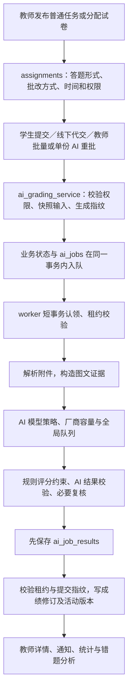

# LanShare 三类任务、成绩业务闭环与多模态模型分层改进计划

日期：2026-09-07。版本：v2。本文保留调查时的设计与验收要求；后续已按用户指令实施并进行隔离验证，实际变更、旧数据保护证据和发布状态见 [实施记录](assessment-routing-implementation-2026-09-07.md)。本文第 2 节的线上状态是调查快照，不能当作实施后的线上已生效配置。没有新增付费模型调用。

**本版正式分类固定为“平时作业／期中测验／期末测验”，替代上版建议的“作业／测验／考试”。** 同步规划教师发布与批改、学生答题与查分、课堂统计、平时成绩表、期末成绩来源和历史材料更新，不能只改分类标签或模型参数。

## 1. 目标与已经确定的决策

采用统一的业务路由：**需要视觉证据的期中测验、期末测验用豆包 Pro high；平时作业用同一 Pro low；聊天等辅助看图用 Lite low；纯文字处理继续用 DeepSeek。** 两类测验均为关键评分业务，不能因为名称为“测验”而降档。在现有模型策略、附件解析、持久任务与成绩版本体系中实现，不另造一套批改服务。

沿用上轮已明确的模态边界：纯文字的期中／期末测验仍用 DS 深度文字模型；一旦需要读截图、扫描页或图形证据，整次评分使用 Pro high。高档模型用于提高可靠性，分数准确还依赖证据完整性、确定性规则、结果校验和教师复核，不能仅凭型号承诺绝对准确。

“最高思考深度”应实际发送 `reasoning_effort="high"`。当前 Pro 2.1 的 `max/xhigh` 最终也映射到 high，不能把日志里的 max 当成更高质量档。Lite 先采用已经小测过的 enabled + low，不在本次实施中顺带改为关闭思考。[官方思考说明](https://www.volcengine.com/docs/82379/1449737)、[参数组合说明](https://www.volcengine.com/docs/82379/2123288)

| 实际输入与业务 | 目标执行档 | 模型与实际思考参数 |
|---|---|---|
| 无需视觉证据的任何文字处理，包括纯文字的三类任务批改 | 现有 DS 文字快档／深度档 | 保持 DeepSeek 现有文字型号；批改使用深度文字档 |
| 期中测验：必须阅读图片／扫描页／视觉文档的批改及明确用于该任务的出题 | `assessment_vision_high` | `doubao-seed-2-1-pro-260628`，thinking enabled，high |
| 期末测验：必须阅读图片／扫描页／视觉文档的批改及明确用于该任务的出题 | `assessment_vision_high` | 同一 Pro，thinking enabled，high |
| 平时作业的视觉批改、明确用于平时作业的看图出题 | `assignment_vision_low` | 同一 Pro，thinking enabled，low |
| 课堂和全局 AI 聊天、公开 @助教、后续私信／博客看图 | `auxiliary_vision_lite` | `doubao-seed-2-0-lite-260428`，thinking enabled，low |
| 教案、考核计划、教学评价、简历、材料库等结构化文档的必要视觉解析 | `document_vision_low` | Pro low；这是对用户未逐项列举业务的建议默认值 |
| 独立的轻量 OCR、验证码识别 | `auxiliary_vision_lite` | Lite low；若 OCR 属于考试证据链，则继承考试档，不先经 Lite 丢失证据 |

这里的“纯文字”指**当前调用已经具备完成任务所需的文字证据**，不单看文件扩展名。扫描 PDF 不属于纯文字；原图不可读、提取失败也不能伪装成纯文字成功。有充足文本且版面／图形与任务无关时，应保留现有文字优先路径。

重要边界：

- 作业有没有 `exam_paper_id` 只反映答题形式，不能决定模型等级。
- 聊天消息写着“期末考试”，或引用了一张试题图，并不会变成正式考试批改业务。边缘入口仍是 Lite。
- 一次 OCR 完成后，独立的文字整理、检索、摘要继续 DS；正式考试的视觉证据不能被一次低档 OCR 永久替代。
- 不扩大 AI 自动批改范围：原来人工批改的任务仍人工批改，教师明确发起 AI 批改时再应用新策略。
- Qwen、GLM、Kimi 的已有配置可保留供后续显式使用，但不加入这套默认多模态路线或隐式评分回退。

## 2. 调查范围、线上事实与证据限制

已检查应用入口、业务服务、数据库分类、附件构造、AI 服务集中路由、Chat／流式／Responses 调用、持久任务与回调、成绩版本、并发、重试、预算和费用统计，并复核已有小样本结果及官方参数。

### 2.1 线上只读核验

下表来自上轮同日对线上环境文件非敏感配置、容器运行环境、AI 内部 health 和数据库的只读核验；本次补计划复核的是最新工作树相关代码，没有再次查询线上数据库。此前数据库查询使用只读事务和 5 秒语句超时，仅返回字段与汇总计数，没有输出密钥、学生答案或个人信息。

| 项目 | 本次核验结果 | 对实施的意义 |
|---|---|---|
| 实际启用厂商 | DeepSeek、Volcengine | 不能把源码默认顺序当成实际调用结果 |
| 声明的视觉顺序 | 轻／深视觉 Qwen → 豆包 → GLM；评分 Qwen → 豆包 | 这是旧策略，必须显式替换，不能仅改豆包型号 |
| 线上豆包轻档 | `doubao-seed-2-1-turbo-260628` | 当前并不是本次选定的 Lite |
| 线上豆包深档 | `doubao-seed-2-1-pro-260628` | 可以继续使用，需增加真实 high／low 参数 |
| 凭据加载状态 | 千问未配置；GLM 已在环境文件中，但运行容器未加载 | 日后重建容器可能改变可用厂商，发布时要核对有效策略 |
| AI 全局容量 | 6；豆包 2；DS 4；候选／全局等待上限 200 | 初期不增加总并发 |
| durable worker | 已启用，工作并发 2 | 新策略必须覆盖任务恢复与回调 |
| 兼容批改队列 | health 显示最大并发 4、待处理上限 200，核验时待处理 0 | 不把示例 env 的数值误当线上值；两条批改路径都需覆盖 |
| 文字溢出 | `AI_TEXT_SPILLOVER_ENABLED=true` | 目前 DS 满载可转豆包，需要明确取消普通文字自动溢出 |

线上 `assignments` 没有正式的作业／测验／考试业务字段。现有相关列是 `grading_mode` 与 `ordinary_grade_kind_override` 等统计字段。共 98 个任务：

| 平时成绩用途覆盖值 | 无试卷 | 有试卷 |
|---|---:|---:|
| 未设置 | 2 | 85 |
| assignment | 0 | 9 |
| exam | 0 | 2 |

其中 **9 个带试卷的任务被教师归为平时作业**，直接说明按 `exam_paper_id` 一刀切会误升档。98 个任务不等于 98 次待批改，更不等于 98 份有图作业，不能据此估算调用费用。

线上核验是当时快照；实施和发布前须重查，不将本计划中的运行参数当作永久配置。调用链的行号来自本地当前工作树；本轮没有逐文件证明线上代码与工作树完全一致。

### 2.2 已有小测支持的判断

三份相同作业的原 Pro 合计估算 ¥0.836586，Pro low 为 ¥0.372792，减少约 55.4%；Lite low 为 ¥0.0267276。Pro low 保住了错箭头和前八题明确扣分，Lite 在复杂卷第 6–8 题漏扣共 14 分。**这些支持分层使用，不支持“某档可以完全代替教师”。** 两款 Pro 都有漏计正面附件证据的问题。

样本只有三份、每配置一次；原 Pro 与低档测试还同时调整了输出上限。不能承诺全站节省固定百分比，也不能将学生得分当成模型能力得分。原始证据见 [豆包降本小测](C:/Users/AngelWei/Nutstore/1/Projects/lanshare/docs/ai-vision-doubao-low-comparison-2026-09-07.md)。本计划不追加模型比较。

## 3. 当前业务链路与需要保留的合同

### 3.1 发布、提交、批改、写回



普通创建入口默认 `grading_mode=manual`；试卷分配入口使用 AI 批改。学生提交、线下代交、教师批量批改、手动 AI 重批、个人阶段试炼，最终汇入 `ai_grading_service`。新分类需从这里进入统一任务数据，而不是仅补一个页面参数。

当前 AI 服务依据图片／原生 PDF 是否存在，选择 `multimodal_grading` 或 `deep_text_reasoning`，没有进一步区分业务类型。应保留“文字走 DS”的原则，再为视觉调用解析业务档。

必须保留以下已有行为：

1. 任务入队与业务状态的事务一致性；网络调用期间不持有数据库事务或行锁。
2. 租约、`submission_fingerprint`、输入修订哈希及附件哈希机制；同时补齐第 6.3 节指出的量表／试卷更新后的过期写回校验。
3. 结果先落 `ai_job_results`，回调失败只重放写回，不重新调用模型。
4. AI 重批失败保留原有效成绩；人工修改后旧 worker 不得覆盖。
5. 使用现有 `submission_grade_revisions` 与活动版本指针，不另建第二套成绩表。
6. 单选、严格匹配、分值上下限、逐题加总、迟交扣分等已有规则继续生效；有附件不能因为正文为空就当作无答案，原始模型分与迟交处理后的成绩不得混淆。
7. 页面 GET／轮询不触发新批改或错题总结；现有主动触发与状态提示保持完整。

目前有效 AI 结果即使 `needs_review=true` 也可能以 graded 写入成绩，再通知教师；只有终止错误 `grading_review_required` 进入无分待人工状态。**本计划不顺带改成“所有有风险成绩自动冻结”**。需要让复核原因随成绩版本保留并向教师可见；是否引入正式的审核后发布制度，应另作成绩发布规则变更。

### 3.2 其他入口全景

| 入口 | 当前能力与调用位置 | 改进安排 |
|---|---|---|
| 全局 AI 助手、课堂 AI 聊天 | `routers/ai.py:2187,2400` → `_process_chat_file:670` → chat-stream | 图片 Lite；纯文字 DS；深度思考开关不能越过场景档位 |
| 课堂公开 @助教 | `routers/files.py:619` → `discussion_ai_service.py:349,439,559` | 流式／非流式均 Lite；保留当前图／引用图的权限与来源标签 |
| 私信 AI 助教 | `message_center_service.py:2951` 明确拒绝附件，`:3171` 固定文字任务 | 目前文字 DS；新增图片传递后才谈 Lite 路由 |
| 博客 @管家 | `blog_ai_service.py:299–342` 只发送文字；图片只有数量信息 | 新增受权限约束的图片输入，不能声称现在已经能看图 |
| 教案、考核计划、教学评价导入 | 对应 import service，使用 document_multimodal_understanding | 需要视觉时 Pro low，否则 DS；“考核计划”名称不构成考试业务 |
| 简历导入 | `resume_import_service.py:248–269` | 保留文本长度、图片条件和确认合并流程，必要视觉 Pro low |
| 材料库统一导入 | `material_ai_import_service.py:506–548` | 保留先文本、无有效结果且文字不足才视觉的流程，视觉 Pro low |
| 公文扫描 OCR、登录验证码 | `gongwen_content_service.py:100–131`、`gongwen_integration_service.py:223–260` | 独立识别 Lite；后续文字处理 DS |
| 带参考图出题 | `routers/ai.py:2944–2998,3336–3481` | 清除以 force_platform 代替业务策略的做法；durable／旧路径共同传递任务用途 |
| 教案／课次材料／LessonDoc 生成，资源分类，文字简历建议等 | 现有 deep_text／fast_text 调用 | 保持 DS，不能因为所属页面有图片就整体切豆包 |
| 教师任务工作台 | `routers/agent_tasks.py:83–115` 把原文件交给独立 runtime，应用侧只产生尺寸文字 | 声明独立执行边界；统一 AI 服务策略不会自动约束外部 runtime，本轮不擅自更换其模型 |

现有软件信息与通用联网检索还有独立的豆包 Responses + web_search 适配器（`ai_assistant.py:4304,4561,4596`）。它包含检索及豆包生成的检索摘要／软件描述、下载地址等最终字段，并非只返回原始搜索结果，软件信息也没有再经过 DS。建议保留这项受登记的现存工具依赖及必要输出，单独标注、限额、计费；独立的后续文字任务仍 DS，不为同一摘要再追加一次 DS 改写。本次不扩展它为文字模型溢出通道。若要连检索工具本身也完全移除豆包，需要单独选择和接入搜索后端，不能靠一次 provider 改名完成。

## 4. 当前架构的关键缺口

| 缺口 | 源码依据 | 不修复的后果 |
|---|---|---|
| 没有权威任务类型 | `ordinary_grade_record_service.py:160–194`；`homework_parts/assignments.py:11–77` | 标题、试卷形式或统计用途被误当考试等级 |
| 通用任务类别不包含业务风险 | `ai_model_policy.py:19–93` | 所有视觉批改只能共用一个型号和档位 |
| 豆包只开 thinking，不发送 effort | `ai_assistant.py:591,3486,4142`；Responses `:3196` | 日志写 low／max，线上可能仍按默认 high 计费 |
| 旧视觉供应商优先级仍有效 | `ai_model_policy.py:140–155` | 新增／重新加载密钥后可能重新走千问、GLM |
| 评分权限仅是供应商描述 | `ai_assistant.py:465` 没有强制 authoritative_grading | 环境顺序可以使不该评分的路线进入最终批改 |
| 回退按厂商去重 | `ai_assistant.py:3762–3777` | 无法区分同厂商 Pro low 与 high，或误重复尝试 |
| 主模型是豆包就跳过仲裁 | `ai_assistant.py:4965–4970` | 普通作业切 Pro low 后，风险升级无法执行 |
| 返回请求模型，而非真实执行模型 | `ai_assistant.py:5026` | 回退结果不可正确审计 |
| 内容修改不一定废止活动批改 | `routers/ai.py:418–436` 主要比对已存令牌；`assignments.py:235–285` 和 `exam_papers.py:56–74` 更新内容时未同步使令牌失效 | 不能声称已有指纹机制已完全拦住修改量表后的旧成绩 |
| 并发是进程内、按厂商计数 | `ai_assistant.py:647,799,877` | Pro 长任务和 Lite 聊天互相占位；不能把它说成跨副本限流 |
| 计费按 light／deep 固定单价 | `ai_assistant.py:323,1062` | Lite 成本、输入阶梯、缓存及同型号不同档位统计失真 |
| 部分调用绕过 App 网关 | `core.py:35`，各服务直接 `ai_client.post/stream` | 只在 ai_gateway_service 改策略或预算无法覆盖全站 |
| 聊天图文列表错配 | `routers/ai.py:2281–2288,2577–2584` | zip 图片列表和含文本附件列表，混合上传时可能漏图、错名 |
| 聊天文档内图片丢弃 | `routers/ai.py:708–716` | 扫描 PDF／DOCX 图片被当成空文字，用户以为模型识别失败 |

新的业务档位应在 **AI 服务的实际模型调用层统一落实**；App 网关仍负责其已有任务统计、优先级与业务额度，不强制为此次改造把所有调用重写到网关。

## 5. 三类任务与教师、学生、成绩统计的完整合同

### 5.1 唯一权威分类与分工

新增 `assignments.assessment_kind`，面向正式课堂任务只允许以下三个值，统一字典供后端、SSR、React、API、导出和通知使用：

| 稳定值 | 两端显示名称 | 视觉评分等级 | 新建正式成绩材料的来源资格 |
|---|---|---|---|
| `homework` | 平时作业 | Pro low | 平时成绩表的作业来源槽 |
| `midterm` | 期中测验 | Pro high | 平时成绩表的测评来源槽 |
| `final` | 期末测验 | Pro high | 期末考核登分表／期末分来源 |

过渡期允许 NULL，并保留分类来源、版本、更新时间和教师审计；新增正式任务不得遗漏分类。上版 `assignment | quiz | exam` 只是未实施的建议，本版直接替换，不能作为另一套新枚举同时保留。数据库已有的 `ordinary_grade_kind_override=assignment/exam` 仍是历史统计字段，不据此重命名或迁移为期中／期末。

必须分开四个概念：

- **业务分类**：assessment_kind，决定正式任务分组、视觉档位及新成绩来源资格。
- **答题形态**：由 exam_paper_id 等已有事实决定是在线试卷、文本／文件提交，前端可显式接收 `has_exam_paper`／`answer_mode`；不决定三类标签。
- **计分方式**：现有 grading_mode、评分量表、迟交、小组互评等；仅修改分类不改变这些规则。
- **正式成绩来源**：教师确认的具体任务／材料 ID；同类多个任务不自动全部入总评。

现有“平时成绩用途”下拉只有 auto／assignment／exam，且承诺不改变批改。新分类选择器应明确替代正式任务上的旧二分展示；旧覆盖字段仅保留历史兼容，不得成为与新分类冲突的第二个实时分类真值。已确认三分类的任务不再由旧接口更改新材料的来源资格；旧页面应引导到“任务分类”，旧接口对冲突操作返回明确错误。未确认旧任务可继续按兼容规则查看历史统计，但新建正式材料前先确认分类。

历史已保存的来源选择和材料快照不被自动改写；新建／明确更新的材料遵循新资格。这样既保留旧记录，又避免“学生看期末测验、系统却将其自动算作平时作业”的矛盾。

### 5.2 创建、发布、修改、复制和特殊任务

1. 教师新建正式任务显示三个选项，普通创建明确默认“平时作业”；创建期中／期末入口写对应值。草稿、预览、正式发布均保留选择，后端校验所属课堂及教师权限。
2. 从试卷库分配同样必须选择分类，不能因使用试卷默认期末。平时作业可以在线答卷；两类测验也可以提交作品／截图，不强制改成结构化试卷。
3. 已发布后修改分类，先由服务器计算影响摘要：涉及的学生任务标签、筛选统计、未来 AI 档位、是否被正式材料引用。保存时校验版本防止并发覆盖；只更新分类和审计，不重批、不改分、不重置答题、截止时间、互评或通知去重标识。
4. 新分类立即用于实时任务分组；已启动批改保留其执行快照，成绩详情能追溯当次分类和档位。已经生成的材料保留旧分类快照并提示来源有变化，由教师明确更新。
5. 复制／再次分配生成新的 assignment_id，携带或显式确认分类；不复制学生提交、成绩、成绩版本、个人试炼绑定和正式材料选源。原已选定的 3+1／期末来源不能自动换成新副本。
6. AI 出题尚未发布时，保存受验证的 intended_assessment_kind 到生成任务；无明确用途的通用草稿按一般档，正式期中／期末看图出题按 high。共享 exam_papers 不能绑定一个全局分类影响其他课堂用途。
7. 个人阶段试炼是已有的独立学习功能，不能把旧方案的 quiz 机械改为“期中测验”。根据 `learning_stage_exam_attempts` 和已有目标查询派生 `source_feature=personal_stage`，保留个人可见性、晋级规则及独立统计范围；该内部任务的 assessment_kind 可不适用，不作为正式三分类的第四个选项。文字仍 DS，若需要视觉则保持其原有高质量策略；不得进入全班正式三类成绩来源、未交人数分母或总评。

### 5.3 历史任务迁移与旧材料兼容

1. 先加兼容字段，不改既有成绩、不触发 AI，不将标题规则放进实时 resolver。
2. 生成一次建议清单：任务 ID、课堂／学期、已有用途、结构化来源、建议分类、建议依据、冲突、关联正式材料及预期影响。
3. 只有明确“期中”才建议 midterm，明确“期末”才建议 final；一般作业／实验可建议 homework。仅含“考试”“测验”“随堂测”或旧覆盖 exam，无法区分期中期末，保持待确认。个人阶段试炼先按来源排除，不能占据期中名额。
4. 教师按课堂批量确认，冲突项单独处理。此前核验的85个无覆盖带卷任务不能全部填 final，9个统计为assignment的任务也不直接把旧选择变成新批改授权。
5. 未确认旧任务在教师端显示“分类待确认”，学生端显示中性历史任务标签，不猜测期中／期末；视觉批改沿 legacy_unknown 的 Pro high，纯文字 DS。它是迁移状态，不开放为新任务第四类。
6. 已生成材料保持来源 ID、成绩和公式不变。下一次创建／显式更新时若发现来源不符合新资格，列出冲突并选择正确来源，不擅自找同名任务替换。允许查看、导出原历史版本，并标注其形成时的分类／规则。
7. 完成活跃任务分类后收紧新正式任务写入约束。SQLite、PostgreSQL 建表／补列／required columns 一致；数据库枚举或 CHECK 限定三个值及兼容 NULL，不依赖前端校验。

新增索引按真实新查询决定：课堂、学期、分类过滤应使用教学班范围的批量查询；先看已有索引和执行计划，再决定是否增加如 `(class_offering_id, assessment_kind, status)` 的组合索引，不为一个三值字段单独建无效索引。

### 5.4 教师端与学生端必须成对改造

| 流程 | 教师端 | 学生端与共同合同 |
|---|---|---|
| 发布与编辑 | 三分类选择、预览、复制、试卷分配同一字典 | 只见已发布且有权限的任务；名称与教师保存值一致 |
| 课堂列表／历史抽屉 | 三类标签与筛选，提交／评分进度保留 | 同样三类标签和筛选；不因关闭而丢失历史成绩 |
| 首页／课程日程 | 分类进入任务摘要，截止与提醒按原规则 | 移动端、首页日程、课堂卡片、通知、微信小程序一致 |
| 任务详情／答题 | 分类、答题形式、量表、批改模式分开显示 | “进入答题／去提交／查看结果”依实际形态和状态判断，不能因为homework就打不开在线试卷 |
| 提交、草稿、附件、重交 | 批量／单份／代交／补附件均绑定原任务类型 | 类型变化不清空草稿、不重复提交；限时、开放时间、迟交与退回权限不变 |
| 批改与复核 | 两类测验视觉high；显示评分版本、复核原因和修改来源 | 只看本人可见结果、反馈、迟交说明及适合学生的复核提示，不展示模型内部思考或其他人成绩 |
| 查分／导出 | 同一有效成绩事实支持列表、详情、统计、导出 | 网页成绩单、小程序、复习Word及HTML／JSON均执行相同权限与公布规则 |
| 正式成绩 | 分类决定候选资格，教师选定具体来源 | 区分任务分、平时成绩、期末分、课程总评，不能用任务均分冒充正式总评 |

当前新课堂界面也必须覆盖：`classroom_page_service.py:148` 仍按试卷绑定产生kind；`frontend/src/islands/classroom-workspace.tsx:259` 用它显示“考试／作业”；`frontend/src/lib/classroom-workspace.ts:36` 用它决定进入考试按钮。应同时改 SSR 数据、bootstrap JSON、React 类型／渲染、历史抽屉和无JS回退，不仅修改旧模板。

API 新增规范字段 `assessment_kind`、`assessment_kind_label`、`classification_status` 和明确的答题形态。旧 `kind/is_exam` 若还被客户端用于答题路由，过渡期保留原语义并标为兼容字段，不能突然改成三态。前端只显示服务器给出的标签，不自行按标题或有没有试卷推断。

### 5.5 共用成绩事实与可见性，修正查分差异

扩展现有成绩服务，形成供列表、统计、学生成绩单和导出复用的批量读取／投影接口。必要字段包括：任务及学生ID、课堂／学期、分类及来源范围、当前有效成绩版本、成绩与分制、评分时间、重批中、缺交记零、迟交、复核、小组揭晓、对当前查看者的可见性。复用现有成绩版本和小组服务，不另建一张复制所有成绩的汇总真值表。

已发现必须处理的现有差异：

- 教师详情统计将已评分记录和教师确认缺交零分纳入均分，但学生任务详情遇到缺交记分会直接把submission置空（`assignment_pages.py:128–129`），成绩单也排除缺交零分。应区分“没有答卷”与“没有成绩”：学生可见“未提交，教师记0”，能否补交仍由原规则判断；没有答卷则继续不能导出复习Word。
- 学生成绩单 `student_report_card_service.py:35–69` 直接读graded分数，未复用小组揭晓门控；`:118–132`只按course_id分组、按有无试卷显示类型。要按教学班和学期隔离，补三类分组，并在服务端先过滤不可见分数再计算均分、趋势、分位，不能只在模板遮挡。
- 小组综合分由 `group_assignment_service.py:663–680`直接写回submissions，目前未同步成绩版本。新投影不能简单改读active revision导致综合分回退为原始分；应让小组最终结算也复用成绩版本服务，保留原始作业分与互评台账，综合分只算一次。小组未揭晓时，网页、API、小程序、通知和导出都不能泄漏原始分、反馈中的分数或互评明细。
- 重新批改中仍可能有上次有效成绩。有效成绩是否存在不能只由 `status='graded'` 决定；未撤销的旧有效分继续展示并注明“重新批改中”，新结果生效时替换一次，失败保持旧分。明确撤销／失效的成绩不参与当前有效均分，历史版本仍可追溯。
- 无样本时现有统计返回平均分0。新共同统计返回有效样本数及可空均分／最高／最低／及格率，两端显示“暂无有效成绩”，不能显示成全班0分或0%及格。

`submissions.score`是现有业务处理后的百分制任务分：确定性评分已经按试卷总分归一化到100（`deterministic_exam_grading.py:269–276`）。新统计不能再除一次试卷满分。逐题原始分、卷面满分、百分制任务分、迟交前后分、小组综合分应有明确字段及来源；其他导入来源若分制不同，只在分制明确时转换比较值，不能猜测或回写原分。

还需修正正式材料的一处分制边界：`exam_grade_record_service.py:378–388`目前直接把submissions.score当卷面总分，并按原试卷满分封顶。原卷满分50、已归一化任务分80时，可能误生成50。实现时显式区分卷面分项与百分制期末分：例如40/50对应80/100，保留原卷分项和总分／满分，同时向期末成绩单提供明确的百分制期末分80，不能变成50或160。沿用模板整数分项要求时，记录确定性的换算与舍入规则，不能从已经取整的分项反算并覆盖有效百分制成绩；无法证明分制与来源一致则阻止正式公布，显示需要核对的字段。

### 5.6 统计分层与正式成绩来源

#### A. 任务运行统计与学生成绩概览

每个课堂／学期按三类分别统计任务数、应参与人数、已交、未交、待批、批改中、无分待复核、缺交记零、有效分人数和覆盖率。迟交、退回、重批、有分待复核是可能交叠的标记，不应直接相加当总人数；接口文档要标注分母与交叠关系。

任务均分、分布和及格率只使用当前有效成绩，包含明确记录的缺交0，排除普通未交／未评分／无分待复核；展示“有效N人／应参与M人”。名单由现有合班、在读、重修和任务范围服务统一获取，不把个人阶段试炼扩展为全班应考。

学生 `/report-card` 改成按教学班／学期分组，再按平时作业、期中测验、期末测验筛选的“任务成绩”。历史趋势只比较同范围、同类、相同分制的可见成绩；个人阶段试炼单列学习记录。保留匿名班级分位至少5个有效可见样本的限制，不暴露他人个体成绩。

跨任务概览标为“已评分任务均分”，展示有效任务数与覆盖范围；同类多份测验可以展示统计均分，但它不是正式计分来源选择。原跨全部任务的平均值不得叫“总评”，也不得将一次人工改分或AI重批版本当成又一次测验。

#### B. 保持既有两层公式，三分类不等于三项权重

| 层次 | 当前规则 | 新分类对应 |
|---|---|---|
| 平时成绩表 | 出勤×40%＋选定3份作业均分×30%＋选定1份测评×30% | 3份均来自homework；1份来自midterm；同一任务不得重复占槽 |
| 考核登分表／期末分 | 教师明确选定的具体任务或经过验证的成绩材料 | 来源须为final，排除个人试炼；不是所有final任务平均 |
| 期末成绩单 | 按教务名单学号合并同课堂／学期的平时成绩表与考核登分表 | 继续校验名单、来源、版本与缺失，不用三类均分替换 |
| 教务总评校验 | 平时×40%＋期末×60% | 保持既有规则；不能另造“作业40%＋期中30%＋期末30%” |

证据：`ordinary_grade_record_service.py:266–295,1420–1439`；`final_grade_transcript_service.py:521–610,719–726`；`academic_final_material_service.py:579–590`。其中平时成绩内部的40%是出勤。`final_grade_transcript`数据中的final_score是期末分，其他教务校验结构的final_score可能表示总评；新共享API必须使用明确的 `ordinary_score / final_exam_score / overall_score`，不能凭同名字段混用。

新建平时表的测评来源只选期中测验，期末测验不能同时进入该30%槽和期末分来源，防止重复计分。新建／更新接口都校验资格、课堂学期、不同槽不重叠，前端筛选不能替代后端校验。现有旧override不得绕过这条规则。

同一课堂允许多份期中或期末任务，但正式表格继续明确选择一份测评及一份期末来源；不自动取最高、最新或均分。补考、重修、免修等沿用已有确认名单和政策，不因为同属final就自动覆盖原期末成绩，也不新增第四个正式分类。

无结构化试卷的期末作品／截图任务仍可以high批改、学生查分和一般成绩导出。学校“大题分项考核登分表”当前需要可识别的大题与分值（`exam_grade_record_service.py:241–247,777–800`）；此时显示缺少结构化评分项，要求教师补齐真实分项或使用已验证导入流程，不能为了导出编造题目，也不能把三类都强制改成试卷形式。

#### C. 缺分、保底及人工调整必须明确

运行看板不把未评分当0；正式平时成绩表目前则会将缺失来源转0并警告，固定三份作业分母，同时存在最低分保护、人工调整与重修默认分。这些是材料规则，不是AI识别结果，不能被新分类默默删除或套到原始提交分上。

保留现有历史公式和调整数据；新建／更新正式材料先提供完整性检查：来源类型、缺分人数、正在重批、无分／有分待复核、小组未结算、成绩内容过期、重修默认分和材料人工调整。草稿可按原有规则形成并带警告；不能把“候选至少一人有成绩、可生成草稿”等同于“全班成绩可正式定稿”。默认要求完成评分／确认缺交后再定稿；确需沿用缺失按0的材料规则，应明确列明名单、规则及教师确认记录。

检查还须比较“当前任务分类”与“评分时分类／实际档位”。例如平时作业经low评分后改为期末测验，旧分保留，但新标签不意味着已经用high重批；显示该来源差异，历史无档位记录则显示未知。正式核验提供显式high重批或教师人工核对并记录确认；不自动增加模型费用、改分或冻结单份有效成绩，未处理的差异不得被默认为已完成关键测验质量核验。

保底或材料人工调整只修改派生材料，不回写学生任务原始成绩；展示来源分、调整后材料分和规则，避免教师或学生把差异误认为模型乱改分。迟交只按已有流程扣一次，小组综合分只按原始作业台账合成一次。

### 5.7 成绩查看与正式成绩公布

本次必须先完成两端三类任务成绩的同源展示，包含0分、无分、复核、重批和小组揭晓。学生始终只见本人已允许显示的内容；新增班级分布也须先按公开资格过滤，不能通过均分和分位泄漏尚未揭晓的小组分。

正式“平时成绩／期末成绩／课程总评”与任务成绩分区。建议在本计划的成绩闭环阶段加入教师对明确来源版本的受控公布：公布记录关联课堂／学期、材料及内容版本、确认教师和时间；校验来源及完整性后，只提供本人结果投影。优先复用既有材料版本与发布能力；如果没有学生公布状态，则补最小持久化的公布记录，不把“材料已生成”自动解释为“全班成绩已公开”。

公布快照必须可重建：现有一键更新会原地修改材料，仅存record_id＋updated_at／哈希不够。应引用真正不可变的材料版本；若不存在，则在公布记录内冻结最小逐学生值（身份主键、平时分、期末分、已确认的总评及其可用状态）和明确的分制、公式、来源版本摘要，另存active／superseded／withdrawn状态及公布、替代、撤回操作者和时间。冻结值只用于重现已公布版本，不开放为另一套可编辑的实时评分来源；通过新源版本重新核验后再发布修订。

没有可确认的正式来源时显示“尚未公布”，不现场用任务均分计算总评。现有登记材料若只提供平时分和期末分，未经对应计算／教务校验的结果不得标为“正式总评”；可显示带规则说明的计算预览供教师核对。学生端绝不直接获得整班成绩Excel、来源材料完整JSON或他人姓名学号。

公布后的来源分改变，原公布快照保留并在教师端标记有更新；教师核对后明确发布新版本或撤回，学生看到对应更新时间，不把GET、AI回调或一键更新变成自动发布。普通单份任务现有有效成绩发布合同继续保留，这项正式成绩公布不把每次作业评分都新增一道审批。

### 5.8 生命周期、刷新与历史可追溯

| 事件 | 实时两端及统计 | 正式材料／公布结果 |
|---|---|---|
| 分类修改 | 标签、筛选和未来路由按新值；已运行AI保留快照 | 不改历史分；相关材料标记分类／资格已变化 |
| 教师改分／AI新结果生效 | 原子更新当前分与版本，刷新相关课堂和本人视图 | 上游成绩版本变化，材料显示待核对／更新，不自动重算 |
| AI失败／回调重放 | 保留旧有效分；无旧分则明确待处理；不重复计数 | 不重复生成材料或公布通知 |
| 缺交记0／补交／撤回 | 实际0与无成绩分开；操作权限和有效状态一致 | 原来源版本保留，新材料按明确缺分政策处理 |
| 小组最终结算／成员重批 | 按原台账计算综合分，更新对应版本和揭晓状态；不泄露未公布分 | 已选来源发生变化时提示，不重复混合80%作业分和互评分 |
| 关闭／归档 | 关闭答题不取消成绩资格，教师和本人继续查历史 | 归档快照保留；硬删来源要显式缺失，不能以同名副本替换 |
| 复制／再发布 | 新任务和新提交空间，类型明确 | 不自动加入旧的3+1或期末来源，不继承学生成绩 |
| 材料一键更新 | 不修改学生原任务分 | 复用现有source IDs更新流程；先提示会覆盖的材料人工调整，校验类型和上游版本，公布版本不自动跟随 |

来源快照沿用 `source_assignments / source_exam / source_lineage`，补分类及版本、所选任务ID、有效成绩版本摘要、名单版本、公式和缺分／重修／调整策略版本。内容哈希或版本摘要在写入／更新时生成，读取时批量核对，不在每次打开成绩单时逐个渲染材料或触发AI。

实时统计不再各页面复制SQL：统一批量获取课堂／学生授权范围和当前成绩事实，分页与按课堂学期限制范围，避免每条任务查询一次小组状态或全文扫描所有历史提交。API响应给出数据版本；前端筛选和异步刷新使用请求版本防止旧请求覆盖新分类。需缓存时按课堂、学期、用户权限、分类及成绩版本区分，在变更提交后失效相关键，不全站清空。

### 5.9 旧数据保护的上线硬门槛

三分类采用增量兼容迁移，不以重建业务表、删除历史行或重算成绩完成升级。新增分类及必要元数据之外，迁移本身不得改写既有任务ID、提交答案、附件内容／关联、量表、成绩、反馈、旧成绩版本或已生成材料的正文与公式。

上线前必须完成以下验证，不能只以“页面能打开”作为旧数据安全的证明：

1. 在生产备份副本上执行迁移和重复迁移，核对任务、提交、附件、成绩版本、材料的记录数量及主键／关联关系；既有答案、分数、反馈和材料内容按确定性摘要对比，不得发生计划外变化。
2. 覆盖旧任务未分类、已归档、缺交0、人工改分、有分重批、小组综合分及无新成绩版本字段的历史记录，确认教师、学生、下载和统计兼容读取，不能因新查询条件漏掉旧成绩。
3. 对附件备份和存储关联做完整性核验；数据库升级不搬迁、重命名或清理旧附件目录。验证旧答卷和历史成绩文件仍可打开。
4. 分类确认只改变新增分类与相应实时分组，不自动重批或改分；历史材料只读其原快照。分制等缺陷修正作用于明确的新建／更新流程，不能借升级批量改写历史原始分或归档文件。
5. 备份同时覆盖数据库和必要文件，并演练恢复。上线回滚优先切回兼容代码与策略；有新提交产生后，不能直接用旧整库备份覆盖当前库而丢掉上线后的学生数据。必须恢复数据时，先停止相关写入、保全当前数据并制定增量恢复方案。
6. 记录迁移前后对照结果和允许变化清单。任一原分、答案、反馈、附件关联或历史材料出现未解释差异，停止上线，先修复迁移／兼容读取问题。

因此要区分两类结果：**旧存储数据保持完整**；教师确认新分类后，实时类别计数、筛选及新材料来源资格会按新规则变化。后者属于明确的业务调整，不能误称为“所有统计展示完全不变”。

## 6. 统一执行计划与调用协议

### 6.1 复用现有 task_type，增加受信任的业务上下文

保留现有 9 类 `task_type` 表达“做什么”，在 `ai_model_policy.py` 增加业务上下文和不可变执行计划。不要把 OCR × 业务 × 厂商 × 档位扩展成几十个 task_type，也不要在各入口重复 if／else。

建议接口结构如下，字段名可在实施时按项目风格统一：

```text
AIBusinessContext
  operation / source_feature
  assignment_id / intended_assessment_kind
  assessment_kind / classification_source
  job_id / logical_call_id / policy_version

AIExecutionPlan
  profile_id / route_id
  provider / model / capability / api_style
  thinking_type / reasoning_effort / max_output_tokens_total
  allowed_operations / allowed_fallbacks
  quality_floor / attempt_budget / policy_version
```

`profile_id` 区分业务档；`route_id` 区分实际厂商、型号、effort 和协议版本。同一个 Pro 的 low 和 high 必须有不同 route_id，不能再只按 provider 去重。每次调用使用独立、不可变的计划和参数副本，不临时修改共享 `PLATFORMS_CONFIG` 来切换档位，避免并发请求串档。

上下文由有权限的服务端业务入口组装，评分时从数据库读取任务类型。普通前端不能指定 provider、raw effort 或降级路径；文件内容、学生答案、任务标题、附件中的指令也不能改路由。AI 内部接口接受的是服务间上下文，部署保持既有内部网络边界；实施时验证外部用户无法直调并伪造它。

解析顺序：

1. 校验业务操作、资源权限与附件是否真实存在，构造完整证据清单。
2. 确定本次调用是否需要视觉；不需要则进入 DS 文字策略。
3. 需要视觉时，按受信任的入口和任务类型选择业务档。正式midterm／final、受控个人阶段试炼的既有高质量视觉路径，以及第 8.2 节受限的平时作业风险复核可以选择high；内部个人任务先按来源识别，不能把分类NULL误作普通未知任务。边缘聊天的“深度思考”按钮不能升级业务档。
4. 验证模型支持该输入与输出协议，且被允许承担该操作；Lite 永不作为成绩评分或评分仲裁候选。
5. 生成实际执行计划，预估输入／输出规模并通过容量与尝试限制，再调用厂商。
6. 将实际执行信息、输出完整性与 usage 一起返回，供结果和日志审计。

### 6.2 参数只在共享适配器转换一次

| 协议 | Pro high／low 与 Lite low 的参数落地 |
|---|---|
| Chat 非流式 | thinking enabled；reasoning_effort 为档位值；max_completion_tokens 为总输出上限 |
| Chat 流式／事件流式 | 与非流式同一执行计划；统一捕获 usage、finish reason 和已输出状态 |
| Responses／原生文档兼容路径 | reasoning.effort、对应 thinking 配置、max_output_tokens；不能直接照搬 Chat 字段名 |

Chat 总输出上限包含思考及答案，与 `max_tokens` 不能同时发送；Responses 的 `max_output_tokens` 也包含思考。当前官方 Chat 范围上限为 65,536，应再受具体模型能力约束。日志记录 **实际发送参数**，不复用只对 DS 生效的通用 effort 文案。[Chat API](https://www.volcengine.com/docs/82379/1494384)、[Responses API](https://www.volcengine.com/docs/82379/1569618)

建议起始总输出上限为：Lite 4,096、普通 Pro low 8,192、Pro high 16,384；较长结构化任务在入队前按题数／目标 schema／附件规模选择已配置的更大上限，首期不超过 32,768。这些是**实施初值，不是已验证的最佳参数**。high 样本曾用到 11,897 个总输出 token，不能直接照搬低档小测的 6,000 上限给所有考试。

不可用截断来伪造省钱：若预估答案格式无法容纳，提前返回任务过大提示，或使用已验证的分题流程；跨题参数和共用附件不能为了分批而被割裂。发生 length／incomplete 时禁止作为完整评分成功写回；不自动无限抬高上限重跑。

### 6.3 任务快照与版本

入队 payload 保存可信业务类型、来源、策略版本、档位和输入指纹；worker 恢复时复用快照，不能因环境重启或任务改名而静默换档。回调在成绩版本元数据中保留实际路线和复核路线。

任务类型编辑只影响随后创建的 AI 尝试；已运行尝试保持原快照并显示该次档位。教师如需按新类型重新批改，应显式新建尝试并使旧尝试失效。区分两种版本：输入内容修订标识用于判断答案／量表／试卷是否变化；类型、profile 和策略版本用于重现这次执行，不用当前可变类型反算旧任务的内容指纹。

目前回调主要比较存储的尝试令牌，量表或共享试卷修改并不一定轮换令牌，必须明确补齐保护。建议复用并完善现有内容指纹函数，覆盖当前答案、附件标识／已存哈希、要求、量表、相关试卷内容及迟交规则快照；在结果应用的短事务内核对当前内容修订，变化则拒绝旧结果并提示按新内容重批。也可由相应编辑事务原子更新内容修订号并废止受影响尝试，但所有共享试卷引用都须覆盖。回调不重新渲染附件、不调用 AI；新旧协议指纹版本应区分，不能因算法更新误拒全部旧任务。

旧 payload 按阶段兼容：从未执行的 queued 任务在短事务内读取已确认类型并补齐快照；已经 running／retry_wait 的任务优先恢复原尝试元数据，无可靠记录时保持 legacy 兼容档，不能用最新类型降档或把累计尝试数归零。result_ready 只重放回调，不为补策略重新调用模型。

## 7. 附件与入口配套改进

### 7.1 已有入口必须一起修复的事项

- 将聊天附件统一成一份结构化清单，包含文件标识、类型、名称、文本、图片内容及来源，再从它生成请求。修复独立数组 zip 造成的图文混排漏图，兼容字段去重。
- 作业批改继续使用现有附件服务和统一图文消息，不为 high／low 再分别读取或上传同一组文件；保留页码、题号、原始文件与派生截图关系。
- 正式评测的图片、参考答案图及学生附件必须完整传递；达到页数／大小限制时记录缺失清单并给出可处理错误，不能默默裁掉后仍评分成功。
- 附件先做权限与本地存储映射，不根据帖子文字或模型返回的任意 URL 去下载。日志不保存图片 base64、密钥或不必要的学生个人信息。

### 7.2 私信、博客与扫描聊天文档：单独交付能力补齐

这部分属于用户所列边缘场景的必要后续工作，但应与现有入口切档分阶段验证：

1. 私信复用消息中心附件所有权和任务机制，允许当前消息的支持格式图片；纯图片输入可以触发识别。保留其他不支持格式的明确错误，不笼统开放任意文件。
2. 博客管家按现有触发规则读取当前可见帖子／评论中的受控图片；仅上传图片但未触发 AI 的普通帖子不能新增隐式计费。维护帖子、评论、删除及可见性边界。
3. 当前图与被引用图需标明来源；不得仅凭历史“图片 N 张”就声称模型看过旧图。不扫描整段会话或整篇博客的所有历史附件。
4. 为聊天 PDF／DOCX 复用文档提取服务：文本不足或必须看图时携带提取图片／有限扫描页，以 Lite 处理；充足文字保留 DS。不为一个附件在同次任务重复执行 OCR 和视觉回答。
5. 采用现有文件数量／体积限制，并增加每次送模图片数和像素上限配置。上线前按真实附件规格确定值；超过上限提示用户缩小范围，而不是偷偷省略。
6. 私信／博客任务重试只处理尚未完成的请求，复用原消息标识与结果，不重复发帖／发消息。新增视觉能力不改变纯文字回复和已存在的通知规则。

## 8. 回退、质量复核与评分保护

### 8.1 可用性回退和质量复核分开

- 默认视觉路线只有本计划指定的豆包型号与档位。high 不因 429、排队或故障降为 low／Lite；普通评分不降为 Lite；也不静默跨到 Qwen／GLM。
- DS 普通文字路线配置为 DS，并关闭自动豆包溢出。DS 满载继续有界等待／重试及现有失败反馈，不以多花豆包费用掩盖拥塞。现有联网搜索工具例外按第 3.2 节独立管理。
- 若提供同等级的备用接入点，必须使用允许列表与明确配置；不由 `force_platform` 绕过质量约束。没有合格候选则排队或失败，重批保留旧分。
- 已向用户发送任何思考或回答内容的流式请求不能换模型拼接第二段答案；出错需明确终止。首个内容之前也只能在允许路线和尝试额度内重试。

### 8.2 普通 Pro low 的风险复核

复用现有复核触发体系，但把 `execution.platform_name != "volcengine"` 改为实际档位与复核次数判断：**普通 low 在触发复核时，最多升级一次到 Pro high；已经 high 的调用不再把同一型号同一档重跑包装成独立仲裁。** 这是风险任务的例外升级，不是让所有作业默认调用两个模型。

一次上限不能保证全站降本：若每份 low 都升级，总费用可能超过直接 high。建议给自动升档增加独立开关及按自然日的次数额度，起始建议为每课程 3 次、全站 10 次，按项目时区计日；这些是可调整的保守实施初值。额度耗尽后保留有效主评分及教师复核提示，不静默当作无风险，也不无限排队等待次日自动付费。期中／期末测验主批改不消耗平时作业升档额度。

次数额度由现有预算服务扩展，持久化到共享数据库。若现有结构无法承载，增加两张小表：按日期／作用域（全站、课程）唯一的计数行，以及按 logical_call_id／复核用途唯一的预约记录。以固定顺序锁定两级计数、条件扣减并写预约，在同一短事务提交；SQLite 使用其对应写事务保护。无课程来源仍受全站额度约束。重放同一预约不再占额；已经发出或状态未知的请求不归还额度，只有明确未发送的取消可释放。这是调用次数控制，不是人民币账本；迁移、保留期限与并发测试一起交付。

初期保留现有风险信号及阈值语义（低置信度、证据冲突、needs_review、分值归一化异常、修复等），记录每类信号的触发率与费用，不为降低成本悄悄删除风险条件。自报 confidence 高不代表无风险；有明显图文冲突、正文为空但有有效附件等情况应补充可解释的规则检查。

复核拿到同一题目、量表、原始图文证据与明确争议点；不能只读 low 的转述。复核之后再次执行已有确定性校验、分值边界和逐题加总。复核失败保留已验证的主结果及需要人工复核标记，遵循现有成绩合同；主结果不完整或不可解析则进入现有待人工状态。

小测证明 high 也可能漏计有效附件，因此必要修正是“证据没有漏传、评分与证据一致、复核原因可见”，不能用高档模型代替这些约束。跨题参数扣分仍以量表和可验证规则为准，不把某次实验的 S 值硬编码进通用批改器。

## 9. 并发、重试与费用控制

### 9.1 复用现有容量体系

保留 AI 全局优先级队列、厂商容量预留、持久 worker 和兼容批改信号量。首期维持线上全局 6、豆包总量 2、DS 4、durable worker 2，不通过增加 worker 来掩盖高档耗时。

在豆包总桶下增加高耗时批改与交互子限制：建议 high 同时最多 1；有交互等待时，新的后台 Pro 不占最后一个豆包位置。允许空闲时借用容量，不能中断已运行请求；添加等待时长提升机制，避免持续聊天饿死批改。优先级只决定先后，不降低模型质量档。

provider 预留、全局槽位和子限制使用明确一致的获取顺序；取消、超时、异常和流式断连均释放。多页解析仍限制并行度和内存，先把任务持久化再等待，不持数据库锁调用模型。

当前限流是进程内机制。此次不扩 AI 服务副本；若将来扩副本，必须先引入共享容量协调或按副本严格分配预算，不能假设数据库任务认领会自动限制厂商总并发。

### 9.2 给一个逻辑任务统一尝试额度

现有 SDK、HTTP、任务恢复、格式修复和仲裁存在叠加风险。所有网络尝试关联同一个 logical_call_id，但每次真实 HTTP 请求都有独立 attempt_id；费用按 attempt_id 去重，再按 logical_call_id 汇总，不能把第二次真实调用当重复日志丢弃。持久任务在请求发出前以租约／比较更新保护写入尝试记录及计数，提交事务后才调用模型；恢复继续累计。区分 worker 认领次数与 provider 请求次数，不能复用一个计数器混算。非持久交互请求在同一执行对象内共享计数，断线后不自动创建后台重试任务。SDK 内置重试显式关闭或纳入同一个控制器，不保留隐藏嵌套重试。

建议初始规则：每个主业务执行最多两次生成机会（主调用 + 一次质量升级或修复），所有 HTTP 尝试合计最多三次；超时最多再尝试一次，429／5xx遵守 Retry-After 与退避。这是拟调整值，须在故障测试中验证，不能仍让每层分别拥有四次额度。

明确被拒绝且没有生成的 429 可只占 HTTP 尝试；已经成功返回或是否生成未知的超时都占生成机会。若格式修复已经消耗第二次机会，又出现风险，保留风险标记并转教师复核；若事先已知同时需要修复与重新判断，则将第二次机会用于一次携带原图的 high 修复／复核，并占用升档额度。任何一层都不能为避免显示错误而重新申请一份预算。

格式问题优先做现有本地解析修复；仅修复 JSON 语法的文字调用可用 DS，但必须通过语义保持检查：题号、分数、证据陈述和复核字段都不能变化。无法确认仅改语法时不接受其结果作为评分依据，不能只靠提示词约束 DS 不改判。需要重新判断证据则保留原图和允许的档位。额度用尽进入现有失败／人工处理流程，不自动新建同输入任务重新获得额度。

未知是否完成的超时可能已经计费，要保留未知状态和保守估算；业务幂等不等于厂商绝不重复收费。回调重放不消耗模型生成额度。

### 9.3 真实费用与现有预算的边界

现有 `ai_usage_budget_service` 管理的是课程任务次数，默认批改 600 次／周、总任务 2,000 次／周；P0 超额提示、部分低优先级任务延后。它**不是人民币余额硬限制**，而且 App 网关没有覆盖全部调用。因此本次不要宣称已经有全站金额预算锁。

本次必须完成：

- 将价格表从 task 的 light／deep 改为实际型号、价格版本、输入区间、缓存条件及 API 类型；费用与请求档位分开统计。
- 明确思考 token 已包含在 completion 中，只计一次；缓存字段未知就记未知，usage 缺失不记 0 元成功。
- 每次请求记录业务档、实际模型、实际 effort、输入／输出／思考 token、缓存可知状态、finish reason、等待／执行耗时、重试和复核次数、估算费用。
- 返回实际执行 metadata，而不只返回 requested_provider／model；与 durable job 和成绩版本建立关联，恢复或回调不能重复累计成本。
- 扩展现有 provider usage 汇总与管理面板，按档位展示主调用费用、复核追加费用、成功率、截断率、未知费用次数。继续有界读取日志，禁止每次页面查询扫全量文件。
- 上线后对同一课程和业务构成比较“每成功任务的总费用”，包含重试和复核。不能只比较 Pro low 主请求的单次价格。

真正的“全站每日人民币硬上限”需要执行层共享的持久预算预留／结算记录、原子占用与未知用量处理，不能靠 JSONL 累计值或 App 内存计数实现。本次先交付输出／尝试／并发上限和准确费用统计；金额硬预算列为可独立实施的增强项，避免为切档引入一套未经验证的账本。

## 10. 配置、可观测性与界面

在既有集中策略中维护具名 profiles，配置只允许受支持的型号和 effort 组合。建议增加 `AI_ROUTING_POLICY_VERSION`、各 profile 输出上限和普通作业复核开关／额度；沿用已存在的并发参数。具体变量名在实施时统一，避免 `MAX_CONCURRENT` 与现有 `MAX_CONCURRENT_REQUESTS` 两套名称。

同步代码默认值、`docker.env.example`、部署环境说明以及有效线上配置：普通视觉和评分／仲裁顺序都限定豆包；普通文字限定 DS并关闭 spillover；轻量视觉设置为指定 Lite。未列入策略的厂商即使有 key 也不会自动激活为候选。保留 key 本身，不复制进报告或版本库。

health 输出策略版本、各档实际模型／effort／总输出限制、兼容任务数、有效候选与容量；只公开可安全展示的字段。启动时发现不支持的 effort、Lite 被用于评分、模型缺失等，给出明确配置错误，不静默忽略参数。

教师与学生都展示准确的“平时作业／期中测验／期末测验”标签；教师另可见“高级视觉批改／标准视觉批改”和复核提示，避免把普通的high主批改称为已经完成了第二次复核。具体型号、token、计费表集中在管理员诊断页面；学生界面不新增模型选择器。分类不只靠颜色区分，窄屏、键盘操作和读屏标签一致。

普通作业发生 high 复核时，在教师成绩版本中展示原因；旧类型未确认时提示，不用持续加载动画代替状态。任务类型选择应与发布表单、试卷分配、任务编辑及复制保持一致；兼容当前正在进行的课堂页面改造。

## 11. 文件级实施范围

| 位置 | 主要改动 |
|---|---|
| `classroom_app/services/ai_model_policy.py` | 业务上下文、profile、唯一 resolver、质量允许列表、兼容规则、安全快照 |
| `ai_assistant.py` | 请求模型／GradingJob、执行计划传递、Chat／流式／Responses 适配、route_id、复核、容量、尝试与真实 usage |
| DB schema／PostgreSQL required columns／迁移 | assessment_kind、必要审计、普通作业升档次数预约／计数；旧行兼容，SQLite／PG 一致 |
| `routers/homework_parts/assignments.py`、`exam_papers.py`、`schemas/homework_contracts.py` | 创建／编辑／复制／分配保存三分类；旧统计覆盖仅历史兼容，不能绕过新来源资格 |
| `services/ai_grading_service.py` | SELECT 增加类型、统一业务快照、输入／尝试标识和入队 payload |
| `services/learning_progress_service.py` | 保留个人阶段试炼来源与恢复，排除正式三分类统计，不能映射为期中测验 |
| `services/ai_durable_job_service.py`、worker、`grading_revision_service.py`、`routers/ai.py` 回调 | 策略快照恢复、真实路线元数据、旧结果兼容、成绩写回保护 |
| `routers/ai.py` 出题／聊天 | 去除业务含义缺失的 force_platform，添加出题用途；修复混合附件列表和文档图片 |
| `discussion_ai_service.py` 与各文档 import service | 来源上下文，统一 resolver；保留文本优先与引用权限 |
| `message_center_service.py`、`blog_ai_service.py` 及其附件服务 | 后续增加图片输入、Lite、权限、幂等与删除处理 |
| `ai_provider_usage_service.py`、相关管理页面 | 按实际型号／档位及尝试统计，不与业务次数重复计费 |
| `ai_usage_budget_service.py` | 增加普通作业自动升档的全站／课程次数额度和原子预约，保留原周任务预算语义 |
| `classroom_page_service.py`、`classroom_main_v4.html`、`frontend/src/islands/classroom-workspace.tsx`、`frontend/src/lib/classroom-workspace.ts` | SSR／bootstrap／React／历史抽屉三分类与筛选，答题形态单独判断 |
| `routers/ui_parts/assignment_pages.py`、`exam_pages.py`、师生详情模板、`frontend/src/lib/assignment-authoring.ts`、`exam-assign.ts` | 发布编辑与详情配对，草稿／在线答题／附件提交不受分类替换破坏 |
| `student_report_card_service.py`、`routers/report_card.py`、`templates/report_card.html` | 按课堂学期及三类显示本人可见任务成绩，均分与正式总评分开 |
| `group_assignment_service.py`、`grading_revision_service.py`、成绩批量读取服务 | 综合分和活动版本一致；统一有效成绩、缺交0、重批与公布投影 |
| `routers/mp/tasks.py`、`mp/teacher.py`、`submission_export_docx_service.py`、成绩导出入口 | 小程序两端分类与可见性，复习Word禁止绕过小组门控，零分与无答卷分开 |
| `ordinary_grade_record_service.py`、`exam_grade_record_service.py`、对应来源选择组件与接口 | 3份homework＋1份midterm与选定final来源，排除个人试炼，保留历史来源和公式，新增完整性检查 |
| `final_grade_transcript_service.py`、`academic_final_material_service.py`、`routers/materials_parts/final_materials.py`、`academic_final_materials.py` | 同课堂学期的来源版本与名单校验、更新影响、期末分析范围，明确期末分／总评字段；受控正式成绩公布的最小持久记录 |
| `dashboard_workspace_service.py`、`dashboard_service.py`、`student_course_schedule_service.py`、`global_search_service.py`、通知服务 | 二级入口统一分类；保留教务考试／监考日程等其他业务类型，禁止全局字符串替换 |
| `student_insight_service.py`、`student_ai_tutor_context_service.py` | 学情与导师上下文按三类引用正确任务事实，既有纯文字AI仍DS |
| 发布／编辑模板和 JS、已有说明组件 | 三类统一标签、权限、版本和风险提示；未分类旧任务说明；正式来源选择不出现冲突旧选项 |
| `docker.env.example`、部署说明、旧多模态策略文档 | 去除冲突默认值，明确本计划替代旧“千问主评＋豆包仲裁”方向 |

优先在现有模块扩展；若拆出 provider 参数适配或业务分类小模块，只保留一个实现来源，不复制到每个调用者。没有必要新增模型选择数据库表、第二套任务队列或第二套成绩状态机。

## 12. 实施顺序与验收门槛

### 阶段 A：锁定语义与兼容迁移

完成homework／midterm／final字段、共享字典、两端API合同、创建／编辑／分配入口、个人任务范围隔离、迁移建议清单、唯一resolver和策略快照。先以shadow模式计算目标档位，只记决策，不发额外模型请求，不改现有执行结果。

通过标准：新正式任务只允许三类且不丢失；教师、学生、SSR／React／小程序得到同一分类；在线答题形态独立；个人试炼不进入全班来源；历史未知有明确兼容行为；数据库升级可重放且不改成绩。

### 阶段 B：执行层与已有多模态入口

完成参数适配、真实 route_id、厂商允许列表、attempt 控制、并发、费用日志及附件完整性修复。先让所有已有入口经同一个执行计划；不立即批量重批历史作业。

通过标准：mock transport 捕获的实际 HTTP 参数与决策完全一致；所有非流式、流式、Responses、durable 和兼容旧队列均覆盖；Lite 不可能进入最终评分。

### 阶段 C：两端成绩、统计来源与风险复核闭环

按依赖顺序完成三个子项：C1统一成绩事实与服务端可见性，修正缺交0、小组分版本、重批旧分、学生成绩单／小程序／导出；C2三类运行统计与正式材料来源资格、快照过期／更新和公式完整性；C3受控正式成绩公布及本人视图。共用已有成绩／材料版本，不复制一套最终成绩真值。

同时替换“厂商不是豆包才仲裁”的判断，按档位进行最多一次风险升级；保存真实批改／复核路线与原因，保持单份任务原成绩发布和失败合同。

通过标准：教师详情／列表／导出与学生本人可见分数相符；三类统计不混学期、不重复计分，期末不进入新平时表测评槽；历史材料不被迁移改写，正式公布只暴露本人。low有风险且有额度才升级；high不重复同档复核；复核失败、人工改分、旧回调、取消和重放不损坏有效成绩；费用含所有尝试。不能把此阶段列为“只改标签之后的可选美化”，它是本次新增需求的必要交付。

### 阶段 D：私信、博客和聊天扫描文档能力补齐

复用已有消息／博客附件权限与任务生命周期接入图片，逐入口验证；以功能开关控制启用，不让它阻碍已经验证好的正式批改分层上线。

通过标准：有图实际送图、无图 DS、无权限不读图、删除后不误引用；已完成结果复用且不重复发消息，网络重试有界并如实记录可能重复收费，日志结算不重复累计；深度思考开关不把边缘入口升为 Pro。

### 阶段 E：小范围发布、运行核验与回滚准备

未来获得实施／发布指令后，先在隔离checkout审核本任务差异，进行部署脚本DryRun、数据库备份、迁移及兼容性检查，再发布。本次复核时源码无未提交修改，新的课堂／首页界面已在当前代码中；实施前仍须重新检查基线，不覆盖其现有工作。

启用顺序：A–C完成后选择一个已有授权课堂验证三类及两端成绩闭环 → 检查实际路由与费用、旧材料对照 → 扩大已有入口 → 分别开放新增私信／博客能力。期中和期末high的路径必须在任何平时作业low全量开启前完成验证；不能出现教师已选期末、学生仍见普通作业或统计进入平时表的过渡状态。

发布核验优先复用教师随后自然触发的少量任务；开发测试全部 mock。若确需人工构造线上付费验收，在实施阶段单列最多 3–6 次、总费用上限后执行；不在本轮计划阶段消耗余额，也不重跑全部供应商。

回滚应能分别关闭新图片入口、停止新策略接收新任务，并恢复部署前的有效配置。新 schema 保留向后兼容，不删除成绩或附件；有新字段的运行任务继续按其快照完成或显式取消，不能重置整个 ai_jobs 表。已生效的类型和成绩版本不因回滚消失。

为防止旧 worker 忽略新协议字段，任务记录 schema／execution 协议版本，认领只匹配 worker 支持的版本。首次发布先停止旧 worker 认领、排空或显式取消运行任务，再部署兼容 worker，最后打开新策略入队；回滚反向处理。不能仅启动旧镜像就让其领取带新档位快照的任务。若不实现版本筛选，则必须在维护切换中严格排空相关任务后更换，不允许不兼容 worker 共存。

## 13. 必须覆盖的验证矩阵

| 测试组 | 核心用例与断言 |
|---|---|
| 类型 × 形态 × 模态 | homework／midterm／final × 在线试卷／文本附件提交 × 纯文字／图片／扫描文档；文字DS，正式三类视觉low／high／high；混合并发不串档 |
| 两端入口 | SSR／React／历史抽屉／首页／任务详情／草稿／成绩单／小程序／通知／搜索的分类一致；homework有卷仍可在线答题，final无卷仍可提交作品 |
| 形式与权限 | 有试卷的平时作业仍low；无试卷的两类测验图片仍high；跨班ID、伪造provider／effort、标题中的指令不能改变策略 |
| 历史迁移 | NULL、旧override两值、只有“测验”无期别、标题冲突、个人试炼、旧payload；无自动批改／改分；实时分类只按确认更新，历史材料和选源快照不变 |
| 生成与复制 | 正式考试看图出题 high、普通出题 low、纯文字出题 DS；共享试卷不同用途互不影响 |
| 所有 API | Chat 非流式／流式／事件流／Responses、durable／旧兼容队列；最终请求都有真实档位和合法总上限，无重复字段；混合业务并发不串档、不修改共享模型配置 |
| 附件顺序 | 图A＋文本＋图B、文本＋图A＋图B、图A＋图B＋文本都发送两张正确图片，名称与来源正确、不重复计费 |
| 图像完整性 | 参考答案图片、学生图、引用图、扫描 PDF／DOCX；受限或坏附件有明确缺失提示，不伪装纯文字成功 |
| 边缘入口 | 聊天深度开关、公开 @助教两种模式、私信／博客图和纯图消息；图片 Lite、纯文字 DS |
| 复核与规则 | low 风险最多一次 high；high 不重复同档“仲裁”；图文冲突、正文空而附件有效、逐题上限／加总、length 不成功落分 |
| 可靠性 | 入队中断、认领后崩溃、结果已存回调失败、租约过期、答案／量表／共享试卷更新、人工改分、取消、旧 worker 版本不兼容；幂等且保留旧成绩 |
| 容量与费用 | 豆包总量 2 与 high 子限制、交互等待、取消释放、429／未知超时额度、两级复核预约并发和耗尽、SDK 无隐藏重试、缺失 usage 非零元、按 attempt 计费及缓存／思考不重复计费 |
| 评分事实 | 真实0／教师缺交0／未交NULL／未评分／无分待复核／有分重批；当前有效分、迟交分、小组综合分与活动版本一致；50分卷40分与百分制80分贯通登记表和期末成绩单，不误封顶50或二次缩放160 |
| 可见性 | 小组未揭晓时网页、JSON、小程序、通知、趋势／分位、复习Word均无原始分泄露；教师缺交0学生可查但不能导出不存在的答卷；只查本人及授权课堂 |
| 来源与公式 | 3份homework＋1份midterm，期末来源final；跨班／跨学期／个人试炼／重复槽／旧override绕过均拒绝；保留原两层公式，不自动取最新或最高卷 |
| 材料与公布 | 部分评分可生成带警告草稿但非完成定稿；保底／重修／人工调整不写回任务原分；来源更新先提示、不自动覆盖已公布版本；学生不获得整班材料 |
| 生命周期 | 改类、复制、归档、删除来源、重批、人工改分、撤回、补交、材料一键更新，教师列表／学生详情／导出与版本一致，缓存和旧请求不回退；homework的low旧分改类为midterm／final时保留分数并展示核验差异；原地更新材料后旧公布值可重建 |
| 现有业务回归 | 人工批改范围、迟交、限时、小组互评不因分类改变；旧正式材料可回看；错题GET／轮询不建任务；个人试炼晋级及课堂AI文字配置不回退 |

优先扩展 `tests/test_ai_multimodal_routing.py`、`test_ai_grading_service.py`、`test_ai_durable_job_service.py`、`test_ai_provider_usage_service.py`、`test_ai_gateway_service.py`、`test_ai_usage_budget_service.py`、`test_ordinary_grade_record_service.py`、`test_learning_progress_stage_exam.py`、`test_message_center_private_ai_jobs.py`。本版增加 `test_student_report_card_service.py`、`test_group_assignment_service.py`、`test_exam_grade_record_service.py`、`test_final_grade_transcript_service.py`、`test_final_grade_transcript_material_persistence.py`、`test_classroom_workspace.py`及前端assignment-authoring／exam-assign／classroom-workspace测试；补小程序合同、复习Word可见性和师生E2E验证。

固定一组不依赖付费模型的数据验收：同一课堂3份平时作业、1份期中测验、1份期末测验，另有同课程另一学期任务、同班个人试炼、一个未揭晓小组。学生包含正常评分、真实0、教师缺交0、未评分、重批保留旧分、迟交和重修。基准公式用普通学生、无迟交／小组二次调整，关闭材料最低分保护及人工调整：出勤90、三份作业80/90/100、期中70，平时成绩应为84；期末80时，按现有总评校验公式为81.6。保底、重修、人工调整另设用例检验其现有政策和来源记录。逐端比对分类、分母、公布范围和导出值；期末80不得再进入平时表测评槽，个人试炼不得进入全班均分。原卷40/50和归一化任务80/100在登分表／期末成绩单中分制正确，最终百分制80不能误变50或160。

现有部分路由测试只检查源码包含 task_type 字符串，不能作为新方案验收证据。必须检查真实构造的请求、任务恢复结果和不可发生的路由。按项目测试隔离条件分组运行，不为了证明计划而导入生产应用或执行真实模型测试。

## 14. 完成定义

最终交付应同时满足：

1. 正式分类仅平时作业homework、期中测验midterm、期末测验final；需要视觉时分别low／high／high，文字DS；辅助看图Lite。个人学习任务、已有联网工具和受限的风险升档按已登记规则单独处理。
2. 教师和学生、网页和小程序从发布到查分使用同一分类，答题形态独立；旧任务不猜期别、不误降档，出题、提交、代交、批量／手动重批和恢复无遗漏。
3. 所有协议实际发送正确参数，日志能追溯真实型号、档位、usage 与总费用。
4. 不丢图、不假装已读图、不允许配置绕过评分质量底线；模型不可用不清空原成绩。
5. 并发与尝试有界，正常聊天和后台批改能共同工作，新增边缘入口不会产生无触发的自动计费。
6. 两端有效成绩、0与NULL、迟交、小组揭晓、复核和重批状态一致；按课堂学期分三类统计，任务均分不冒充总评；3+1平时来源与期末来源不重复，原公式、旧材料及人工调整可追溯。
7. 私信／博客图片能力按独立阶段真正完成并验证，不能用“路由已配置”代替功能交付。
8. 正式成绩按明确来源版本经教师核对公布，学生仅能看本人；材料更新不自动重批／发布，不把教师内部整班文件暴露给学生。
