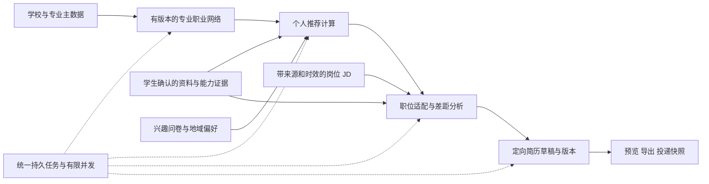

职业发展、岗位推荐与简历管理：调查结果、改进方案和验收标准

调查日期：2026-09-06，Asia/Shanghai。

本次交付是实施前方案。已完成代码追踪、线上只读检查和隔离复现；没有修改业务代码、生产数据或部署配置，也没有在生产环境执行压力测试。

**1. 结论与证据边界**

“绘制职业网络”卡住的主要问题在后台任务与页面状态闭环。等待页面出现时，前端尚未开始绘制 SVG。新专业依赖耗时 AI 生成；生成失败后业务表写 failed，但 handler 正常返回，调度器把任务标为 done；下一次状态查询又将 failed 改为 generating 并重置任务重试次数。前端既不显示失败，也不处理轮询异常，最终表现为持续正常生成中的假象。

这不是单一文案或超时参数问题。调查同时确认：简历编辑保存存在必现参数错误；简历后台任务没有持久恢复与版本保护；岗位匹配把求职意向当作技能证据；已有岗位 JD 未真正进入定向优化输入。若只修等待动画，仍不能实现可靠的多专业、个人化推荐和求职闭环。

证据来源如下：

| 证据层 | 本次实际完成 | 能证明什么 / 限制 |
|---|---|---|
| 本地代码 | 页面、JS、路由、服务、数据表、AI 调用、调度器、持久任务、全局文件删除链路 | 确认接口与控制流缺陷，识别影响范围 |
| 线上只读 | 容器状态；PostgreSQL 显式只读事务查询职业任务、专业网络和匿名状态汇总；资源配置 | 确认真实失败形态及生成耗时；不读取学生简历正文、姓名等业务内容 |
| 版本核对 | 7 个核心文件做换行归一后的 SHA-256 比对，线上与本地一致 | 本地发现适用于被核对的线上核心代码；不代表已逐文件核对全仓库 |
| 现有测试 | 5 个相关测试模块，57 项，14.012 秒，全部通过 | 现有回归基线通过，但关键路由、异步状态、真实浏览器流程缺测 |
| 隔离复现 | 现行 Python 函数配合内存 SQLite / stub；现行 JS 配合 Node vm、假 DOM、fetch 和计时器 | 复现失败重启循环、孤儿任务、保存 TypeError、匹配误判、轮询叠加、跳题、属性注入等；不是生产压测或浏览器视觉验收 |

线上取证结果：

| 专业 | 网络状态 / 调度状态 | 时间与结果 |
|---|---|---|
| 网络工程（专升本） | failed / done | 2026-09-05 15:15:26 开始，15:20:54 结束，执行 328 秒；attempt_count=0、max_attempts=3、last_result="failed: "；业务 error_message 为空，网络内容为 {} |
| 人工智能（专升本） | ready / done | 2026-09-05 15:58:59 至 16:03:56，执行 297 秒；25 个方向 |
| 计算机科学与技术（专升本） | ready / done | 2026-09-06 08:17:55 排队，08:19:40 开始，08:24:43 完成；排队 105 秒、执行 303 秒、合计 408 秒；26 个方向 |

取证时 scheduler 容器健康、工作心跳正常，不能把这次问题简单归因于 scheduler 未启动。线上缺少有效错误类型和追踪信息，无法从空错误反推具体模型、网络或解析异常。隔离的空 TimeoutError 可以复现相同记录，但不构成“线上一定是超时”的证据。线上另有 1 条个人化失败记录及 2 条失败简历记录，未据状态汇总推断它们的具体原因。

**2. 现有业务链路与应保留的能力**

当前链路为：学生鉴权 → 从学籍/班级解析专业与毕业时间 → 查询或准备专业网络 → 完成快速/深度兴趣问卷 → scheduler 联网研究和 AI 个人化 → 网络节点星级、亮度、方向建议、准备清单 → 招聘关键词与外部平台搜索 → 岗位 JD 分析 / 简历工作台 → 编辑、生成、优化、预览、导出 → 手工维护投递进展。

现有基础值得保留：

- `career_major_networks` 已按学校和专业共享基础网络，`career_student_sessions` 已隔离学生个人结果；共享基础知识的方向正确。
- 职业网络已有方向、阶段、跨方向连线、准备清单，支持把职业方向传入简历构建器。
- 简历已有个人资料库、学历/经历/技能/证书、自我介绍、附件、导入、布局、预览/导出、岗位目标和投递记录。
- 常规简历读取和编辑服务多处已按 student_id 约束，仍需对所有新增接口、附件、任务和版本做一致的归属校验。
- 项目已有持久 AI 任务账本、去重、租约令牌、重试、结果保存与重放、取消和诊断能力；应扩展其任务类型和 worker 分派。
- 已有 AI 全局与供应商限流、文档渲染服务及最小化求职行为事件；继续复用，补足当前链路缺口。

当前“岗位推荐”主要是职业方向与搜索词推荐，加上学生粘贴 JD 后的分析；没有完整的、带来源和时效的在招职位库与职位级个性化排序。后续需要清楚区分“适合探索的职业方向”“可去搜索的岗位”“已获取且仍有效的实际职位”。

**3. 已确认缺陷与影响优先级**

P0 表示本轮必须优先修复的核心不可用、数据丢失或不可信内容边界问题；P1 表示规模化和业务准确性必需项；P2 表示交互与质量完善。排序不等同于已经发生所有潜在影响。

| 编号 | 级别 | 确认问题、触发条件与影响 | 代码证据 |
|---|---|---|---|
| C01 | P0 | 网络生成异常被正常 return；scheduler 标 done；GET state 又将 failed 重建并清零次数。持续失败可无限消耗模型与等待时间 | [生成处理](<C:/Users/AngelWei/Nutstore/1/Projects/lanshare/classroom_app/services/career_path_service.py:1172>)、[准备网络](<C:/Users/AngelWei/Nutstore/1/Projects/lanshare/classroom_app/services/career_path_service.py:356>)、[任务替换](<C:/Users/AngelWei/Nutstore/1/Projects/lanshare/classroom_app/services/scheduled_task_service.py:118>) |
| C02 | P0 | generating 行不检查关联任务与过期时间；孤儿状态可永久存在。前端每 6 秒轮询，忽略所有异常且没有失败出口 | [状态读取](<C:/Users/AngelWei/Nutstore/1/Projects/lanshare/classroom_app/services/career_path_service.py:371>)、[等待界面](<C:/Users/AngelWei/Nutstore/1/Projects/lanshare/static/js/career_path_app.js:480>) |
| R01 | P0 | PUT 编辑保存给 validate_resume_build 传不存在的 source_context 参数，进入该调用即 TypeError，不能保存修改 | [路由](<C:/Users/AngelWei/Nutstore/1/Projects/lanshare/classroom_app/routers/resume_console.py:681>)、[校验签名](<C:/Users/AngelWei/Nutstore/1/Projects/lanshare/classroom_app/services/resume/resume_readiness_service.py:197>) |
| R02 | P0 | 全局文件引用计数没有覆盖简历原件、附件、头像。同 hash 文件仍被简历引用时，删除最后一条课程侧引用可能删除物理文件 | [引用计数](<C:/Users/AngelWei/Nutstore/1/Projects/lanshare/classroom_app/services/file_service.py:150>)、[物理删除](<C:/Users/AngelWei/Nutstore/1/Projects/lanshare/classroom_app/routers/materials_parts/library.py:1216>) |
| C03 | P0 | AI tag 直接拼入 SVG 属性、颜色直接进入属性/style；后端仅转字符串。隔离复现引号创建额外属性，存在共享内容注入风险，未执行攻击或证实线上利用 | [SVG 生成](<C:/Users/AngelWei/Nutstore/1/Projects/lanshare/static/js/career_path_network.js:278>)、[结构校验](<C:/Users/AngelWei/Nutstore/1/Projects/lanshare/classroom_app/services/career_path_service.py:1032>) |
| C04 | P1 | scheduler 一批领取默认 20 条，再逐条等待重型 AI；心跳整批结束才更新，共用提醒任务；过期重领及迟到完成没有租约令牌保护 | [调度执行](<C:/Users/AngelWei/Nutstore/1/Projects/lanshare/classroom_app/services/scheduled_task_service.py:324>) |
| C05 | P1 | state 每次无条件 UPDATE 学生 session；轮询未限制在途数量。1000 个等待页按 6 秒轮询约 167 次/秒，还会带来相应写事务 | [session 更新](<C:/Users/AngelWei/Nutstore/1/Projects/lanshare/classroom_app/services/career_path_service.py:420>)、[轮询](<C:/Users/AngelWei/Nutstore/1/Projects/lanshare/static/js/career_path_app.js:495>) |
| C06 | P1 | 网络未生成阻断问卷；个人化 failed 却映射 ready，前端不展示失败，基础结果被当作专属结果呈现 | [状态合成](<C:/Users/AngelWei/Nutstore/1/Projects/lanshare/classroom_app/services/career_path_service.py:697>)、[结果展示](<C:/Users/AngelWei/Nutstore/1/Projects/lanshare/static/js/career_path_app.js:507>) |
| C07 | P1 | 专业缺失默认软件工程；专业、学生学年、班级名字段优先级/别名不完整；学制缺失使用默认值。可能误选模板、误判准备时长 | [上下文解析](<C:/Users/AngelWei/Nutstore/1/Projects/lanshare/classroom_app/services/career_path_service.py:184>)、[毕业推导](<C:/Users/AngelWei/Nutstore/1/Projects/lanshare/classroom_app/services/career_path_service.py:125>) |
| C08 | P1 | 模板和个人结果没有输入、算法与版本绑定；重测/切专业时旧任务可能覆盖新结果；资料变化没有可靠失效机制 | [会话保存与重置](<C:/Users/AngelWei/Nutstore/1/Projects/lanshare/classroom_app/services/career_path_service.py:412>)、[个人化落库](<C:/Users/AngelWei/Nutstore/1/Projects/lanshare/classroom_app/services/career_path_service.py:1213>) |
| C09 | P1 | 校验只检查清洗前至少 12 节点：12 个空对象也可清洗成空图；重复 tag、未知分类、越界阶段、幽灵 top_paths 未严格拒绝 | [网络校验](<C:/Users/AngelWei/Nutstore/1/Projects/lanshare/classroom_app/services/career_path_service.py:1032>) |
| C10 | P1 | 问卷提交不验证完整性；单选快速双击会跳题；模式和版本未存，深度模式前三题退出可恢复成快速模式；草稿乱序覆盖 | [答题交互](<C:/Users/AngelWei/Nutstore/1/Projects/lanshare/static/js/career_path_app.js:303>)、[草稿恢复](<C:/Users/AngelWei/Nutstore/1/Projects/lanshare/static/js/career_path_app.js:217>)、[提交校验](<C:/Users/AngelWei/Nutstore/1/Projects/lanshare/classroom_app/routers/career_path.py:90>) |
| R03 | P1 | 简历导入、渲染、优化使用进程内 create_task；重启会失去执行上下文；缺少版本检查，旧任务可能覆盖新编辑 | [简历任务入口](<C:/Users/AngelWei/Nutstore/1/Projects/lanshare/classroom_app/routers/resume_console.py:641>)、[生成服务](<C:/Users/AngelWei/Nutstore/1/Projects/lanshare/classroom_app/services/resume/resume_generation_service.py>) |
| R04 | P1 | 更新后仍保留旧 render_html；预览/导出优先取缓存，可能导出旧版本。不存在不可变简历版本和投递时快照 | [简历更新](<C:/Users/AngelWei/Nutstore/1/Projects/lanshare/classroom_app/services/resume/resume_document_service.py:167>) |
| R05 | P1 | 求职意向进入能力证据；空技能仅填 Python developer，特定 JD 的覆盖率即可 100%。关键词命中不能代表熟练度或完整资格匹配 | [JD 分析](<C:/Users/AngelWei/Nutstore/1/Projects/lanshare/classroom_app/services/resume/resume_job_target_service.py:111>) |
| R06 | P1 | 定向优化没有读取关联 job_id 的 JD/分析，只看岗位名和个人资料。同名不同要求的职位不会因此产生不同优化输入 | [优化输入](<C:/Users/AngelWei/Nutstore/1/Projects/lanshare/classroom_app/services/resume/resume_ai_service.py:211>) |
| R07 | P1 | 兜底摘要和能力生成沿用软件技术文案；部分专业会出现不适用的代码/功能实现描述。空 education 块也可通过“已有内容”校验 | [简历兜底](<C:/Users/AngelWei/Nutstore/1/Projects/lanshare/classroom_app/services/resume/resume_ai_service.py:367>)、[内容校验](<C:/Users/AngelWei/Nutstore/1/Projects/lanshare/classroom_app/services/resume/resume_readiness_service.py:223>) |
| R08 | P1 | 导入先合并并提交个人资料，再等待能力生成和保存导入结果；后段失败时，界面显示失败但资料可能已经改变，冲突结果没有完整落地 | [导入事务边界](<C:/Users/AngelWei/Nutstore/1/Projects/lanshare/classroom_app/services/resume/resume_import_service.py:82>) |
| R09 | P1 | 岗位目标只保留最新 30 条，直接硬删旧记录，未保护投递关联；关联目标被删除后，原投递记录改状态可报错 | [目标淘汰](<C:/Users/AngelWei/Nutstore/1/Projects/lanshare/classroom_app/services/resume/resume_job_target_service.py:271>)、[投递校验](<C:/Users/AngelWei/Nutstore/1/Projects/lanshare/classroom_app/services/resume/resume_application_service.py:175>) |
| R10 | P1 | 简历处理中每 2.5 秒并行拉取完整列表和 readiness；1000 个处理中页面按该行为估算约 800 HTTP 请求/秒，无退避和在途控制。导出重复转换且缺少统一并发上限 | [简历轮询](<C:/Users/AngelWei/Nutstore/1/Projects/lanshare/static/js/resume_list.js:337>)、[导出转换](<C:/Users/AngelWei/Nutstore/1/Projects/lanshare/classroom_app/services/resume/resume_render_service.py:406>) |
| U01 | P2 | 题目加载失败提示处于隐藏元素；快速关闭再打开方向时旧 timer 隐藏新面板；连字符 tag 高亮被 split('-') 截断 | [测评入口](<C:/Users/AngelWei/Nutstore/1/Projects/lanshare/static/js/career_path_app.js:184>)、[面板关闭](<C:/Users/AngelWei/Nutstore/1/Projects/lanshare/static/js/career_path_app.js:818>)、[方向高亮](<C:/Users/AngelWei/Nutstore/1/Projects/lanshare/static/js/career_path_network.js:449>) |

**4. 目标架构：共享事实、独立个人结果、可追踪求职版本**

专业网络负责职业知识，学生推荐负责个人适配，实际职位负责具体招聘条件，简历负责有事实依据的对外表达。身份归属、版本和任务状态贯穿四者。

**5. 新专业冷启动与任务状态改造**

1. 新专业首屏直接开放问卷、职业资料、通用能力清单与简历工作台。专业模板异步生成，不再遮住整个页面。已有网络即使过期也可继续展示并标明更新时间。
2. 状态查询改为纯读。初始化、提交、重试、取消使用显式命令接口；业务状态与任务行在同一事务创建。重复初始化返回同一个有效任务。
3. 分别记录专业模板、问卷、个人推荐的状态，不再用单一 phase 混淆。服务端任务状态包含 queued、running、retry_wait、result_ready、succeeded 及明确终态；页面据此显示排队、处理中、重试、完成、失败、基础推荐或结果待更新。展示态 degraded/stale 不伪装成 AI 成功。
4. 响应提供 job_id、当前阶段、queued_at、started_at、updated_at、retry_after、安全错误码、是否可重试、结果版本和是否为基础结果。没有可靠进度时不画虚构百分比；排队时间和执行时间分开。
5. 把职业网络、个人推荐以及简历导入/优化/渲染接入已有 ai_durable_job_service。新增任务类型、策略、业务回调和 worker 的 task_type 过滤；现有 worker 只处理特定类型，单纯往账本写新类型不能完成迁移。scheduler 只负责何时启动与维护，重 AI 不占提醒执行循环。
6. 领取数量不超过真实空闲 worker 槽位。模型调用和文档渲染期间不持有数据库连接/事务。租约定期续期，提交时同时核查 lease_token 和业务 revision；任务取消、重测或资料更新使旧结果失效。
7. 失败分类处理：429/网络/可恢复 5xx 有界退避并尊重 Retry-After；鉴权或配置错误快速终止并告警；结构错误有限修复后终止。建议每逻辑版本最多 3 次完整执行，供应商内部重试也计入总调用预算，避免多层重试相乘。明确每阶段与整次执行 deadline。
8. 定期巡检“业务处理中但无活跃任务”、租约过期、结果未应用等不一致。恢复程序必须幂等，保留旧有效结果。未知异常至少记 exception class、安全 message、阶段和 trace_id，禁止再留下单独的 "failed: "。
9. 前端每页面最多一个状态请求在途；请求完成后安排下一次，采用带抖动的退避、超时取消、后台降频和离线暂停；终态停止。轻量状态与大网络按版本分开加载，防止反复传整个网络。

**6. 多专业模型与内容质量**

复用现有学籍、专业管理体系，先核对 canonical major 的来源，再增加职业领域映射，避免维护第二套相互冲突的专业主数据。

- 专业身份用稳定 major_id / major_code；专业名称与别名分离。未知专业保持“待确认”，提供通用职业探索；不再默认软件工程。
- 区分“专业知识相同”与“学生教育阶段相同”。本科、专升本可共享职业方向与技能基础，但保留培养层次、入学时间、实际学制、预计毕业时间及来源；不要仅凭名称去括号就合并所有培养信息。
- 基础职业知识可按专业族共用，学校特色作为学校覆盖层；缓存键包括范围、专业标识、知识版本与配置版本。共享缓存不得包含学生资料或个人建议。
- 图谱采用稳定 direction_id、分类与阶段 ID，边显式引用 ID；名称可编辑，链接关系不依赖字符串拼接。分类、技能项、跨方向迁移条件都需结构验证。
- 清洗后验证有效节点数、唯一 ID、分类归属、阶段范围、边引用、名称/文本长度、结果大小；不得为凑满 12 个方向补造不合理内容。首期建议每图最多 60 个方向、240 条边，超限按需展开，最终以真实客户端基准调整。
- 专业内容包含典型入门岗位、进阶路径、技能/资格、作品证据、学习建议及跨专业路径。英语、管理、教育、艺术等专业采用适合它们的能力词汇和职业路径，避免统一写成“技术栈/工程师晋升”。
- 薪资、招聘需求、资格条件属于有时效事实。记录来源、地区、观察日期与适用条件；无可靠来源时标为待核实或不展示具体数值。个人化不能把过期模板事实重新包装成最新信息。
- AI 输出和 JD 文本按不可信内容处理：结构 schema、字符和长度限制、安全 DOM、颜色白名单、URL 校验；检索文本中的指令不能改变业务权限或系统规则。
- 新版先生成候选，校验合格后原子切换生效版本；保留上一有效版本和回滚入口。学校或专业管理员可审阅来源、纠正方向与别名，不能查看无授权的学生私密资料。

**7. “千人千面”的具体实现**

个性化不能仅改变节点星级、称呼和欢迎语。相同专业学生应根据真实差异得到不同的方向排序、准备重点和可投职位，同时同样输入应能解释和复现。

输入分为四类：

| 输入 | 具体内容 | 使用边界 |
|---|---|---|
| 学籍与阶段 | 专业、培养层次、在读/毕业状态、预计毕业时间 | 来源明确；缺失保持未知，学生能反馈纠错 |
| 学生显式偏好 | 兴趣、工作内容偏好、城市、实习/校招/升学、工作方式及可投入时间 | 可查看、修改、撤回；问卷是探索参考，不作人格诊断 |
| 能力证据 | 自填技能、课程/项目成果、作品、实习、语言能力和证书 | 标注自述/材料佐证/待确认；不能把求职意向或 AI 建议当已具备能力 |
| 反馈 | 收藏、明确不感兴趣、已投递、本人确认的准备进展 | 优先采用明确反馈，限制点击推断影响，保留探索空间 |

现代码把隐藏学习支持画像及 mental_state_summary 等送入职业个人化提示。建议岗位资格与排序只用相关、可说明的资料；不以心理状态、性别等决定适合什么工作，不把未经确认的性格推测变成招聘能力结论。既有学习支持能力可服务于沟通支持，但不混入岗位能力证据。

推荐过程分两级：

1. 确定性基础推荐：从专业方向召回，结合明确偏好、阶段和能力证据计算可解释排序。对真正的职位逐条判断 JD 硬条件；缺少资料使用“未知/待补充”，不能自动算通过或永久排除。基础结果快速可用，AI 故障仍可使用。
2. AI 增强解释：围绕已计算的候选、事实和缺口生成自然解释、阶段计划与跨方向建议；不允许凭自由文本创造学生经历或擅自改写硬条件。市场研究按专业/岗位族/地域共享，避免每个学生重复联网搜索。

方向卡与职位卡均展示“为什么推荐、依据是什么、还缺什么、哪些尚未确认、下一步怎么做”。分开呈现兴趣适配、能力证据覆盖、现实资格与市场数据覆盖度；单个综合数值不能宣称是录用概率。

可先采用配置化加权规则，不在本方案中拍定所谓最优权重。用专业教师与就业指导人员标注的多专业样本调整，并记录评分版本。加入小比例可控的跨专业/相邻方向探索，避免所有人被固定在专业默认高分方向。

输入快照包含 profile_revision、quiz_version、quiz_response_revision / answers_hash、preference_revision、feedback_revision、network_version、market_version 和 scorer_version，并计算完整 recommendation_input_hash。题库版本不能替代答卷版本，重测、改城市、收藏或明确不感兴趣都必须参与失效判断。资料变化只刷新受影响结果；先显示原结果与待更新提示，再异步替换。不同学生的缓存必须隔离，同一学生同一输入版本可重用结果。

**8. 实际岗位推荐与简历衔接**

保留第三方搜索作为可用入口，同时完成两步建设：先把现有粘贴 JD / 自建岗位目标做准确、可追踪；再接入获授权的招聘源、校企岗位或允许导入的数据。真实来源接入是上线真实职位列表的必要前提，不能用 AI 生成公司名称、职位链接和招聘状态来填空。

- 职位记录至少包含 source、external_id、原始链接、公司/职位名称、城市、招聘类型、发布时间、最后检查时间、有效期/状态、JD 原文与结构化版本。
- 区分 must-have 和 preferred，处理否定表达、学历、专业限制、经验、证书、语言、地点与毕业时间。现有关键词分析只能作为初始提取的一部分，不能把全部匹配质量寄托于词表。
- 岗位要求与学生证据逐项关联。把“已满足、部分证据、未知、当前缺口”分开；没有提取到技能时显示“分析覆盖不足”，不伪装成精确 0 分或 100 分。
- 职位去重、过期下架、来源失败、区域无结果都有明确降级；可以建议相邻城市或岗位，但先保留学生的硬性选择并说明变化。
- 缓存公共 JD 解析；个人匹配缓存使用 student_id + 完整 recommendation_input_hash + job_version，覆盖资料、偏好、答卷、反馈和算法版本。收藏/不感兴趣/投递反馈影响后续个人推荐。
- 方向 → 岗位目标 → 简历传递稳定 direction_id、job_target_id 和推荐版本；服务端校验归属，不信任 URL 中的目标 ID。避免只靠岗位名称和自由 tag 传递上下文。
- 定向简历输入必须包含该 JD 的版本、职责、必需/优先项以及选中材料的证据；同名不同 JD 应产生可核对的不同强调重点。
- 投递记录固定指向投递当时的 resume_revision 与 job_snapshot。后续编辑简历、更新/归档岗位不改变历史投递内容；删除岗位不能阻止维护历史投递状态。发送投递仍由学生主动操作。

**9. 简历管理和编辑改造**

先修保存接口，再围绕“材料库 → 草稿 → 已确认版本 → 预览/导出 → 投递快照”收口。

| 环节 | 改造要求 |
|---|---|
| 个人材料 | 保留现有分区；资料字段有类型、长度和必填校验；自我介绍、技能、经历保留来源，不把 AI 生成内容自动当作事实 |
| 草稿保存 | 允许不完整草稿保存；发布/生成正式投递版时再做完整度校验。用 revision / If-Match 防并发覆盖，冲突显示差异并允许另存副本 |
| 编辑体验 | 自动保存防抖与明确状态；离开提醒或本地恢复；保存失败保留输入；支持撤销、版本历史与恢复；不要求每次改一个字都重启模型任务 |
| 资料引用 | 布局引用的学历/经历必须真实存在且属于本人；空 IDs 区块不算有效内容。材料删除提示被哪些草稿引用；已发布版本保留快照 |
| AI 优化 | 生成建议版本和变更对比，学生确认后生效；事实不足询问或标记缺口，不补造履历、证书、数字成绩或工作经验 |
| 能力展示 | 统一为适用各专业的“专业能力/相关技能”；软件专业可以呈现技术栈，其他专业按语言、设计、运营、教育实践等结构展示 |
| 导入 | 原件保留；先持久化提取结果和合并预览，再确认应用；冲突按导入基线、当前值、新值三方比较，应用事务可重放。识别失败可重试、人工编辑或仅保留原件；重复请求和重复文件处理幂等；流式上传达到限额即停止，避免先完整落盘才报超限 |
| 后台处理 | 持久任务、限并发、超时、取消和恢复；任务绑定目标版本，迟到结果不能覆盖新版本，删除简历使关联任务失效 |
| 预览/导出 | render_revision 与内容 revision 一致；新版本渲染中保留上一有效版本并明确标注，导出选择明确版本，不能把旧缓存说成最新版 |
| 文档质量 | 使用项目既有渲染能力；导出按版本+模板+字体/渲染器版本缓存；长中文、多页、照片、附件、分页、链接、字体进行真实渲染 QA |
| 附件安全与寿命 | 文件访问验证所有者；全局文件引用统一登记或统一完整计数，文件删除需二次检查，避免检查后新增引用的竞态；软删除/延迟回收保护有效引用 |
| 投递管理 | 保留简历与岗位历史快照；公司、岗位、阶段、备注可继续修改；删除/归档目标后历史记录仍可读且可更新状态 |

经历管理、构建器、HTML、PDF 和 Word 使用同一经历类型注册表，覆盖已有的实习、课程成果、社团、志愿服务、兼职、调研等类型；不再统一输出“项目/比赛经验”。单份简历允许独立微调已选材料的表达，形成该简历版本的内容快照，不强制修改全局材料库。

**9.1. 页面布局与操作体验**

继续沿用学生区和简历工作台现有导航与视觉体系。职业页默认展示当前准备阶段、三个优先行动和最值得探索的方向卡；每张卡提供推荐依据、关键缺口、查看路径和查看岗位入口。完整网络保留为切换视图，支持搜索、筛选、缩放和返回当前方向，避免让复杂大图成为所有操作的前置步骤。

桌面使用主内容加单一详情区，方向简介、准备清单、岗位和简历作为同一方向下的分段内容；手机使用一个可返回的抽屉或页面，不同时叠加两个占满屏幕的面板。等待状态保持紧凑且可离开，完成后提供明确更新提示，保留学生正在编辑的内容与当前视角。

简历工作台显示最近草稿、可导出的明确版本、待确认导入和投递进度。编辑器提供材料选择、独立文字调整、布局和预览，保存状态常驻且可理解；AI 建议以对比形式呈现，学生选择采用。提示说明复用项目已有共享解释组件，失败、权限阻碍和保存状态持续可见。

**10. 数据结构、接口与迁移**

尽量扩展既有领域表，只有不可变历史和公共职位等现有表无法表达的概念才增加表。以下是逻辑模型，正式 DDL 需结合现有专业主数据、数据量和迁移框架确定。

| 对象 | 复用 / 扩展建议 | 关键约束 |
|---|---|---|
| 专业映射 | 关联既有学籍专业；增职业映射/别名，保留学校覆盖 | canonical ID；别名范围明确；培养层次不随名称清洗丢失 |
| 专业网络 | 扩展 career_major_networks 为当前有效版本指针；新增必要的版本历史 | 每范围/专业/配置一个当前指针；结构、来源、状态、schema_version |
| 学生会话 | 扩展 career_student_sessions：问卷模式/版本、revision、输入 hash、任务和结果版本 | student_id 唯一；乐观并发；跨学校读取不能共享私有状态 |
| 学生推荐 | 不可变推荐快照或版本表 | student_id + 输入版本唯一；依据、缺口、候选及评分版本可追溯 |
| AI 任务 | 复用 ai_jobs、结果和尝试表 | 幂等键、租约、重试预算、终态、owner 与业务 revision |
| 职位/目标 | 扩展 resume_job_targets；公共来源职位独立存储 | source+external_id 去重；JD 版本/新鲜度；私有目标所有权 |
| 简历 | 保留 resumes 当前元数据；增加 revision 与不可变内容版本 | 文档版本和渲染版本绑定；student_id 权限；历史可恢复 |
| 投递 | 扩展 resume_applications | 固定 resume_revision、job_snapshot；目标归档不破坏历史 |
| 文件 | 扩展统一文件引用机制覆盖本领域 | hash+owner_type+owner_id 唯一；仍有有效引用不可物理删除 |

热查询索引以实际 EXPLAIN 为准，至少覆盖学生当前结果、专业当前版本、学生简历列表、职位检索范围与状态、活跃任务去重和租约回收。分页限制写入 API 契约，避免简历列表/岗位列表无界加载。

建议接口契约：

- 保留现有 URL 的兼容层；新增初始化、重试、取消命令，返回 202 + job_id/业务 revision；相同幂等键返回已有任务。
- GET 状态只读且精简；GET 网络/结果按版本返回。共享网络可用公共缓存，个人结果必须是私有缓存范围，不能通过公共 CDN 泄露。
- 问卷草稿保存携带 mode、quiz_version、revision 和 answers；服务端版本检查，错误答题结构返回可读的 4xx。
- 简历保存携带 revision；冲突返回 409 与恢复信息。source_context 在校验、保存和任务输入之间使用统一结构，不允许再次出现路由和服务签名漂移。
- 状态接口、结果接口、文件、预览、导出、任务取消均绑定当前学生，不接受客户端声明的 owner 作为鉴权依据。

迁移采用“新增字段/历史表 → 回填和一致性检查 → 双读兼容 → 新任务灰度 → 切换写入 → 清理旧路径”。DDL 从高频 GET 的懒执行路径移到受控启动/迁移流程。上线前报告当前网络、会话、简历、文件引用数及异常记录；老 valid 网络和简历不被重建失败覆盖。旧职业 scheduled_tasks 先盘点，停止旧生成分派后迁移活跃任务，确保两个体系不会并行写同一版本。

**11. 多人并发与容量方案**

线上读到 2 个 CPU、约 3.57 GiB 系统总内存，应用 PostgreSQL 连接池上限 12、线程池 32、HTTP 并发配置 512；供应商并发分别设置为 DeepSeek 4、Qianwen 4、Volcengine 2、Zhipu 1。供应商额度不能相加当作职业模块可用并发，仍受全局 AI 配额及其他业务占用约束。

“1000 人可使用”与“1000 个 AI 同时计算”必须分别设计与验收。首期以共享知识、确定性快速结果、持久排队、有界后台工作保障体验。

- 普通读请求不调用模型、不触发生成、不无条件写 session；公共网络按版本重用，个人评分缓存按人和版本隔离。
- 简历列表分页，轮询只取变动的任务/版本状态；readiness 按资料 revision 缓存，资料未变时不重新扫描全部素材与简历。职业与简历共用请求节流规则，避免修了一个页面、另一个仍在高频拉全量数据。
- 同专业冷启动合并为一个活跃模板任务；同学生同一输入版本合并为一个推荐任务；同一简历同一版本只有一个有效活跃渲染任务，结果最多发布一次。崩溃恢复可能重新执行，不能承诺外部模型或渲染物理上绝不重复。
- 职业 AI worker 初始总并发建议 1–2，文档渲染 1；通过配额与现有全局 AI 限流协同，不把每个功能独立并发相加。最终数值以混合负载结果调整。
- 职业任务与教学批改、提醒、交互 AI 分配独立可观测预算；优先级之外增加等待老化/公平轮转，避免某专业突发流量长期饿死其他专业。
- 公共市场研究按专业族/地域共享并定期刷新。先收集候选再做少量增强，不为每名学生重复搜索所有方向。
- 排队上限、每学生活跃任务数和重复提交频率受控；超出接纳能力快速返回带 Retry-After 的明确结果，不创建任务后丢弃。
- 新专业模板建议阶段总执行预算约 6 分钟、最多 3 次完整尝试；队列等待与计算预算分离。运行超时撤销本地租约并拒绝迟到结果；上游不支持取消时，HTTP 超时不代表供应商推理和计费已经停止，尚未收口的请求继续计入在途预算或保守冷却，避免立即重试放大负载。排队过长展示预计范围与基础方案。此为实施起始值，不是当前性能承诺。
- 职业 AI 若每人需要 60 秒、并发 2，1000 个个人任务的纯执行吞吐也约 8.3 小时，尚未含共享业务与重试。这是容量算式示例，不是压测结论；因此必须让基础个性化不依赖每人一次长 AI，并按需增强。
- 状态轮询前台初期 5–10 秒，持续等待退避到 30 秒左右并加抖动；后台至少 60 秒或暂停。1000 等待页稳态约 33 次/秒是轮询策略量级目标，需验证实际请求量，不等同于服务端压测已通过。是否增加推送由连接资源与实测决定。

**12. 可执行验收标准**

以下均为未来实施的验收门槛，本次只建立了现状证据和测试基线。性能需在与生产同等级的独立环境测量，不在生产直接压测；明确客户端、数据量、AI 模式、缓存状态、负载模型和测量点。

| 编号 | 场景 | 通过标准 |
|---|---|---|
| A01 | 完全无缓存的新专业首次进入 | 正常网络、服务健康时 2 秒内可开始问卷或维护资料；网络排队不阻止简历入口；显示真实任务阶段 |
| A02 | 同一新专业 100 人同时初始化 | 对同一模板版本仅 1 个活跃任务；所有请求返回一致 job/version；无唯一键 500、无重复模型生成 |
| A03 | 持续模型超时/429/5xx/坏 JSON | 显示重试/失败，累计预算不被刷新重置；最多达到配置的执行次数；无永久正常“绘制中”；有效旧图保持可用 |
| A04 | 业务 generating 但无任务；worker 退出 | 维护巡检可在配置的恢复窗口内发现；建议巡检周期 ≤60 秒；过期租约后重新领取，旧 worker 无权提交；终态可追踪 |
| A05 | API 503、离线、慢响应、401 | 可见对应提示；慢请求最多 1 个在途；终态停止轮询；401 给出重新登录入口且保存草稿 |
| A06 | 连续 GET 状态 1000 次 | 已初始化场景不创建任务、不修改 session.updated_at；单独计入的采样分析事件不混入业务写事务 |
| A07 | 软件/网络/AI/英语/管理/教育/艺术及未知专业 | 每类有独立样本；未知不落到软件；非技术专业没有无依据的代码经历；所有图满足结构和来源规则 |
| A08 | 本科/专升本/毕业/转专业/学籍字段缺失 | 学制和毕业时间按可信来源推导；未知明确显示；切专业后原异步结果不得覆盖新专业结果 |
| A09 | 问卷快速/深度每一题退出恢复 | 模式、版本、答案和当前进度一致；双击 10 次只前进一题；缺答/非法选项/重复题不能通过完成校验 |
| A10 | 两标签页重测、草稿乱序、重复提交 | revision 冲突可见；旧草稿不覆盖新草稿；同版本只产生一个逻辑任务；老结果不能成为当前结果 |
| A11 | 同专业不同能力/城市/阶段的对照学生 | 预先标注应变化的排序与缺口确实改变；不以随机文本差异冒充个性化；相同输入在同版本基础评分中可复现 |
| A12 | 只有求职意向、没有能力证据 | 意向不计为技能满足；“不熟悉 Python”等否定材料不得命中熟练技能；未知、缺口和提取不足分别显示 |
| A13 | 隐私与反事实校验 | 只改变姓名、性别或心理支持信息不改变岗位资格与基础适配分；API/缓存/提示输出不混入他人或隐藏支持内容 |
| A14 | 各专业推荐质量评审 | 初期至少 7 类专业×10 个合成或获授权脱敏样本；≥90% 的样本 Top-5 至少 3 项被专业评审认为可探索且有依据；所有实际职位 Top-5 无已知硬条件冲突。资料未知单独标注，不计作通过 |
| A15 | 实际职位列表 | 每条有真实来源、原始链接、地点、检查时间与有效状态；无来源内容不得标“在招”；过期岗位按配置下架；无职位有明确空态 |
| A16 | 相同岗位名、不同 JD | 匹配依据和定向简历输入绑定正确 JD 版本；不同必须项产生对应不同缺口/内容建议；岗位 ID 越权请求被拒绝 |
| A17 | 简历创建、编辑保存、刷新重开 | PUT 不再 500；内容、顺序、目标、来源上下文完整保留；不完整草稿可保存；正式版缺少有效材料会给出准确提示 |
| A18 | 编辑→优化→再编辑，故意延迟旧任务 | 最新用户 revision 保持生效；旧任务只留历史或终止，不覆盖新内容；冲突可另存/比较 |
| A19 | 渲染中预览/导出 | 输出携带明确 revision；不把旧 HTML 当新版；重复同版本导出命中缓存；新模板/内容触发正确重渲染 |
| A20 | PDF/DOCX/HTML 与长中文简历 | 选定各模板真实渲染；页内无截断、覆盖、乱码，分页合理；页面展示与导出事实一致；已有 8 类经历名称和内容在管理、构建、预览和导出中一致；不虚构经历或数据 |
| A21 | 导入失败/重启/重复导入/字段冲突/上传边界 | 原件可访问；任务可恢复或明确失败；冲突逐项确认；重复请求不重复建档、不覆盖已确认材料；超限时终止上传处理、不创建解析任务、不留下本次无引用文件；合法 20MB 边界文件可正常进入处理 |
| A22 | 删除与文件共用 | 同 hash 同时被课程、简历原件、附件、头像引用时，删除任一业务对象不破坏其余；新增引用与回收竞态不能删有效文件 |
| A23 | 投递后修改简历、归档岗位 | 历史投递显示原简历版本与 JD 快照；仍可维护投递状态，不因关联目标归档报错 |
| A24 | 跨学生/跨学校越权 | 资料、简历、附件、预览、导出、任务状态/取消、岗位目标、版本和投递全部用他人 ID 测试；0 越权读取/写入 |
| A25 | 图谱安全与交互 | 重复/中文/连字符/长 ID、引号、异常颜色、坏边有明确处理；无额外 HTML 属性或脚本执行；快速切换方向 20 次无旧 timer 隐藏新内容 |
| A26 | 小屏与可访问性 | 360/390/768/1440 宽度、200% 缩放和纯键盘完成主要操作；列表可替代图操作；弹窗焦点正确，减少动画偏好生效 |

性能与稳定性专项门槛：

| 负载 | 测试方式 | 初始验收目标 |
|---|---|---|
| 读场景容量 | 1000 已登录虚拟用户，模拟真实思考时间，总负载至少 50 RPS 持续 30 分钟；另测 1000 人在 60 秒内进入，冷热缓存分开 | 轻量状态 API 服务端 P95 ≤300ms、P99 ≤1s；热缓存网络结果 P95 ≤800ms；5xx <0.1%；正确鉴权与结果归属无例外 |
| 命令接纳 | 300 人在 30 秒内完成提交，跨至少 10 个专业；AI 用确定性 stub，专测接纳/队列/去重 | 接纳 API P95 ≤800ms；已返回成功的任务 100% 入库可追踪；重复完成/任务丢失=0；过载为明确受控响应 |
| 编辑与导出 | 100 人有节奏地编辑草稿，20 个不同版本首次导出，并重复请求同版本导出 | 人工保存 P95 ≤800ms；活动转换进程严格不超过配置上限；同版本转换去重且完成后命中缓存；每份导出与其内容版本一致 |
| 混合业务 | 上述读负载叠加 100 人简历草稿编辑、职业后台任务、现有教学/提醒代表请求 | 非职业核心接口 P95 相比基线恶化 ≤20%；无 DB 连接池耗尽；普通任务不被职业 AI 长时间阻塞；提醒延迟 P95 ≤30 秒 |
| 资源 | 与线上同规格测试环境，记录 CPU/RSS/DB 活跃连接/锁等待/队列积压 | 无 OOM、无持续交换抖动；保留至少约 20% 内存余量；连接池等待 P95 <100ms；CPU 长期接近饱和则不得扩并发，应降配额或扩容 |
| 故障恢复 | 在领取后、模型调用中、结果已保存未应用、渲染后切换前分别终止 worker | 已接纳任务不丢失；每业务版本最多生效一次；取消与过期版本绝不迟到落为当前版本；重启后无需学生重填 |
| 长时稳定性 | 1 小时混合负载 + 24 小时低强度浸泡；模拟慢供应商、429、断网与无效响应 | 无不断增长的任务/连接/文件/内存泄漏；积压在停止新增后可收敛；所有终态都有可解释原因 |

真实 AI 质量与耗时另做少量跨专业样本试运行，记录排队和各阶段 P50/P95、tokens、费用和成功率；不得用 stub 的毫秒耗时承诺真实 AI SLA。若同规格机器达不到以上目标，应先优化查询、缓存和轮询，继而调整接纳能力或扩容，并以报告说明实际边界。

**13. 实施顺序、发布与回滚**

| 阶段 | 交付内容 | 进入下一阶段的门槛 |
|---|---|---|
| 第 1 批：恢复核心可用性 | 修复 C01/C02、R01、C03 和文件引用保护；显示真实失败；问卷/简历不再被网络阻塞；增加关键路由与状态回归 | 新专业故障复现转为通过；保存/预览/附件主链路通过；已有成功结果不受影响 |
| 第 2 批：任务与版本基础 | 职业和简历迁移持久任务；纯读状态；幂等、租约、revision、有限并发；老任务修复和审计 | worker 故障恢复、重复提交、迟到覆盖、隔离和混合负载通过 |
| 第 3 批：多专业与个人推荐 | 专业映射、学制纠正、结构校验、模板版本；显式偏好与能力证据；确定性推荐与 AI 增强解释 | 多专业质量样本和反事实测试达到门槛；基础推荐脱离长 AI 等待可用 |
| 第 4 批：JD、简历与投递闭环 | JD 要求/证据模型、真实来源适配、定向优化、简历历史/导出版本、投递快照、导入冲突 | 同名不同 JD、版本、导出渲染、文件寿命与投递历史全部通过 |
| 第 5 批：体验与上线验收 | 图/列表双视图、移动端和键盘、监控面板、压测与灰度 | A01–A26 适用项和性能专项通过；灰度观察无关键回归 |

依赖顺序应保持，部分前端和测试可并行。具体工期在真实招聘源与首批专业覆盖清单确定后估算，避免把数据接入与质量评审时间漏出计划。

上线按专业/学生小范围灰度，先覆盖已有软件专业和一个当前失败的新专业，再扩大至非技术专业。保留旧有效网络、简历及兼容读取；用开关停新任务并回退到上一生效结果，不能回滚删除用户刚保存的新数据。涉及文件回收的变更先观察引用计算，不直接批量删除历史文件。

运维补充网络/个人化/简历任务成功率、错误类型、排队时长、执行时长、重试次数、孤儿状态数、旧结果拒绝数、每专业 AI 成本、状态查询写入数、缓存命中率、预览版本不一致数、文件引用异常数。沿用现有诊断和最小化行为事件，新增 trace_id 与错误阶段；指标不得记录简历正文或学生敏感内容。

**14. 本方案的完成定义**

学生第一次进入新专业即可开始有价值的操作；后台成功、失败、排队、重启都有出口；共享专业知识不混入私人资料；推荐差异来自相关事实与明确偏好并可解释；实际岗位有来源、时效和资格依据；简历可以安全编辑、恢复、生成和导出明确版本；投递保留历史；1000 人访问场景以实测的接纳能力、有界排队和基础结果可用性验收，不用同时启动大量 AI 冒充并发能力。

本轮未实施上述改动。实施前仍需落实的业务配置是首批真实招聘数据来源与首批人工质量评审专业；这不阻碍第 1、2 批以及现有 JD 粘贴流程的修复。
