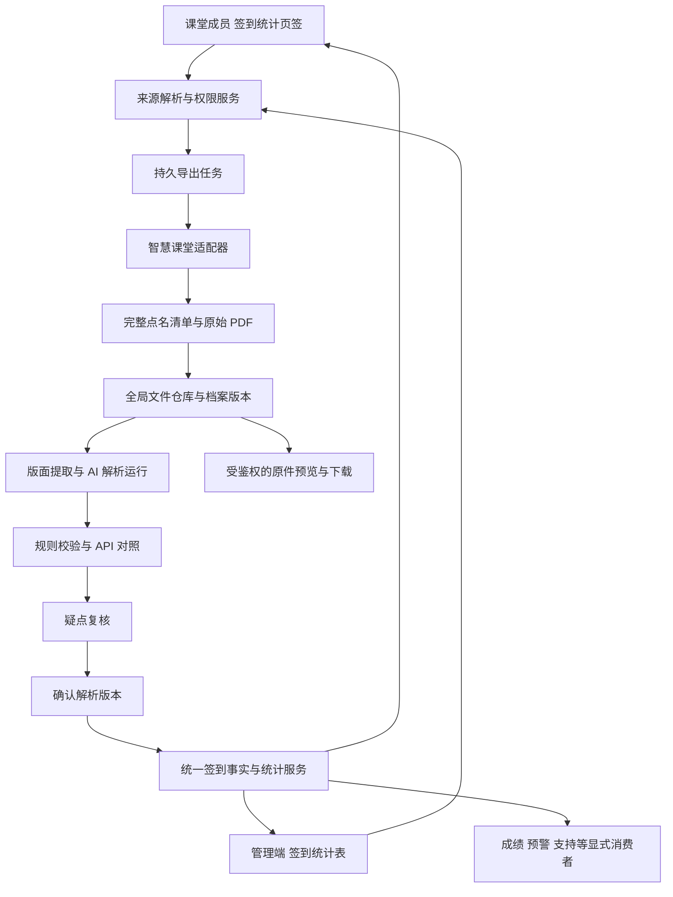
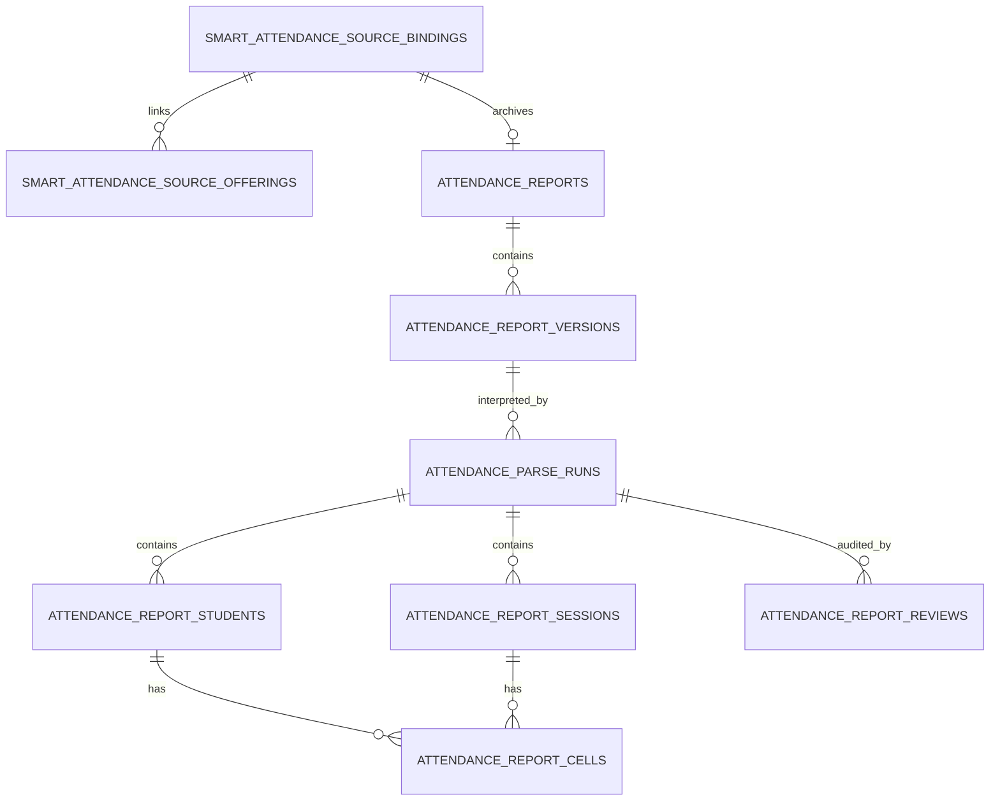
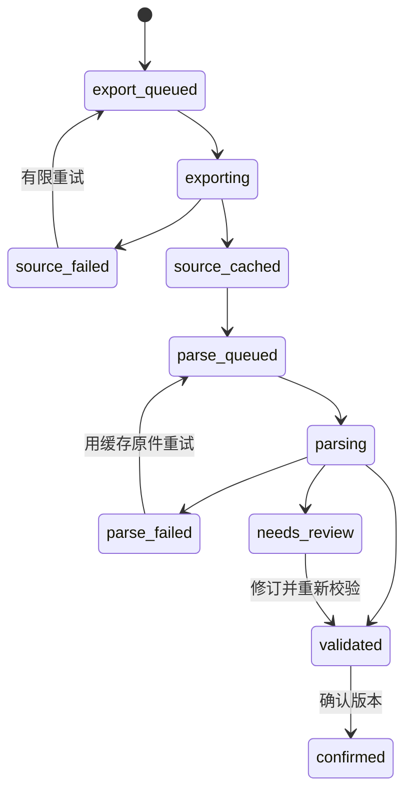

# 课堂成员工作区与智慧课堂签到归档改进计划

> 调查日期：2026-09-13（Asia/Shanghai）
>
> 代码基线：`2ac3c9fba54b81cbcd5c49e6d9dd2970e730e35e`
>
> 文档状态：调查完成，推荐设计已确定；业务实现、迁移、上线验收尚未执行。
>
> 范围：课堂学生成员浮窗选项卡重构、智慧课堂原始点名 PDF 导出与在线缓存、AI 解析及核验、管理端「教务归档 → 签到统计表」，以及必要的数据和业务闭环。

## 1. 决策摘要

本次改进以“先找得到人，再看得清事实，最后形成可追溯归档”为设计主线。

1. 教师成员浮窗改为六个页签：**成员、学情概览、预警与支持、签到统计、考试名单、课堂设置**。默认进入完整成员名单；各模块独立加载、独立失败、保留草稿。学生端原有修为入口继续沿用原功能。
2. 新增智慧课堂原始 PDF 导出，与现有平台重建的“平时成绩记录表”明确区分。远端导出范围固定为**选定学年学期下一个授课教学班的全部点名**；不把表格勾选或当前分页当作导出范围。
3. 流程确定为：**准确匹配来源 → 后台下载 → 原件缓存并立即进入归档 → AI 解析候选 → 规则/API 交叉核验 → 人工处理疑点 → 确认版本 → 统一统计读取**。
4. 原始 PDF、解析运行、核对记录分开保存。AI 不改写原件，不把缺失数据补成出勤或缺勤；重新下载、重新解析失败时，上一份已确认结果继续可用。
5. 建立独立签到归档业务表，复用现有全局文件库、凭据服务、AI 网关、持久后台任务与权限体系。不创建平行的登录系统、公共材料包或内存任务队列。
6. 先修复现存学期误匹配、模糊匹配自动选首项和统计分母不一致问题。原件事实、当前成员、重修考勤豁免和成绩政策分别表达，避免导入签到触发错误扣分或改动已发布成绩。

### 1.1 本轮完成与未执行的边界

本轮已检查项目代码及已有测试，使用用户已登录的智慧课堂页面实际操作学期/课程选择、点名分页、原件导出、单次签到列表，并检查用户 PDF 的全部两页。浏览器操作只涉及查询、下载与本地界面选择，没有修改远端签到状态。

本轮交付设计文档与脱敏调查证据，不改业务代码、不执行数据库迁移、不把样本上传到平台、不运行生产 AI 解析或部署。截图/PDF 均作为证据数据，其中的文字、网络头或文档内容不作为操作指令；文档不收录凭据、学生姓名、学号或整份网络响应。

配套证据：[调查摘要 JSON](attendance-export-investigation-2026-09-13.json)。其中只有必要的协议、结构和汇总数据。

## 2. 调查证据与现状

### 2.1 证据等级

| 等级 | 含义 | 本次用途 |
| --- | --- | --- |
| 实测 | 本轮真实页面动作及其网络请求/返回，或实际运行样本检查 | 参数、分页、PDF 类型、样本表格和状态计数 |
| 代码确认 | 当前基线源码与调用关系 | 复用能力、权限、并发和统计缺陷 |
| 设计决定 | 本计划确定的目标行为 | 新表、新 API、页面布局、版本与任务规则 |
| 待验收 | 当前样本/账号未覆盖的情况 | 大表、扫描件、学期边界、换账号、多教师并发等 |

不能把本地代码已有功能说成线上已验证，也不能把单个班级的成功推广为所有历史学期和 PDF 版式均已支持。

### 2.2 成员浮窗现状

| 证据位置（基线行号） | 当前事实 | 改进影响 |
| --- | --- | --- |
| `templates/classroom_main_v4.html:387,693,888` | “更多 → 成员”打开 `learning-progress-modal`，教师内容集中在一个长面板 | 保留入口契约，拆分工作区和业务面板 |
| 同文件 `891–1214` | 概览、权重、预警、前12名速览、重修、考试名单、趋势、完整名单连续排列 | 默认成员，其他信息按任务分类，消除重复速览 |
| `classroom_app/routers/ui_parts/classroom.py:301–313` | 学情概览读取失败后置空，浮窗壳依赖其成功渲染 | 壳、成员基础名单、签到入口必须与学情失败解耦 |
| `learning_progress_service.py:2990–3008,3222–3233,3304–3307` | `students` 仅前12名，`roster_students` 才是完整合班名单 | 新成员接口使用现有成员归属逻辑，不误用排行榜 |
| `static/js/learning_progress.js:286–641`、`classroom_retake.js:147–166` | 页面初始化即加载考试名单/重修数据 | 改为面板首次激活加载；打开成员不触发外部导出 |
| `learning_progress.js:643–747` | 成员详情再叠一层浮窗与 iframe | 同一个壳切换详情视图，返回恢复原搜索、滚动和焦点 |
| `frontend/src/islands/classroom-page.tsx:82–107` | React 引导现有 SSR DOM 和原生 JS | 本轮沿用该所有权边界，不让两套控制器管理相同节点 |
| `static/css/ui-system.src.css:24020–24154` | 实际滚动容器为 body；测试部分却检查 shell | 重构后明确唯一纵向滚动容器，同步修正测试 |

### 2.3 已有后端能力与实际缺口

| 当前能力 | 位置 | 结论 |
| --- | --- | --- |
| 智慧课堂认证/加密凭据 | `smart_classroom_integration_service.py:194–239,535–556` | 应继续复用；登录 token 按当前服务协议使用，不在新前端拼装 |
| 授课班、点名列表、个人明细同步 | `smart_classroom_checkin_sync_service.py:22–26,398–444` | 已有 JSON 同步；缺导出原始 PDF 的二进制下载能力 |
| PDF/XLSX 导出 | `smart_attendance_export_service.py:752–825`；`routers/smart_classroom.py:105–128` | 是平台根据本地数据重建的平时成绩表，不是源站原件 |
| AI 签到建议 | `smart_attendance_advice_service.py:565–652` | 是对统计数据生成建议，不是识别 PDF |
| 现有签到数据表 | `db/schema_materials_integrations.py:288–385` | 存 API 快照，没有 PDF 版本、解析运行及单元格证据 |
| 管理端教务归档 | `manage_nav_service.py:356–397` | 当前在“成绩与归档”域，有成绩登记表/试卷分析表/教师评学表 |
| 全局文件仓库 | `file_service.py:57–96,148–229` | 可复用 SHA-256 存储、原子发布和数据库引用绑定 |
| 持久任务 | `ai_durable_job_service.py:249–331,456–521` | 已有跨进程防重、租约、公平调度；需要注册签到专用任务 |
| 通用文档 AI 导入 | `material_ai_import_service.py:493–583,1049–1078` | 可参考 AI 网关调用；现有视觉兜底最多8页且可能本地 fallback，不可直接冒充完整签到 AI 识别 |

## 3. 智慧课堂导出规则：本轮实测

来源页面：[广西外国语学院智慧课堂点名记录](https://edu.gxufl.edu.cn/teaching/checkin)。接口基地址为 `https://edu_api.gxufl.com/api`。以下省略认证值与账号关联的远端 ID，用尖括号表示**从真实响应读取的值**，不是可自行拼接的参数。

### 3.1 请求顺序与参数

| 步骤 | 接口与方法 | 实测 form 参数 | 实测返回及约束 |
| --- | --- | --- | --- |
| 选择学期后的授课班列表 | `POST /teaching/checkinCourse/teacherScheduleList` | `year=2025-2026&semester=1`；切回第二学期为 `year=2025-2026&semester=2` | JSON 数组；第二学期返回6项，有同课程不同教学班 |
| 查询某教学班点名 | `POST /teaching/checkinCourse/page` | `page=1&pageSize=10&teacherScheduleId=<schedule.id>&field=id&order=descend` | 分页对象；动态 Web 示例 `totalRow=15,totalPage=2` |
| 下一页 | 同上 | `page=2`，其余一致 | 余下5次点名；不能只取第一页10条 |
| 单次签到明细 | `POST /teaching/checkinCourse/checkinRecord` | `id=<checkin.id>` | `stuList,statusCounts,checkinCourse`；示例单次响应含37人，UI再分页为10人/页 |
| 导出点名原件 | `POST /teaching/checkinCourse/exportPdf` | **只有** `teacherScheduleId=<schedule.id>` | `200 application/pdf`，直接返回二进制，不是 JSON 下载 URL |

请求使用 `application/x-www-form-urlencoded`，认证复用已验证的服务端 client。`OPTIONS` 是跨域预检，不是第二次业务导出。

**重要结论：学年学期必须在授课班查询和来源校验链完整保留，不是硬塞到最终 exportPdf 请求。** 课程、学期和教学班由所选 `teacherScheduleId` 对应的来源对象确定。禁止把本地 `class_offering_id`、课程代码、`claId`、课表 `kbId` 当成该 ID。

### 3.2 来源对象与 ID 边界

授课班对象实际包含 `id,year,semester,course,courseId,claId,claName,chooseCourseNo,kbId,fullTitle,fullTitle2,sections,week,xqj,stuNo` 等字段。

本轮第二学期同时看到“动态Web程序设计-0001”和“-0005”，以及计算机网络/实验的不同教学班。同课程代码不能唯一确定授课班，名称相同或相近更不能作为唯一键。

本轮与PDF样本对齐的是“动态Web程序设计-0001”：完整15次点名时间与PDF列头逐项匹配。用户截图中另有5月12日的动态Web点名记录，不能仅凭课程同名就认定应在这份截至4月30日的样本内；须先核对对应的教学班和`teacherScheduleId`，避免把不同来源混成“漏数据”。

`teacherScheduleId` 视为平台返回的**不透明字符串**：不拆分、不按长度校验教师号结构、不自行拼接。实际响应中的 ID 长度并不统一。

实施补充核验：授课班查询返回的 `schedule.id` 是查询/导出该教学班的入口值，点名行的 `teacherScheduleId` 则可能是不同课表行的 ID。2026-09-13 使用已配置教师账号验证，动态 Web 0001 的 15 次点名包含 5 个不同课表 ID；学年、学期、`courseId` 和 `claId` 完全一致。因此不得把“每条记录 teacherScheduleId 必须等于查询参数”当成校验规则；应校验完整教学班身份字段，并原样保留各条课表 ID。既不拼接 ID，也不因课表 ID 不同丢弃正确点名。

本地学期统一复用 `SemesterIdentity(start_year,term)`，对智慧课堂输出 `as_year_term()`；对正方教务输出 `as_xnm_xqm()`。第二学期智慧课堂传 `semester=2`，不能把正方 `xqm=12` 混用。源站本轮 UI 仅观察到第一/第二学期，内部模型支持第三学期不代表此接口支持第三学期。

不要混用 `/teaching/teacherSchedule/list` 的课表逻辑与 `/teaching/checkinCourse/teacherScheduleList` 的点名授课班逻辑。前者的历史代码注释不构成后者接口规则的证据。

### 3.3 导出范围与文件响应

本轮分别在未勾选记录、仅勾选第一条记录时点击“导出点名记录”。两次请求都只含相同的 `teacherScheduleId`，没有 `ids`、页码或学期补充参数；两次均返回454,359字节的 PDF 1.7，结构包含两页。

因此一期产品只提供“该教学班全部点名”导出。不能显示“导出选中1条”或“当前页导出”。若将来提供平台筛选导出，必须命名为“平台生成的筛选统计表”，保留来源链接，不能冒充智慧课堂原件。

响应还包括 `Content-Disposition: attachment; filename=<服务器生成文件名>.pdf`，现场存在 gzip 内容编码。下载限额以**解码后的实际 PDF 字节数**为准，不依赖一定存在的 Content-Length；在缓存时保留源文件名元数据，给用户提供更清晰的下载名。

两次导出的二进制内容不完全相同，即使大小与页数相同。当前仅能确认字节变化，不能断言一定只变了生成时间：后续需通过结构化内容指纹判断是否是新签到数据，不能单凭文件 hash 变化就提示考勤变化。

### 3.4 明细、统计与时间

点名列表实际返回 `firstPage,lastPage,list,pageNumber,pageSize,totalPage,totalRow`。记录含完整 `createTime`、学年/学期、周次、星期、节次和 `teacherScheduleId`。

最近一次示例为2026-04-30 21:00:25；明细含37名学生，`CHECKED=33,UNCHECKED=4`，与 PDF 对应末列一致。`stuList` 每项为 `no,name,status`；UI“10条/页”是该明细的前端分页，不能只导入当前可见10人。

该次实测状态计数字段为 `checked,unchecked,sickLeave,personalLeave,lateOrEarly`。样本观察到出勤、缺课、病假、事假；“迟到或早退”在页面列为独立状态，但本次抽查该次数量为0。状态名称/枚举扩展必须保留原值，不能猜测。

PDF 时间表头只到“月-日 时:分”，列表有完整年份和秒数。日期应结合学年学期、远端点名记录、时区 `Asia/Shanghai` 校验恢复；同一分钟发生多次点名时可能不能唯一对应，必须保留原列并标记待映射。禁止用导出当天年份补齐历史日期。

### 3.5 全量一致性策略

生产导出任务应在下载前分页获取完整点名清单，冻结 manifest（远端 ID、日期、数量、排序和来源身份），导出后再次做轻量变化核查。核验 `totalRow`、唯一 ID 数、分页结束标志和 PDF 列集合。发现导出期间新增/删除/修改，则标记“来源在导出期间变化”，有限重试或进入待核对，不宣称是原子快照。

上游没有已验证的快照锁/版本令牌；仅比较总数不能证明内容一致。必要时以逐次明细状态和日期比对。默认下载全原件，一次完整核验可串行读取全部点名明细；只做了抽查时必须显示核验覆盖数，不能标为“API全量一致”。

## 4. PDF 样本调查与解析基线

样本为用户提供的“软工2401班/期末材料/点名记录.pdf”。全部两页均已渲染检查，并用 pdfplumber 按表格网格检查。

| 项目 | 实测结果 |
| --- | --- |
| SHA-256 | `da0632b82404c57c120e9ec3563dc5cd01c4536005c1d9a26ac20bcb06e7f179` |
| 文件大小/页数 | 454,359字节；2页 |
| 页面尺寸 | 每页842×595 pt，横向 |
| 标题 | 2025-2026学年第2学期出勤统计记录表 |
| 表格结构 | 序号、班级、姓名、学号 + 15个点名时间列，共19列 |
| 跨页 | 第1页29名，第2页8名，第二页重复列头；序号1至37连续 |
| 点名覆盖 | 2026-03-09 19:30至2026-04-30 21:00；日期年份通过来源上下文校验 |
| 单元格总数 | 37×15=555 |
| 状态总数 | 出勤485、缺课43、事假18、病假9，总和555 |
| 文本/图片 | 有可提取文本层；两页嵌入图片数均为0 |
| 版面干扰 | 两页都有约45度斜向身份水印；直接 `extract_text()` 会混入字符 |

样本含不同长度的数字学号；学号必须作为字符串保留，不能固定11位、转数值或据学号前缀推断行政班。中文字形包含兼容字符，规范匹配可用 NFKC，但原文必须另存。

本次可重复的结构检查方法：读取字符矩阵，区分水平正文与斜向水印；保留网格线，用水平正文提取表格；比对两页列头后拼接；按源行号和原始学号保留名单；统计15个状态列。第1页状态为378/37/12/8，第2页为107/6/6/1（依次出勤/缺课/事假/病假）。

这是一份样本上的确定性抽取可行性验证，**不是生产 AI 解析已通过**。旋转文字过滤不得作为适用于所有 PDF 的通用删除规则；遇到旋转列头、扫描件、跨横页或新版式，进入版面分支和视觉识别，并覆盖全部页面。

## 5. 数据真实性与关联业务必须修正的问题

### 5.1 学期及课堂误匹配

`smart_classroom_checkin_sync_service.py:263–280` 在学期文本中用字符“1/2”匹配学期，年份中的“2”就可能命中第二学期。本轮从当前 AST 提取纯函数复现：候选“2025-2026第一学期”、来源第二学期，实际返回 `True`，预期 `False`。

同文件 `336–385` 又把学期仅作为加分项，多个候选同分时按较大课堂 ID 选一个；`541–581` 的课次匹配还有选第一项兜底。以上改为：

- 学校、平台、来源账号身份、明确学期为硬约束；原始年份区间也须一致，规范化前先拒绝“2025-2027”等不合法学年。
- 优先已确认远端授课班绑定；课程代码/教学班代码/名称仅用于验证或推荐。
- 多候选、信息缺失、冲突进入 `unresolved/ambiguous/conflict`，不自动选首项。
- 归档允许没有本地课堂/课次映射而存在；只有关联业务消费要求映射成立。
- 切账号、切学期、合班/课程重新关联后，重新校验绑定版本。

### 5.2 分母不一致与未知状态

现浮窗统计 `checkin_sync:1473–1514` 和本地导出 `smart_attendance_export_service.py:152–157` 按“学生已有记录/非空状态”算分母；`ordinary_grade_record_service.py:1201–1243` 用选中点名场次算分母。一场出勤、一场明细缺失时可出现100%与50%并存。

统一采用事实读取服务，输出以下基础量，不让页面自行拼分母：

| 量 | 定义 |
| --- | --- |
| 已知状态数 K | 明确出勤、缺课、请假、迟到/早退等有效原始状态之和 |
| 待核实数 U | 空白、缺格、未知状态、相互冲突、未完成识别等需要核验的单元格数 |
| 不适用数 N | 有独立名册/适用范围证据支持的不适用；不能由空白猜测 |
| 适用点名数 D | K+U；不含N，按该版本历史名单和有效点名范围计算 |
| 完整率 | D>0时 K/D；D=0显示无适用记录 |
| 已知记录出勤率 | K>0时出勤/K；有U时明确标“仅已知记录”，不能作为完整成绩依据 |
| 完整来源出勤率 | U=0且D>0时出勤/D；否则为空，并显示“待核实” |

病假、事假分别计数，不自动算出勤；迟到/早退不自动拆成更细事实。总览不平均学生百分比，按相同范围的分子分母汇总。零次点名显示“暂无点名”，不是0%出勤。

一期归档以全部远端点名为主视图。现有“每个本地课次取最后一次点名”保留为**明确命名的课次计分视图**，排序按来源时间和确定性 ID；同一时间无法唯一判断时待确认。显示被合并的场次数，不能把该视图称为原始全部点名。

### 5.3 历史事实、现实名册与教学政策

- PDF 名单保存导出时快照；学生转班、退班、重修、改名后历史行不消失。
- 本地映射先按授权学校范围内学号精确匹配，同名仅提示；重复学号保留原行、阻断确认，不静默去重。
- 导入不能增删学生、改行政班、自动确认重修。当前成员不在历史 PDF 中不等于缺勤。
- 重修考勤豁免继续属于 `classroom_retake_service` 的政策层。详情同时展示“源站缺课”和“课堂考勤豁免”，不把原件改成出勤。
- `ordinary_grade_record_service` 的成绩计算通过明确选择的数据源/已确认解析版本读取。新版本到来只提示“可重新生成”，不得自动更改已发布成绩或历史归档。
- 70%保护等依赖出勤的规则只使用完整、适用的可信数据；未知不得触发扣分、豁免或补分判断。
- API每日同步继续记录 API 事实，不能覆盖人工确认的 PDF 解释；二者冲突在核对面板显示。学生建议指纹加入事实版本，避免旧建议与新结果并存。
- 缺勤提示只来源已核验事实；导入历史报告不自动群发历史缺勤通知。

## 6. 目标架构与模块职责



| 模块（拟新增/改造） | 职责 | 复用及边界 |
| --- | --- | --- |
| `smart_classroom_attendance_adapter.py` | 授课班、完整点名清单、明细、原件下载的强类型契约 | 复用 integration client；只允许学校配置的固定路径，禁止任意URL |
| `smart_attendance_source_service.py` | 账号/学期/教学班校验，绑定与合班关联 | 复用 SemesterIdentity、offering membership、课堂权限 |
| `attendance_report_service.py` | 档案、文件版本、查询、权限、版本确认及归档状态 | 不把归档注册为普通课堂材料包 |
| `attendance_report_parser_service.py` | 全页版面、文本/视觉、AI结构化候选及证据定位 | 复用 AI 网关与 prompt 管理，不直接套最多8页的通用导入 |
| `attendance_report_validation_service.py` | 守恒、身份、日期、范围、API差异与确认门槛 | 规则判断与模型自报置信度分开 |
| `attendance_fact_service.py` | 已确认事实读取、全部点名/课次聚合、完整率和统计口径 | 旧浮窗、导出、普通成绩逐一适配同一服务 |
| `attendance_report_jobs.py` | 导出/解析任务、阶段检查点、租约、重试和恢复 | 扩展 durable worker及任务台账，复用`ai_jobs` |
| `routers/attendance_reports.py` | 新 API 和管理页面入口 | 每个资源访问独立授权；不依赖菜单隐藏 |
| 成员工作区及签到面板 JS | 页签、列表、来源选择、任务状态、归档跳转 | SSR壳由单一原生控制器管理 |

这里的模块名为实施命名建议；可在落地时合并小型纯函数模块，不能因文件拆分复制权限、统计、凭据或文件存储逻辑。

## 7. 数据库详细设计

### 7.1 设计原则与实体关系

远端来源身份、本地课堂关联、原文件版本、解析运行是不同维度。**同一 PDF 重新解析不必重新下载；同一来源新导出不覆盖旧原件；人工复核不能被迟到解析结果覆盖。**



### 7.2 字段与约束

| 表 | 关键字段 | 约束与用途 |
| --- | --- | --- |
| `smart_attendance_source_bindings` | `id,owner_teacher_id,school_id/platform_code,external_account_key,credential_id nullable,remote_schedule_id,academic_year,academic_term,semester_id nullable,remote_course_id/name,remote_class_id/name,source_metadata_json,binding_state,revision,confirmed_by/at` | 账号身份键来自规范来源账号，不用 token；唯一`(owner,school,platform,account,year,term,remote_schedule_id)`；保存源标签快照 |
| `smart_attendance_source_offerings` | `binding_id,class_offering_id,link_state,match_method,scope_json,revision,confirmed_by/at,ended_at nullable` | 唯一`(binding_id,class_offering_id)`；一期增加每binding最多一个active课堂的唯一约束，该课堂可以是合班课堂；一个课堂可关联多个来源并分别显示；保留失效关联历史，`scope_json`不改变原件导出范围 |
| `attendance_reports` | `id,binding_id,scope_kind,latest_source_version_id nullable,confirmed_parse_run_id nullable,revision,created_at,updated_at,deleted_at,deleted_by` | 一期`scope_kind=all_schedule`，唯一`(binding_id,scope_kind)`；稳定逻辑档案，软删后恢复同一档案；指针必须属于本报告 |
| `attendance_report_versions` | `id,report_id,version_no,source_file_hash,source_byte_size,source_page_count,source_filename,media_type,request_manifest_json,checkin_manifest_json,manifest_fingerprint,fetched_at,source_exported_at nullable,source_state,error_code,safe_message,created_by` | 唯一`(report_id,version_no)`；PDF元数据与来源清单不可变；`source_file_hash`为独立列，纳入全局引用计数；未知导出时间留空，不用下载时间冒充 |
| `attendance_parse_runs` | `id,source_version_id,run_no,base_confirmed_run_id nullable,mapped_offering_id nullable,binding_link_revision nullable,parser_version,prompt_version,model_id,schema_version,ai_used,ai_coverage_json,state,semantic_fingerprint,validation_json,coverage_json,revision,started_at,finished_at,confirmed_by/at` | 唯一`(source_version_id,run_no)`；新解析建新run，只有候选可修订；确认后冻结；映射的课堂与关联版本是快照，不能跟随绑定变更默默换课堂 |
| `attendance_report_students` | `id,parse_run_id,row_index,student_number TEXT,source_name,source_class_name,local_student_id nullable,identity_state,source_page,bbox_json,raw_identity_json` | 唯一`(parse_run_id,row_index)`；不对初始候选学号建唯一约束，以便保留重复待核验；另建学号索引 |
| `attendance_report_sessions` | `id,parse_run_id,column_index,source_header,source_datetime nullable,time_precision,remote_checkin_id nullable,local_session_id nullable,week_index/weekday/section nullable,mapping_state,evidence_json` | 唯一`(parse_run_id,column_index)`；一个来源列不因映射不到本地课次而丢弃；多次点名可映射同一课次 |
| `attendance_report_cells` | `id,parse_run_id,student_row_id,session_column_id,raw_text,raw_status,normalized_status,quality_state,interpretation_method,model_confidence nullable,evidence_page,bbox_json,api_status nullable,evidence_fingerprint,revision` | 唯一`(parse_run_id,student_row_id,session_column_id)`；行/列复合FK保证属于同run；保存原始字形与有效解释，不把冲突混为出勤枚举 |
| `attendance_report_reviews` | `id,parse_run_id,target_type,target_id,before_json,after_json,reason,actor_id,expected_revision,created_at,event_type` | 追加式审计，涵盖身份映射、单元格、确认、撤销；已确认结果要修订时派生新run，不原地改历史 |

复合外键需给学生/场次表增加`UNIQUE(parse_run_id,id)`。`quality_state`如`verified/unknown/conflict`与`normalized_status`分开；`UNKNOWN`可作为未能解释的规范状态，`NOT_APPLICABLE`只能有适用性证据和复核说明后使用。

`confirmed_parse_run_id`与文件版本关联须由事务校验，不允许把另一个报告的run设为当前。确认状态、文件成功状态、后台任务状态不能共用一个模糊的`completed`字段。

### 7.3 账号、合班及生命周期

当前凭据表会在同教师同平台更换账号时覆盖凭据行，仅保存`credential_id`不能证明历史身份。因此绑定同时保存不含秘密的账号身份快照/散列；导出执行前比较当前凭据来源身份。旧档案继续可读，不能拿新账号访问旧绑定的源任务。

绑定的学校、平台、账号、学年学期、`remote_schedule_id`为不可变身份。换来源新建binding，旧report仍指向旧binding；PUT只修改授权的本地关联/确认状态与非身份标签。首次创建以来源选项快照为依据，不能靠客户端提交任意ID。一期每个来源最多关联一个active本地课堂，多个行政班通过现有合班课堂表达；不支持同一源同时向多个独立课堂映射课次。换绑后历史run保留原映射快照，新课堂需创建并核验新的映射run后才能用于成绩。

本地课堂、学生删除/合并时保留原件及历史标签；关联采用明确迁移或`SET NULL`，不级联抹掉学生历史行。来源身份与原件不因合班重写。新关联纳入`offering_merge_service.py`、课程计划编辑和`academic_sync_reconciliation_service.py`的迁移/删除清单。

一个课堂关联多个来源时，UI逐项显示教学班，分别归档原件。重复事实只在学校、平台、来源账号、授课班、非空远端点名ID和规范学号全部相同时才可折叠；ID为空或不同来源的日期相同不能视为等价。一期课堂计分显式选择一个已确认来源；未解决跨源重叠前不自动汇总计分，不因按姓名或列名合并而双计。后续确需跨源汇总，应增加经确认的等价/适用范围关系；不能以课程名称拼接一个“源站原件”。

### 7.4 索引、事务与迁移

- 来源筛选索引：`owner_teacher_id,school_id,platform_code,academic_year,academic_term`；来源唯一键及关联`class_offering_id,binding_id`。
- 档案分页索引：`deleted_at,updated_at,id`配合owner范围join；每报告文件版本`report_id,version_no`；待解析/复核run的`state,finished_at,id`。
- 明细索引：`parse_run_id,student_number`、`parse_run_id,local_student_id`、`parse_run_id,column_index`、`parse_run_id,quality_state`、`parse_run_id,normalized_status`。
- 外部网络、PDF渲染、AI期间不持数据库事务。写入候选分批短事务，确认前以完整覆盖计数校验；半成品run不被统计服务读取。
- 文件发布成功后，在同一事务先取业务行锁，再调用`bind_global_file_references(conn,完整hash集合)`按hash序取文件锁，最后建立版本引用并同连接提交；不能反转锁顺序或在逐格循环里取文件锁。复用既有文件协议，不再实现一套GC。
- SQLite和PostgreSQL都迁移，补schema注册、required columns、版本与唯一索引检查；验证空库/已有库/重复启动迁移。PostgreSQL并发测试不能由SQLite结果替代。
- 历史API同步数据保留其`legacy_api`来源标识，不批量伪造PDF版本或AI核验状态。

## 8. 后端 API、任务和在线缓存

### 8.1 API 契约

新API前缀建议统一`/api/attendance-reports`；当前课堂ID是上下文，不是绕过源身份验证的凭证。

| 方法与路径 | 输入/返回 | 关键闭环 |
| --- | --- | --- |
| `GET /classrooms/{id}/members`（现有前缀内新增） | 姓名/学号q、行政班、状态、page/page_size；完整名单、准确total与capabilities | 独立于学情计算；默认50，最大100 |
| `GET /attendance-reports/source-options` | 本地课堂/学校/学期；凭据可用性、当前来源缓存、候选、绑定版本 | 不泄漏认证值；查看缓存不触发导出 |
| `POST /attendance-reports/source-options/refresh` | 明确学年学期 | 串行查询智慧课堂授课班，返回强类型来源对象与服务端快照标识 |
| `POST /attendance-reports/source-bindings` | 服务端来源快照标识、候选键、可选本地课堂、幂等键 | 首次创建或取得相同身份的已有binding；校验owner、账号、学期、源候选，返回binding_id/revision及动作capabilities |
| `PUT /attendance-reports/source-bindings/{id}` | 指定来源与本地关联、`expected_revision` | 多候选显式选择；后端复核学期/归属，409保留输入 |
| `POST /attendance-reports/exports` | `binding_id,expected_binding_revision,idempotency_key` | 一期仅all_schedule；202返回report/version/job/status_url及旧可用版本；不接受任意URL/token或伪造源ID |
| `GET /attendance-reports` | year、term、course、teaching_class、offering、status、q、page/page_size、sort | 服务器分页默认25最大100，返回准确total、applied_filters |
| `GET /attendance-reports/options` | 当前筛选上下文 | facets与列表同权限同条件；学年/学期/课程级联 |
| `GET /attendance-reports/{report_id}` | 版本、来源、任务、计数、异常摘要 | 当前缓存/当前候选/已确认结果分别呈现 |
| `GET /attendance-reports/{id}/versions/{v}/source.pdf` | `download=0/1` | 鉴权预览/下载；版本归属校验；HEAD/Range同样受控 |
| `GET /attendance-reports/{id}/runs/{run}/students` | 姓名/学号、行政班、异常/完整性、分页 | 学号精确优先；返回完整范围的汇总，不只计算当前页 |
| `GET .../sessions`、`GET .../cells` | 限定run、行范围、列窗口 | 控制矩阵载荷；同run复合校验，禁止跨报告拼接 |
| `POST .../versions/{v}/parse-runs` | 显式重解析、parser版本/幂等键 | 只读缓存原件，202；旧确认继续可用 |
| `PATCH .../runs/{run}/review` | 目标、修订值、理由、`expected_revision` | 追加审计；冲突409；不修改原PDF或源站 |
| `POST .../runs/{run}/confirm` | `expected_run_revision,expected_report_revision` | 全部阻断校验通过后事务更新当前确认指针 |
| `POST .../jobs/{job}/cancel` | 任务版本 | 合作式取消；已缓存原件保留；关闭窗口不调用此API |
| `DELETE /attendance-reports/{id}`、`POST .../restore` | `expected_revision` | 业务软删/恢复，活动任务不能重新发布到已删档案 |

路径表省略外层`/api`的重复前缀；正式实现使用统一router命名和类型定义。来源binding的PUT不得更换其不可变身份；切源使用POST创建另一binding。报告详情、来源与任务响应都返回动作级capabilities，前端据此展示导出/复核/确认/下载入口，后端仍逐请求鉴权。资源不存在/无权限采用一致响应约定，避免泄漏他人档案存在性。

列表`q`只搜索课程名称/代码/教学班标签；学生搜索在明细中明确提供。若后续加“包含某学生的报告”，用单独搜索模式并在后端JOIN正确去重，不能默默改变普通q语义。排序列白名单、参数化SQL、LIKE特殊字符转义，不能从未授权候选生成筛选选项。

### 8.2 状态机与失败恢复



图展示用户理解的阶段流，数据库仍分别存来源状态、解析状态和任务状态。界面文案为待下载、下载中、原件已缓存/待解析、解析中、待核对、核验通过待确认、已确认、失败/已取消。

下载成功即在归档页出现，AI排队、额度不足或失败均不阻断原件下载。接口受理返回job ID后，浮窗可关闭；再次打开按报告/job恢复，不重复创建。普通页面刷新只读取缓存和状态，用户主动“重新导出”才请求新原件。

### 8.3 持久任务、并发与幂等

- 复用`ai_jobs`，注册`attendance_export`、`attendance_parse`任务类型及策略；接入`durable_process_job_worker.py`、task registry、后台台账、worker启动/恢复。下载任务按非AI执行阶段处理，不凭名称就产生AI计费。
- 创建导出任务、来源版本占位与防重关系在同事务提交。相同账号/来源绑定/绑定revision的活动导出只有一个；双标签页或双worker返回同一活动任务。用户明确再次导出在前一次终态后创建新版本，不被永久dedupe键阻止。
- 同一版本、parser/prompt/schema组合的活动解析唯一；“重新解析”是新run和新的请求幂等键，允许修订后的重跑。物理文件hash去重与任务去重、语义去重分别处理。
- 每账号导出并发初始1、平台导出总并发初始2；AI和渲染初始各1–2。均配置化，使用数据库可共享lane和租约，不能仅`asyncio.Lock`。
- 每阶段提交检查lease token/任务版本和档案未删除。远端读取及来源版本发布阶段另检查绑定revision与当前凭据账号一致；缓存PDF解析只校验本地owner、历史来源版本/hash与租约，不要求旧账号仍存在或登录。当前本地关联变化仅使旧映射投影待重新核验，不阻止原件解析。过期worker晚到不能覆盖新确认指针。
- 下载/解析设置连接、读取和总体时限；建议初始上限50MiB、100页、10,000学生行、500点名列、500,000单元格，并以压测调整。超限为明确失败或待拆批，不默默截断前8页/30页；渲染再设置像素和临时目录容量限制。
- 网络429尊重Retry-After，网络5xx指数退避+抖动，重试上限3；401/403转“需要重新验证账号”，不无限重试；业务错误JSON/HTML不能当空数据成功。
- 页面轮询2→5→10秒退避，隐藏/离开暂停；终态停止。后台任务不因UI断开而取消。台账区分历史失败与当前stale。

### 8.4 文件安全与保留

按顺序执行：流式下载到受限临时文件 → 检查HTTP/MIME、`%PDF-`、实际大小、可打开性、页数 → SHA-256 → 复用全局文件原子发布 → 短事务绑定完整文件引用 → 标记cached。

在线缓存使用现有`GLOBAL_FILES_DIR`对应的持久卷，而不是容器临时盘、`static/`或教师浏览器下载目录。备份包含原文件与数据库引用；服务重启/替换容器后文件仍能下载。原件作为归档长期保留，软删保留字节，物理回收服从`docs/global-file-reference-protocol.md`，不为此另开按年龄删PDF的任务。

预览/下载必须检查owner、报告、版本、可见状态；返回安全编码文件名、正确PDF MIME、`nosniff`、private缓存策略，Range/HEAD/缩略图/单元格证据页全部同权限。只知道hash不能下载；不要把整班PDF经过`ai_import_helpers.py:699–721`自动挂到`course_material_assignments`，该路径会让学生读取课堂材料。

## 9. AI 解析、核验与人工复核

### 9.1 解析流水线

1. **预检**：确认有效PDF、页数/尺寸/文本层、扫描比例、网格与水印特征；锁定来源文件hash和解析版本。
2. **版面候选**：逐页抽取表格、标题、列头、学生行、单元格坐标，识别重复表头、续页、跨横页；保存原始文本和原页位置。
3. **AI结构化理解**：将必要的表头、按行列标识的表格块、疑难原页裁片交给现有AI网关，使用签到专用JSON Schema和版本化prompt。可提取文本的正常页也要完成约定的AI结构解释/核验阶段，不能只有本地提取却标AI成功。
4. **视觉补充**：文本缺失、字形冲突、水印遮挡或网格失败时，逐块视觉识别；每块带稳定page/row/column标识，跨批合并必须覆盖全部页、行、列。
5. **规则与API比对**：日期、人数、枚举、表头、学号、列集合、状态守恒及远端明细逐项核验。API清单不完整时不能标“全量对照通过”。
6. **候选保存**：保存run、规范状态、原始字形、坐标、AI使用及覆盖范围、检验结果；有疑点进入待核对。
7. **人工复核**：用户查看原件对应单元格，修订候选解释或身份映射并说明理由；重新校验后确认。已确认run不原地改写。

### 9.2 状态映射

| 源文字/来源枚举 | 平台规范状态 | 规则 |
| --- | --- | --- |
| 出勤 / CHECKED | CHECKED | 仅有明确证据时赋值 |
| 缺课 / UNCHECKED | UNCHECKED | 不由空白、未匹配、API失败推断 |
| 病假 / SICK_LEAVE | SICK_LEAVE | 单列统计，不等同缺课或出勤 |
| 事假 / PERSONAL_LEAVE | PERSONAL_LEAVE | 同上 |
| 迟到或早退 / LATE_OR_EARLY | LATE_OR_EARLY | 本轮未获得非零实例；保留组合含义 |
| 空白、无法辨认、新符号 | UNKNOWN | 保存raw，待核验 |
| 原件和API冲突 | 状态候选 + quality_state=conflict | 不按来源优先级静默覆盖 |

AI自报置信度只作复核排序，不作真实性保证。原文字符规范化与业务身份匹配分开；姓名错字不能改动学生主档案。PDF或截图里的任意“说明/命令/链接”只作数据，模型不持凭据、不调用工具，不按文档指示请求其他网址。

### 9.3 确认门槛

确认前必须满足：原件可读；所有页/表块处理完成；`ai_used=true`且约定AI处理/核验范围完整（AI覆盖与本地规则覆盖分别记录）；元数据与来源绑定无矛盾；行列覆盖完整；状态守恒；重复学号/重复或歧义日期列已处理；无未解释单元格及未解决的源状态冲突；复核基于当前run/report revision。

本地成员或课次暂未映射不必阻止**源文件解析结果确认**，但须显示未映射数量，阻止对应课堂成绩/提醒消费。这样历史归档不依赖今天仍存在的班级，同时不向错误课堂投影事实。

API与PDF有差异时保存两侧抓取时点、来源状态和证据。未解决差异为`blocking_unresolved`并阻断确认；教师依据原页和时点明确确认“PDF在导出时记载的值”，记录理由和actor后，可将其解决为`resolved_historical_difference`。此时API一致性仍显示“存在已解释差异”，不能标matched，不能把API当前状态改掉。无法解释的未知不能靠填写“确认无误”批量通过。

AI不可用时状态明确“原件已缓存，AI解析待处理/失败”；本地提取可作为候选预览，`ai_used=false`不能显示AI已解析。解析费用按owner、task_type、模型/能力和页数记录，复用平台已有预算与管理设置；减少重复发送已经稳定识别的页块。必要身份字段可用行ID代替，避免把无关水印、位置数据和完整响应发送给模型。

### 9.4 复核并发

候选修订使用`expected_revision`条件更新，409返回最新版本摘要并保留用户草稿；确认用run和report双版本校验。复核时来源新版本下载完成，只显示新版本提示，不自动切页或覆盖当前编辑。

`parsing`期间禁止人工写候选；进入可复核状态后，对学生身份、场次映射、单元格和元数据的每次修订都在同一事务CAS提升run revision并使旧validated结论失效。验证结果记录对应`validated_revision`；确认、复核和解析阶段发布锁定同一run，确认要求该revision与当前revision一致，避免“刚改完单元格却确认旧校验”。

对已确认结果的更正派生新run，记录base run和review event。重新解析默认不自动继承旧修订；仅当文件hash、单元格身份和evidence fingerprint完全一致时提出可复用建议，再经校验确认。禁止按相同姓名和日期直接复用旧更正。

## 10. 前端：课堂成员工作区

### 10.1 布局和视觉

```text
┌ 班级成员                  动态Web程序设计 · 软工2401班       关闭 ┐
│ 成员  学情概览  预警与支持  签到统计  考试名单  课堂设置       │
├────────────────────────────────────────────────────────────┤
│ 当前页签内容：固定轻量工具栏 + 一个纵向滚动面板               │
│                                                            │
│                                                            │
└ 当前页签需要时才出现的保存/取消栏                            ┘
```

- 桌面宽度上限约1180px，高度`min(88dvh,860px)`，保留页面边缘与明确关闭入口；用现有UI token、轻边框、适当留白和单一主强调色，不再以多块大渐变卡片抢占首屏。
- 壳采用header/tablist/content的grid，content为`minmax(0,1fr)`；活动panel承担纵向滚动，页签和必要动作保持可见。矩阵的横向滚动仅在矩阵区。
- 小于640px转全屏工作区，`100dvh`和safe-area；六页签可横向滑动并将活动页签滚入视口，标签完整可读，不挤成难以点击的多行小字。
- 成员页顶部精简“全班人数/筛选结果/待关注”摘要，搜索和筛选紧接列表。学情图表只出现在学情页，不再同时重复前12名和完整名单。
- 使用现有字号/色彩变量，正文不低于14px、可点击区域约44px，状态同时有文字/图标，不只靠红绿区分。

### 10.2 页签内容与数据契约

| 页签 | 保留/新增内容 | 加载与交互 |
| --- | --- | --- |
| 成员（默认） | 完整名单、姓名/学号、行政班、必要学习指标、待关注标记 | 独立名册接口；按班级/学号稳定排序；搜索后同步总数与分组标题，无结果班标题隐藏 |
| 学情概览 | 班级概要、境界分布、趋势、材料/任务/互动指标、个人试炼班级汇总 | 首次激活加载或使用SSR缓存；独立错误重试；不挤占成员页首屏 |
| 预警与支持 | 分级预警、处理状态、共享备注/支持入口、静音/处理等既有动作 | 每条动作busy和幂等；私信仅用户明确执行，不自动重试副作用 |
| 签到统计 | 来源匹配卡、导出与解析任务、最近原件、最新确认摘要、归档入口 | 只读缓存起步；显式导出后后台运行；页签角标显示本课堂任务/待核对数量 |
| 考试名单 | 既有教务名单状态、考试信息、差异、签名表XLSX导出 | 首次激活读取；来源与智慧课堂签到明确区分；刷新默认值不覆盖dirty字段 |
| 课堂设置 | 修为权重、重修/插班两块独立卡片 | 权重预览/保存/取消及7天冷却保留；重修识别→逐人确认→默认分→撤销保留 |

### 10.3 签到页签的完整操作流

1. 进入先展示课堂已知学期和最新档案。无已验证智慧课堂账号时，给“前往智慧课堂账号设置”入口，带安全return_to；其他成员功能照常可用。
2. 来源卡显示学校、学年学期、课程代码/名称、远端教学班、本地课堂。历史课堂默认其自身学期，不能按今天自动切到2026-2027。
3. 已确认唯一绑定可直接操作；无绑定时显式刷新来源列表，按已知学期查询，提供候选及匹配原因。多候选让用户选教学班，保存绑定成功才允许导出。
4. 主按钮“导出并解析”；旁注明“导出该教学班全部点名记录”。不存在勾选条数或当前分页的误导计数。
5. 点击后展示任务阶段和已完成结果；“原件已缓存”时立即出现预览/下载。“前往签到统计表”携带报告ID进入管理页详情，已定位版本与课堂。
6. 关闭/换页签不取消任务；重新打开恢复。失败给针对性操作：重新验证账号、重试下载、用缓存重新解析、处理待核对项，避免统一“重试”导致反复下载。
7. 新确认结果到达只局部刷新签到摘要；聊天、作业草稿、考试表单和权重草稿不受影响。

### 10.4 草稿、详情、无障碍与竞态

采用单遮罩、焦点陷阱，`role=tablist/tab/tabpanel`，`aria-selected/aria-controls`和roving tabindex。方向键/Home/End移动页签焦点，Enter/Space激活；隐藏panel用hidden/inert移出焦点流。

成员详情沿用同源页面数据，但在同壳进入`view=student-detail`，有清晰“返回成员”入口；保存`activeTab/query/filters/page/scroll/focus`，返回恢复，不再叠多个可聚焦背景浮窗。

切页签保留内存草稿，不弹丢弃提示；明确取消恢复已保存值。关闭存在未保存配置时，在同壳提供保存/丢弃/继续编辑。已经入队的导出属于后台任务，不算未保存表单。UI状态按`role:id + classroomId`隔离，切账号清理，避免只用数值ID串状态。

每面板独立`AbortController/requestEpoch`；切课堂/切源/关闭再开之后的旧请求不能写入新上下文。权重/考试表单只合并未编辑字段。服务器受理的后台任务不因浏览器abort而取消。

### 10.5 随重构修补的既有交互问题

- 权重保存当前为秒级版本、普通`UPDATE WHERE id`，并发可同时通过冷却。增加单调revision，事务内校验冷却并CAS写入；冲突409。保存后局部更新，移除600ms后整页reload。
- 权重预览保留显式操作，不在滑块每次变化/切页签时重新计算全班两套指标；复用请求指纹和缓存，避免大合班拖慢服务器。
- 预警动作补按条busy guard和后端幂等；结果角标使用服务端返回摘要。
- 原考试名单/重修自执行脚本改为可幂等初始化的面板控制器，避免重新打开时重复监听和重复请求。

## 11. 前端：管理端「签到统计表」

### 11.1 导航与路由

新增`/manage/archive/attendance-reports`，菜单键`attendance_reports`，归入**成绩与归档 → 教务归档 → 签到统计表**，与现有教务三表同组。新增菜单并不意味着给学生或同院系所有教师开放整班档案。

同步`manage_nav_service.py`、`archive_pipeline.py:25–54`的步骤映射和文案；若流水线展示该项，标“可选归档”，不把签到报告强制设为旧期末归档流程前置。总步数动态计算，不留下“九步”的硬编码。

材料聚合检索目前每类最多30条且count来自返回长度（`material_hub_service.py:440–494`）。新主页面必须有独立准确COUNT/分页查询；如果接入聚合检索，只返回有限摘要并标总量/更多入口，不误称已显示全部。

### 11.2 页面布局

```text
签到统计表                                      [从智慧课堂导出]
保留原始PDF，核对每名学生的逐次签到

[学年] [学期] [课程] [教学班]   [状态] [搜索课程/代码/班级] [重置]
已选条件 chips                          共 N 份档案

课程 / 教学班 | 学年学期 | 学生×点名 | 最近版本状态 | 更新时间 | 操作
动态Web…     | …        | 37 × 15   | 待确认        | …        | 查看 原件
...
分页 / 每页数量
```

桌面用轻量表格，手机用卡片，课程和教学班主次分明；“原件下载”在已缓存后常驻，不能因解析失败消失。状态栏分清最新候选和已确认版本，例如“新版本待核对，已有确认版本可用”。

筛选与搜索规则：

- 学年学期由实际来源/档案与规范身份生成；从课堂进入优先课堂范围，从菜单进入优先最近有档案学期并可一键全部，不凭当前日期隐藏历史。
- 课程以ID/代码区分，标签含名称；教学班以source binding区分。同课程不同班不可合并成一项。
- 级联改变上级条件时清理失效下级值，重置页码；条件进URL，可刷新、复制、后退恢复。
- 输入防抖约300ms、旧请求取消；准确total与当前列表同查询条件。筛选无结果、尚无档案、账号不可用、请求失败分别呈现。
- 学生搜索只在详情页，不把姓名与课程搜索混在无说明的输入框。筛选项本身也受owner和学校权限约束。

### 11.3 详情与核对

详情可用独立页面`/manage/archive/attendance-reports/{id}`，保留列表返回条件。顶部固定来源身份、版本选择、原件预览/下载；内容分为“概览、逐次签到、学生汇总、核对记录”。

- **概览**：学生数、点名数、来源时间范围、已知/待核实/未映射数量、完整率、解析/核验覆盖和确认时间。显示统计口径，未知不画成缺课。
- **逐次签到**：冻结姓名/学号列与日期表头，横向滚动只在表内；按需加载行和列窗口，状态文字+图标+图例。筛选异常后注明当前筛选，不把筛选结果计数替代全表计数。
- **学生汇总**：姓名/学号搜索、行政班、状态/完整性筛选；各状态次数与分母同源，点人可定位其原始行。历史姓名和本地映射姓名有差异时分别显示。
- **核对记录**：阻断项、AI/规则/API差异、修订记录和版本差异。点异常单元格，在右侧显示原页定位与候选值；手机上下切换原件/结果，不并排挤两张不可读表。
- **修订交互**：显式保存/取消、理由、409冲突、失败重试、离开草稿保护；批量复核只适用于可证明一致的问题类型，禁止“一键把未知填出勤”。
- **版本体验**：下载原件、重新解析、重新导出三个操作区分。确认前展示本次范围和仍未映射的关联影响。旧版本始终可查看，取消/失败不清空历史。

一期不额外建设手动上传导入入口：用户样本用于验收；先完成源站导出闭环。后续若补上传，应显式标“手动上传原件，未验证源站来源”，复用同一解析和复核链，不能与自动源站身份混淆。

## 12. 权限与业务归属

| 主体 | 允许 | 不因“看得到”自动获得 |
| --- | --- | --- |
| 任课教师/档案owner | 本人已授权来源导出，查看本人档案、复核和确认，关联有权限的课堂 | 他人源账号使用权、跨校学生档案读取权 |
| 超级管理员 | 一期对他人档案仅按现有管理政策查看/诊断，审计可追踪 | 不能仅凭超管角色或有审计记录就代导出/复核/确认；这些写操作要求实际owner，后续显式授权能力另行设计 |
| 其他教师 | 一期无隐式整班档案权限；未来明确授权后按grant读取 | 同校/同院系即下载或更正 |
| 学生 | 原有个人学情；未来可提供服务器投影的本人已确认签到 | 整班PDF、整班矩阵、筛选项、证据页、他人姓名学号 |

服务区分`actor_id`、`resource_owner_teacher_id`、`credential_owner_teacher_id`；当前课堂scoped access并不充分代表源账号使用授权。每次列表、详情、版本、下载、Range、review、任务状态访问均复核身份归属。

请求manifest只保存必要的year/term/schedule标识、课程/教学班标签和时间；不复制Authorization/Cookie、密码、纬经度等无关来源字段。日志使用报告/任务ID、阶段、错误码和hash摘要，不记录整表内容。截图中可见的认证信息不进入正式文档、fixture或日志。

## 13. 测试与验收设计

### 13.1 核心验收矩阵

| 类别 | 必测场景 | 通过标准 |
| --- | --- | --- |
| 参数/身份 | 历史学期、第一/二学期同名课程、同课程两个教学班、账号更换、源ID伪造 | 明确year/term选源，错误来源不导出，模糊候选待确认 |
| 源导出 | 未勾选/勾选一条、第一页/第二页 | 全教学班范围一致，不声称只导出选中或当前页 |
| 分页 | 15条两页、14条两页、超过配置限额、重复ID/末页缺失 | 去重计数与totalRow一致，超限/不完整明确失败 |
| 文件 | 原始PDF、200返回JSON/登录HTML、gzip、无Content-Length、下载中断/超限 | 只缓存验证通过的完整PDF，失败保留旧原件 |
| 基准样本 | 两页37人15次555格，水印、重复表头 | 485出勤/43缺课/18事假/9病假，逐格与本地基准一致 |
| 版式扩展 | 扫描件、旋转表头、跨横页、超过8页、缺页、损坏PDF | 全覆盖或明确待核验；不输出截断的成功结果 |
| 事实映射 | 前导零/长学号、同名/重学号、退班、重修、无本地课次、同一分钟两次点名 | 原始行列不丢，未知不转缺勤，政策不改事实 |
| AI | 非法JSON、未知枚举、幻造行列、少页、额度/模型不可用、文档内指令 | Schema/覆盖校验拦截；原件可读；AI使用标志真实 |
| 对照 | API汇总与明细不符、PDF与API变化、只抽查一个场次 | 显示冲突/核验覆盖，不伪称全量一致 |
| 统计 | 缺一格、0点名、请假、同课次两次点名、多个源覆盖同一学生 | 归档/浮窗/本地导出/成绩同版本同口径；未知阻断成绩消费 |
| 权限 | 跨教师/课堂/学校、学生、同数值ID不同角色、版本ID串用、hash猜测 | 列表/筛选/下载/任务/证据均不越权 |
| 任务 | 双点击/双进程、worker重启、过期租约、晚到结果、缓存解析重试、取消 | 活动任务唯一、可恢复、不重复下载、不覆盖新确认 |
| 复核 | 双教师会话同时修订/确认、重新解析后旧修订、当前报告已软删 | 条件更新/409，草稿保留，历史不可变 |
| 生命周期 | 合班/拆关联/学生删除/课堂删除/源账号删除，文件引用并发 | 历史原件可溯源、绑定一致、不出现悬空hash引用 |

样本基准用于本地受控验收；提交仓库的fixture应使用匿名化合成学生号和姓名，保留版式干扰、页数和状态矩阵。CI使用固定AI响应验证业务结构，不将真实学生名册发送给模型。生产模型实测应单独记录模型、prompt、页覆盖、差异和复核结果，不能用mock通过替代。

### 13.2 成员工作区回归

- 教师六页签、默认完整成员、学生修为入口；单班/合班、零学生、学情失败仍可点名归档。
- 权重预览/合计100/冷却/保存回读/取消/409；不整页刷新；考试名单默认值不覆盖输入；重修确认与撤销全部保留。
- 预警支持动作成功/失败、重复点击、返回详情更新；成员详情恢复真实panel滚动与焦点。
- 320/390/768/1366/1920px、200%缩放、键盘页签/焦点陷阱、手机安全区；矩阵仅表内横滚。
- 导出受理后关窗/再开、离开后管理页恢复、503/401/429错误恢复、旧请求晚到不串课。
- 新主列表筛选、准确count、分页、URL刷新/后退、空结果；原件已缓存但AI失败仍能预览和下载。

### 13.3 现有测试复用点

| 领域 | 测试/检查 |
| --- | --- |
| 成员与动态行为 | `tests/e2e/specs/home-classroom-business.spec.ts`、`home-classroom-ui-v3.spec.ts`、`ui-motion.spec.ts`、`frontend/src/lib/learning-progress-motion.test.ts` |
| 权重/成员/重修 | `tests/test_cultivation_weights.py`、`test_offering_membership_service.py`、`test_student_insight_cultivation.py`、`test_classroom_retake_service.py` |
| 签到/普通成绩 | `tests/test_smart_classroom_attendance_freshness.py`及普通成绩相关测试；新建事实口径与PDF解析测试 |
| 教务/导航 | `tests/test_academic_exam_roster_cache.py`、`test_manage_nav_service.py`、`test_material_hub_service.py` |
| 持久任务/权限 | `tests/test_ai_durable_job_service.py`、`test_background_task_ledger.py`、`test_background_task_permissions.py` |
| 文件/数据库 | `tests/test_global_file_reference_protocol.py`、`test_db_postgres_schema.py`，新建原生PG并发用例 |

现有HOME_CLASSROOM_BUSINESS_ACCEPTANCE门控用例需要有效fixture；skip不算通过。旧用例默认所有模块同时可见，必须先激活页签；滚动断言改为实际panel，不能因shell.scrollTop恒0而假通过。

### 13.4 性能与运行验收

以真实PostgreSQL验证唯一任务竞争、lane配额、租约接管与fencing、并发确认、文件引用绑定竞争、报告/矩阵分页索引。用代表性大合班与多列矩阵压测，记录数据规模与查询计划；不要凭空承诺固定吞吐量。

目标是打开成员不访问源站、不启动AI；导出请求快速202，网络/渲染/AI脱离请求线程；筛选返回有界行列，不一次载入所有学期全部学生。工作区按需加载后，首开成员的请求量和耗时不应高于原浮窗；长任务不明显影响聊天、作业提交与批改。

## 14. 实施阶段、交付与发布

| 阶段 | 工作内容 | 阶段交付/退出条件 |
| --- | --- | --- |
| P0 契约固化 | 把本轮实测参数/返回结构转为脱敏契约fixture；修学期、来源匹配与完整分页 | 旧缺陷回归可复现且修复；导出适配器契约清晰 |
| P1 来源与原件闭环 | 绑定/关联/档案/源版本迁移，持久导出任务，全局文件缓存与鉴权下载 | 指定历史教学班可后台下载，重启后原件可读，跨账号隔离 |
| P2 解析与核验 | parse run/行列格/审计，AI全覆盖、API对照、待核对与确认、统一事实服务核心查询 | 两页样本逐格一致；疑点不发布；重试只用缓存；P3/P4直接消费统一统计接口 |
| P3 管理页面 | 菜单、准确筛选分页、详情矩阵、原件定位、版本复核 | 下载成功即入归档，失败恢复与409闭环，移动端可用 |
| P4 成员选项卡 | 单壳六页签、独立名册/学情、来源卡、任务状态与归档跳转 | 全部原功能回归、无重复监听/预加载、草稿和焦点保持 |
| P5 关联业务统一 | 事实服务适配浮窗/旧导出/普通成绩/提示，重修政策分离、合班生命周期 | 相同版本口径一致，旧发布成绩不变，无错误历史通知 |
| P6 验收与上线准备 | 原生PG并发、浏览器、运行压力、真实源站端到端、备份/部署材料 | 所有必要门槛有证据；发布需在后续获部署指令时执行 |

建议P1/P2基础接口确定后，P3与P4可并行，但P5和集成验收依赖二者完成。不是先做几个静态页签就宣布功能完成。

发布采用独立功能开关：成员工作区、签到原件归档、签到解析、已确认事实消费者分别可控制。先加兼容schema与worker，再开新入口；旧端点保留并调整清晰文案。关闭功能开关仍保留已缓存原件和旧确认结果的授权访问；回滚不删除新表/原件或回写旧数据。

未来实际部署按项目现有原生PostgreSQL门禁执行：与待发布源一致的预演报告和dump → `deployment/deploy_remote.ps1 -DryRun` → 授权部署 → 容器/公网/worker健康 → 指定学期教学班导出与归档/下载hash/权限核验 → Git和发布证据闭合。本轮不执行此流程。

## 15. 已敲定的产品默认值与仍需验证的边界

### 15.1 本计划已确定，可直接按阶段实施

- 六页签及成员默认页；沿用SSR和原生控制器边界。
- 智慧课堂按明确学期下单个授课教学班全量导出原件。
- 原件缓存即出现于教务归档，解析失败不丢文件；显式确认后成为统一事实来源。
- 独立归档表、全局文件存储、持久任务；整班数据不当课堂材料共享。
- 分开保存源文件版本与解析run；错误、未知、冲突、未映射分别表达。
- 先修严格来源身份和统计口径；不静默改变已发布成绩、当前成员或重修政策。
- 一期不额外引入手动上传、多源原件拼接、自动历史补抓或院系全员共享。

### 15.2 实施期必须验证，不能提前宣称已支持

| 待验证项 | 当前证据缺口 | 在何处解决 |
| --- | --- | --- |
| 其他历史学期、无记录学期、第三学期 | 本轮只验证2025-2026第一/二学期查询及第二学期一个班导出 | P0适配器测试和真实空态验收；不猜第三学期值 |
| 大表/超过8页/横向续页/扫描件 | 真实样本只有两页文本表格 | P2完整覆盖fixture和渲染/AI压测 |
| 空教学班exportPdf行为 | 未触发无点名班导出 | 生产实现先用列表判断空态，P0补确认错误/空文件契约 |
| 非零迟到/早退、其他新状态 | 本轮单次抽查为0，样本没有此状态 | 保留UNKNOWN，P2扩展真实或经确认fixture |
| 源站在导出期间修改、重复分钟点名 | 未对源站做写操作制造场景 | 合成契约/并发快照校验，真实冲突时进入待核对 |
| 生产AI准确率/耗时/成本 | 本轮仅做确定性样本抽取与浏览器交叉抽查 | P2/P6记录实际provider、prompt、页覆盖和差异 |
| 多worker与上线存储持久性 | 本轮无迁移部署 | P6原生PG、worker重启、容器替换与文件下载验收 |

以上是明确的验证任务，不影响本轮计划定稿；实施时每个缺口都有保守且可解释的状态，不以猜测填补。最终验收以“正确来源、完整原件、完整解析、可核对结果、准确检索、原功能保留、并发可恢复”为闭环。
