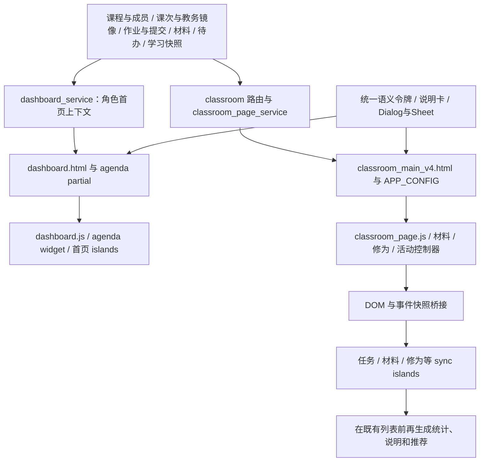

# 首页与课堂页：信息收敛、版面重构方案

日期：2026-09-05。调查基线：本地 `dev` 分支，提交 `c79f1674`。本文保留先调查、后设计的方案记录；后续经用户同意已实施，当前证据与验收边界见[实施验收附录](home-classroom-redesign-verification-2026-09-05.md)。

配套文件：[验收标准与测试矩阵](home-classroom-redesign-acceptance-2026-09-05.md)。

## 1. 结论与范围

建议先统一信息含义与归属，再重排页面，最后退役重复展示和遗留样式。首页以“现在需要处理什么、进入哪门课堂”为主；课堂页以“正在看哪次课、有哪些材料可学、哪些课堂任务需要处理”为主。修为、全学期安排、完整材料目录、历史记录与管理细节保留完整能力，通过明确的二级入口承接。

用户所说的“仙宫、道法自然”，落实为克制的秩序：有轻重的留白、准确的文字、稳定的对齐、适量的色彩，以及打开、处理、返回都连贯的交互。保留“修为”等已有产品语义；不增加装饰性仙侠名词、背景山水、漂浮光效、鼓励长句或新的积分仪表盘。

### 1.1 本轮调查覆盖

- 学生首页、教师首页及共同导航；学生课堂页、教师课堂页及其角色分支。
- 用户四张截图对应的待办驾驶舱、作业学习清单、材料学习路径、课次详情、修为进度。
- FastAPI 路由、服务层、SQL/表结构、Jinja 模板、传统 JS、React islands、共享样式与现有测试。
- 统一说明浮窗、材料列表/详情、修为详情、课程资料、待办编辑、课堂活动等现有承接能力。
- 本地既有设计文件，以及 NN/g、GOV.UK、Carbon、W3C、web.dev 的一手资料。

截图是界面现状证据，不把其中的文案当作改动指令。截图中的人数、任务数与时间也不视为本地数据库的实时值。调查阶段没有登录生产系统、改写数据库、运行可能触发同步/提醒的业务页面、改动业务代码或部署；以下明确区分当时的代码事实、设计决定与待测项。后续实施及隔离环境验证以实施验收附录为准。

### 1.2 范围边界

本方案重点改两类页面的结构、信息展示与必要的数据投影，不重做作业提交、考试作答、文档渲染、教务同步、修为算法、AI 生成、权限模型或小程序。它们的既有能力与约束必须继续工作。必要的口径修正和因版面迁移引出的生命周期整理属于本次范围。

学生端是截图问题的主要对象，但教师端共享同一模板、样式与控制器，必须同步设计和回归。教师的授课、批改、发布与班级管理需求不能照搬学生布局。

## 2. 现状调查：从信息源到界面

### 2.1 来源链



主要入口为 `classroom_app/routers/ui_parts/dashboard.py:7` 与 `classroom_app/routers/ui_parts/classroom.py:10`。前者通过 `build_dashboard_context` 输出角色上下文；后者先验证课堂身份，再装配文件、作业、课次、材料与页面上下文。

当前重复不仅存在于模板。课堂的 sync islands 还从旧 DOM、全局配置与事件中提取状态，再生成一套“概览”。因此只删除标题或隐藏卡片，既不能纠正数据含义，也可能破坏读取 DOM 的统计与操作桥接。

### 2.2 主要信息归属表

| 信息域 | 当前来源与展示链 | 用户真正需要的内容 | 建议唯一主归属 |
|---|---|---|---|
| 课堂身份与可访问课堂 | `class_offerings`、课程、班级、教师、合班成员关系 → dashboard/classroom 路由 | 课程名、班级、进入课堂 | 首页课堂列表；课堂页页头显示当前身份 |
| 上课/监考/考试安排 | 课次、教务同步数据、todo overview → `dashboard_agenda_events`、teaching plan | 日期、节次、地点、变更状态、进入入口 | 首页日程；当前课堂只显示当前/所选课次 |
| 作业考试 | `assignments` + `submissions` + 访问判断/补交策略 → 路由、任务卡、任务板快照 | 我能否做、截止/补交时间、是否已提交、成绩是否可见 | 课堂任务清单；首页只摘取需行动项 |
| 个人待办 | 既有 todo 服务与 `/api/todos` 等接口 | 标题、时间、完成状态、编辑/完成 | 首页统一事项清单与日程，不再另建任务系统 |
| 课次学习材料 | `class_offering_learning_materials` 与兼容主绑定 → teaching plan、材料列表弹层 | 所选课次可打开的文档与必要状态 | 当前课次的材料短清单 |
| 全课堂材料目录 | 材料授权、目录 API、`classroom_materials.js` | 目录、文件、打开/预览/下载 | “全部材料”二级视图；不等同于课次材料 |
| 共享课堂资源 | `course_files`、公开/教师资源标志 → 课堂资源区 | 可用文件、详情、允许的下载/管理 | 既有课堂活动中的资源入口；与课程材料区分 |
| 学习/修为 | 学习进度服务、快照、证书、阶段试炼 → 首页、课堂、详情弹层 | 当前课程境界、数值、可执行的阶段动作 | 课堂一行摘要 + 修为详情；全局成长留个人中心 |
| 阅读续接 | 学习阅读进度与最近材料 → 首页下一步/学习路径 | 文档名、所属课堂、继续阅读 | 首页唯一续接动作，不再叠加推荐卡 |
| 讨论/互动/小组/私信 | 既有活动控制器、WebSocket、必要轮询 | 进行中的互动、未读信号、输入与协作操作 | 课堂活动工作区；进行中事项可提升为轻提示条 |
| 通知与安全 | 消息中心、安全摘要、异常状态 | 未读入口、需要处理的真实风险 | 顶栏统一消息入口；关键风险在相关流程显式呈现 |
| 教师管理 | 教师上下文、管理三域与管理页 | 备课、授课、批改、班级与系统管理 | 教师首页紧凑导航及已有管理页 |

**重要边界：作业目前属于整个课堂。** `schema_assignments.py:293` 起的建表结构没有课次关联字段，课堂查询在 `ui_parts/classroom.py:149` 按 `course_id + class_offering_id` 取任务。新布局必须称“课堂任务”，不能凭标题、发布时间或相邻课次推断为“本次课作业”。若未来需要课次关联，应另立业务需求。

### 2.3 四张截图的具体诊断

| 编号 | 观察到的问题 | 已核对的代码原因 | 处理方向 |
|---|---|---|---|
| E01：作业与考试 | 一项任务前有整套学习清单、四格数字、进度、推荐及已提交条；字段被挤成细缝；远期倒计时过醒目 | `assignment-task-board-sync.tsx:216/246` 再生成概览；`assignment-task-board.ts:208` 的活跃值来自 open/stage/exam 信号；CSS `45365` 起多层网格挤压 | 保留一张真实任务清单，去掉虚构活跃率；状态行和日期替代仪表盘 |
| E02：课程材料 | 目录前重复课次、材料数、README 数、已选数、待配置课次、导航和刷新；材料行异常高 | `material-learning-path.ts:252` 混合课次绑定率与目录可用比例；`:275` 把未配材料课次放入队列；CSS `44117` 起旧卡片断点与 `44252` 起单列规则冲突 | 主层只显示可学材料；教师配置缺项进入备课视图；目录恢复清楚的行布局 |
| E03：课次与修为 | 教务说明、日期节次地点重复；未配状态与巨型禁用按钮重复；修为横板又列五指标六阶段 | 模板 `568/680/852` 起；`learning-progress-sync.tsx` 将已有详情再次铺开 | 课次摘要一处；必要阻断一行；修为一行摘要，完整阶段与排名进详情 |
| E04：首页 | 长问候、大深色待办、六统计格、下一步、课程脉搏争夺主次；未来课次被当“本周截止” | `dashboard.html:121/145/183`；`dashboard_service.py:2000/2091` 时间与计划口径不一致 | 一份可行动事项清单，课堂列表成为主内容；日程与成长详情下沉 |

材料行的重叠有明确样式链：`ui-system.src.css:44117` 起在大视口将材料行变三行卡，第三、第四子元素共享 `grid-area:meta`，第四项又有负外边距；`44252` 起材料区域改回单列后，旧行规则仍生效。应删除被替代的规则，不能再用另一条负边距补救。

任务统计区也不能仅以浏览器宽度判断是否足够宽：课堂侧栏在 `44244` 附近占据固定宽度，主内容内部又是三列和四格细分，`:45411` 附近的 nowrap/overflow 隐藏会把中文标签压没。验收必须覆盖实际容器宽度。

### 2.4 优先修正的信息真实性问题

1. **日期已过不等于任务已完成。** `dashboard_service.py:946` 的事件归一化把早于今天的日期置为 `completed`；`:1090` 的未完成 todo 仍进入该函数；`dashboard_agenda_widget.html:12` 再过滤掉 completed。于是逾期未完成项可能从提醒区消失，却在另一块被标为超时。这条路径已静态确认，实施阶段必须用固定时钟 fixture 复现。
2. **未来七天不等于本周，课次不等于截止。** `dashboard_service.py:2000` 的分支没有限定任务种类。需分开“上课时间”“任务截止”“本周”“未来七天”。
3. **今日计划不是当天计划。** `dashboard_service.py:2091` 混合逾期、未来事项、阅读、复盘和消息，随后生成今日计数与完成率。新首页去掉该混合百分比，显示明确范围的状态。
4. **活跃率不是学习完成率。** `assignment-task-board.ts:208` 把 open/stage/exam 计数相加后归一化；一项试炼考试可以同时命中多个信号。该值不适合作为学生学习进展，应退出用户界面。
5. **材料就绪度不是研读进度。** `material-learning-path.ts:252` 的公式混合课次绑定和当前目录可预览/下载比例，切换目录可能改变数值。删除学生主界面的这根进度条；教师若确需配置完整度，仅展示有明确定义的已配/总课次分数。
6. **修为、总分比例、阶段比例不得混称进度。** 保留服务提供的原始语义，按“本课程修为”“当前阶段进度”等准确命名；全局汇总与单课值不能放在同一上下文中暗示相等。具体跨端小数/四舍五入差异需用同一快照复核，不能仅据截图断言算法错误。

补充核对：`learning_progress_service.py:1338` 的阶段百分比、`:2779/2827/2867` 的全局 profile 选课与取值，并不构成“全课程完成率”。首页阅读百分比来自滚动与阅读时长的代理值（`dashboard_service.py:1763`），不代表掌握程度；连续学习文案也未始终检查 `active_today`（`:2340`）。这些解释可进说明卡，首层不能夸大为学习成效。

首页“继续学习”取到的课堂活动时间还可能来自任务或材料更新（`dashboard_service.py:2205/2528`），并非个人最后进入课堂。没有真实访问依据时使用“进入课堂”；有自己的材料阅读记录才使用“继续阅读”。“今日完成”如未按完成事件时间计数，应退出展示，不能按截止日倒推完成日。

## 3. 本地知识与网络依据的取舍

### 3.1 延续的项目约定

| 本地文件 | 延续内容 | 本方案调整的旧建议 |
|---|---|---|
| `docs/ui-explanation-system.md` | 使用统一说明卡、单例委托、懒加载、安全链接；关键状态常显 | 不把“所有提示”一概隐藏，按是否阻断任务区分 |
| `docs/frontend-redesign-2026-08.md` | `--ls-*` 语义令牌、现有 shadcn/Radix 基元、Jinja + islands 渐进迁移、构建产物一致 | 旧“课堂结构无大缺陷”结论不再用于本次判断；按当前截图与代码修正 |
| `docs/frontend-premium-design-language.md` | 内容先行、留白、克制、角色区分、功能可达 | 不沿用过大的首页标题和多统计卡作为固定目标 |
| `docs/ui-copy-simplification-plan.md`、`docs/ux-overhaul-2026-08.md` | 去重、说明下沉、保留错误与业务约束 | 不继续在大文件末尾堆 polish；退役被替代段落 |
| `docs/student-dashboard-improvement-goals.md` | 单一焦点、统一 agenda 来源、续接学习与空态 | 暂不继续增加 AI 导学、节奏条、纹理与数字入场；先解决已有密度和口径 |
| `docs/cultivation-system-improvement-goals.md` | 已有快照、证据链、阶段条件及调度边界 | 视觉改动不触发修为算法或计分数据库重构 |

旧文档的完成勾选是历史记录，不构成本轮测试证据。本方案被采用后，应同步更新冲突的设计条目，保留历史说明，避免出现两个相互矛盾的“真源方案”。

### 3.2 一手资料及落地方式

- [NN/g：Progressive Disclosure](https://www.nngroup.com/articles/progressive-disclosure/)：第一层保留高频关键能力，第二层承接低频复杂内容。本方案用“全部课次”“全部任务”“修为详情”等可预测入口，而不是无意义的“更多”。
- [GOV.UK：Details](https://design-system.service.gov.uk/components/details/)：折叠适合补充解释，不能隐藏多数人完成任务需要的信息。因此截止、未配原因、失败与权限状态持续可见。
- [IBM Carbon：Data table](https://carbondesignsystem.com/components/data-table/usage/)：同构数据便于用行扫描，额外信息按需展开，批量动作跟随选择状态。本方案借鉴这一模式整理材料列表，不把学生页面改成密集管理报表。
- [W3C：WCAG 2.2](https://www.w3.org/TR/WCAG22/) 与 [重排说明](https://www.w3.org/WAI/WCAG22/Understanding/reflow.html)：布局必须支持键盘、缩放、对比度和小宽度重排。主要清单不能依赖横向滚动才能读完。
- [W3C：悬停或焦点内容](https://www.w3.org/WAI/WCAG22/Understanding/content-on-hover-or-focus) 与 [APG Tooltip](https://www.w3.org/WAI/ARIA/apg/patterns/tooltip/)：解释内容应可关闭、可移入、持续可读。项目说明卡带链接，应维持现有非模态 dialog 语义，不能套成不可聚焦的纯 tooltip。
- [W3C APG：Modal Dialog](https://www.w3.org/WAI/ARIA/apg/patterns/dialog-modal/)：二级面板必须处理入内焦点、焦点约束、Escape 和关闭后返回，不能只验收浮层是否出现。
- [web.dev：Web Vitals](https://web.dev/articles/vitals)：后续性能目标采用 LCP、INP、CLS；实验室结果与线上真实用户结果分开记录。

以上“每屏最多几行”“间距多少”“两层以内”等数值是本项目拟定的设计预算，不是这些来源给出的通用定律。WCAG 的规范性要求与项目目标在验收文档中分列。

## 4. 信息分层与共同规则

### 4.1 四类去向

| 层级 | 内容 | 呈现规则 |
|---|---|---|
| L1：行动与真实状态 | 当前课堂/课次、可打开材料、待处理任务、正在进行的活动、阻断原因 | 常显；主要动作无需等待悬浮提示 |
| L2：完整集合或细节 | 全部待办、学期日历、所有课次、全部任务/材料、修为详情、课程资料 | 明确命名的标签/按钮进入既有页面或二级面板；关闭回到原位置 |
| H：补充解释 | 功能用途、统计定义、来源机制、操作说明、名词释义 | 复用统一说明卡；可悬浮，也必须有键盘与触屏入口 |
| R：退出展示 | 重复标题/副标题、无意义零值卡、合成活跃率、重复导航、宣传鼓励句 | 删除对应展示与死逻辑；不删除业务记录或可用功能 |

一个指标在同一上下文只有一个主展示位置。允许首页摘要链接到课堂详情，但不再在同页三处重复数值、解释和行动。预览数与总数必须明确，如“显示 3 项，共 12 项”；不能把截断后的 DOM 数量当总量。

“常显”指所展示记录的关键状态不藏入说明卡，并不要求所有记录全文常驻。完整集合可以进入第二层；超出预览的紧急/异常事项必须有准确数量和直达相应筛选的入口，不能静默截断。

### 4.2 状态与时间的统一约定

- 将事件种类、时间位置、业务完成状态拆开：例如 `kind=class`、`temporal_state=past` 不推出 `completion_state=completed`。字段名是拟议的展示契约，不要求新增数据库列。
- 保留原始来源标识，使用类型 + 来源 ID + 课堂 ID 去重；课程安排、教务考试、站内考试任务和个人试炼保持来源差别，不只按标题去重。
- “今天”使用 `Asia/Shanghai` 本地日界；“本周”使用周一至周日；滚动窗口标为“未来 7 天”。现有 `china_now()` 可作为服务侧时间基准，需同步消除浏览器解析无时区时间的差异。
- 普通任务先显示明确截止日期。超过 24 小时默认不显示秒级倒计时；24 小时内可显示小时/分钟；考试实际进行中或业务要求秒级精度时保留计时器。判断均以服务状态和截止时间为准，切后台不累计误差。
- `0`、未知、加载中、失败、未配置、无权限是不同状态。空值不得补成“0 分”“已完成”或“100%”。真实暂无事项可用一行空态，零值徽章通常不渲染。
- 普通已关闭任务归历史；逾期仍可提交/补交的任务留待处理；逾期不可操作的结果保留可见状态及详情入口，不能推荐无效“去完成”。

### 4.3 统一视觉预算

| 项目 | 拟定值与规则 |
|---|---|
| 内容宽度 | 两页主要阅读区优先约 1200–1280px；超宽屏留外侧空间，不无限拉长句子。讨论/目录全量视图按任务另行放宽 |
| 桌面边距 / 手机边距 | 24–32px / 16px，320px 时必要处 12px；使用既有间距令牌 |
| 章节与组内间距 | 章节 24–32px，组内 8–16px，标签与正文 4–8px；不靠空卡片撑高度 |
| 字级 | 页标题 24–28px、章节 18–20px、正文 14–16px、辅助 12–14px；相邻信息不使用过多字级 |
| 行高 | 中文正文约 1.5–1.7；标题约 1.3–1.4；长名称自然换行，不压成单字竖列 |
| 面板与行 | 页面底层不套大卡；章节最多一层轻表面；列表行用分隔线与留白，无独立重阴影 |
| 色彩 | 使用既有语义令牌；学生行动色、教师行动色沿用角色主题；警告色只承载真实状态 |
| 操作层级 | 每个行动区最多一个实心主按钮，其余文字/次级按钮；去掉按钮小标题与重复箭头 |
| 圆角与阴影 | 沿用 `--ls-radius` 及既有标度；主层默认无阴影或极轻阴影，浮层才表达明确景深 |
| 动效 | 仅状态变化与开合，约 120–200ms；数值不为装饰跳动，尊重 reduced-motion |
| 响应式 | 依据容器实际可用宽度重排。双列不足时转单列，禁止“桌面视口够宽所以内部继续六列” |

这些预算需在高保真实现中以长中文、英文文件名、空态、短屏和 200% 放大确认，不能用裁切、缩小字体或固定高度强行达标。

## 5. 首页具体方案

### 5.1 学生首页结构

```text
全局顶栏：品牌 / 当前页面                        消息 / 个人入口

张三，早上好                                     日程  新增待办
9 月 5 日 周六

现在需要处理                                    全部事项（N）
真实紧急事项 / 当前上课 / 一条续接学习       [唯一主操作]
次要行动最多 2 行；无事项时不展示空统计

我的课堂                          搜索  学期/状态筛选（按需展开）
课程名 · 班级                 下一次课或需处理状态      进入课堂
课程名 · 班级                 下一次课或需处理状态      进入课堂

学习工具：学习路径 / 错题本 / 成绩单 / 成就入口
```

“现在需要处理”不是又一块仪表盘。它是统一事件投影的短清单：一个最重要动作和最多两项辅助事项，不并排铺六个统计值，也不为了凑三项添加激励卡。有更多待处理项时显示准确总数和“全部事项”入口。

候选仅从本人有权限且有明确下一动作的事项产生。以下作为首版可测试排序，不改变业务截止规则；仅在无近期硬任务时展示“下次课：9 月 10 日”，不标为截止或今日任务。

| 顺位 | 候选范围 | 冲突时的决定 |
|---|---|---|
| 0 | 有效行动窗口将在30分钟内结束的硬截止事项 | 优先于普通进行中投票；按有效截止时间从近到远 |
| 1 | 本人正在进行的考试/测验，或有可靠起止时间的当前授课/监考/课程 | 不把没有时间依据的普通课次推断为进行中 |
| 2 | 今日其余硬截止/有限补交或重交窗口 | 按当前有效窗口截止排序，不按早已过去的原截止 |
| 3 | 今日课程安排、今日个人待办和明确需处理的教师工作 | 先当前/最近安排，再用户高优先级，随后稳定来源键 |
| 4 | 普通进行中投票、高优先级无日期待办、仍可操作但无明确结束时间的逾期/补交 | 不因原截止很久以前就永久霸占首页；在全部事项保持可找 |
| 5 | 未来7天的有效任务窗口 | 明示日期，不能称今日任务 |
| 6 | 一条本人续读、低优先建议或最近未来课程安排 | 不为了填满列表而全部添加 |

同顺位先按当前有效截止时间（缺失置后）、明确开始时间、用户优先级、稳定来源键排序；顺位3按表内当前安排规则先分组。日期只有“天”时按日期合同处理，不伪造精确时刻。已关闭且不可执行的事项不参与“去完成”推荐，异常结果可作为状态入口保留。去重在截取前三项之前执行；计数来自完整集合。

未在调查中发现足够可靠的精确课节开始时间时，只显示“今天第 4–5 节”，不猜测正在上课。如果有可靠、未取消的起止时间，才显示“进行中”。

### 5.2 首页逐块取舍

| 当前内容 | 第一层新呈现 | 二级去向 / 退役内容 |
|---|---|---|
| 长个性问候 | 姓名 + 简短问候，日期一行 | 个性化长句退出页头；AI 解释不阻塞首屏 |
| 黑色滚动待办卡 | 合并为“现在需要处理”短清单 | 全量安排进入“日程/全部事项”；去掉首页内嵌长滚动区 |
| 今日计划/已完成/临近截止六格 | 只保留与当前清单范围一致的必要文本计数 | 今日混合完成率删除；连续学习与全局修为进入个人成长 |
| 下一步 | 与待办合并，续接阅读仅一处 | 不保留第二套推荐榜 |
| 课程脉搏 | 需要行动的原因在对应课堂行显示一句 | 各分项、排名、趋势进修为详情/学习路径 |
| 职业发展大卡 | 学习工具中一个“职业发展”入口 | 保留 `/career-path`，退出教学首屏常驻长文案 |
| 课堂列表 | 页面主体；课程、班级、一条必要时间或状态、进入操作 | 冗余学期/教师/来源/鼓励说明进入详情或帮助 |
| 学期日历、我的日程视图 | 一个“日程”入口 | 同一二级容器的“事项 / 学期日历”视图；共用选择学期和事件源 |
| 快捷入口 | 底部一组紧凑文字入口 | 已在顶栏存在的消息、个人资料等不再复制 |
| 优先处理、最近动态 | 可行动项并入唯一清单；纯通知归消息中心 | 不保留没有独立任务价值的侧栏卡 |
| 登录安全 | 当前需处理风险显式提示；入口保留 | 常态安全记录在个人中心，不能隐藏强制整改提示 |

课堂数量 ≤2 时不撑大卡片填满页面；3–6 门可为两列紧凑条目；更多课堂仍可搜索筛选，并明确分页/查看更多。不要因数量大而把所有课程详情、修为图和全部待办同时渲染出来。

### 5.3 日程与全部事项

复用既有学期日历与 todo 编辑能力，补齐统一状态投影、组合筛选和完整授权集合的读取契约。现有 agenda 已预先过滤部分状态，不能直接当完整事实源；“编辑待办”弹框也不能直接替代“全部事项”。全量面板提供事项/日历切换，按今天、未来、逾期、无日期等可理解的范围浏览，完整保留个人待办新增、完成、编辑和现有提醒设置。教师默认不关联课堂，学生维持原有授权课堂选择与编辑不可改课堂规则，两者均按本人归属隔离。

小集合允许在完整授权结果上客户端筛选；首版完整列表每批建议20项、内存完整集合上限100项作为待测预算。超过上限或来源本来存在截断时，发布前必须补齐分页/日期窗口读取与真实总数，不能留到未定义的后续阶段才修正“全部”的含义。F04/F05用于验证边界；预算可依据实测调整并记录。不新建第二份 todo 表或与学习路径竞争的状态。保留手机日历订阅、复制/打开订阅与原有重置流程；这些放日程工具菜单。教师邮件提醒及个人待办提醒设置保留原授权和确认流程。

现有“我的日程”将课堂时间轴与全部 agendaEvents 合并，课堂搜索未必同步过滤 agendaEvents（`dashboard.js:906`）。新视图必须明确筛选范围，并让列表与日历遵守同一个课程/日期/类型条件，不能出现“只搜一门课却仍混入其他课事项”。

切换事项/日历不重复请求相同事件；关闭恢复首页原滚动位置、搜索词和筛选。日历可有局部横向滚动，首页本体只有纵向滚动。

### 5.4 教师首页差异

页头使用“教学工作”语义。主清单优先当前授课/监考、待批改与必须处理的异常，课堂列表继续作为主体。开课、备课与管理三域（教学域、教务域、材料中心）缩为一组明确导航，保留超级教师与普通教师原有权限差异；不能把低频管理入口直接删除。密码审核等需要处理的真实事项依权限保留入口。

教师需要的待批改数量、当前课次未配材料等是工作状态，允许按需常显。全班修为排名、教务同步详情、历史评价、统计明细进入既有详情/管理页。同步失败、排课变动、发布失败必须在相关任务处可见，不能仅依靠悬浮卡。

## 6. 课堂页具体方案

### 6.1 总体布局

保留当前页面与锚点体系，优先完成板块收敛，不先把整个课堂改为新的 SPA 或多级页签。桌面去掉挤占材料/任务可用宽度的常驻大侧栏；活动作为完整的下方区域。第一层布局如下：

```text
返回首页          计算机网络原理 · 班级        消息 / 课堂菜单
轻量导航：课次  课堂任务 N  材料  课堂活动

所选课次：第 3 次课                         上一次  下一次  全部课次
9 月 10 日 周四 · 第 4–5 节 · 五合校区 B310   课次详情
课次标题 / 教师实际写的内容摘要（有内容才显示）

课堂任务：待处理 N                          课次材料
未提交 · 任务名 · 截止日     进入            可打开文档 1                 打开
待重交 · 任务名 · 补交日     进入            可打开文档 2                 打开
全部任务（M）                               本课次全部材料 / 全部课堂材料

本课程修为：未入道 · 2.2                     修为详情 / 可用的试炼动作

课堂活动：研讨 / 互动 / 协作 / 资源
当前活动内容；保留输入、状态及原有功能
```

双列仅在两侧都能容纳完整标题、状态和操作时启用；不足约 960px 的内容区转单列。DOM 与主要阅读顺序统一为课次摘要、课堂任务、课次材料、修为摘要、活动；桌面双列按这个顺序从左至右排列。不为手机与桌面维护两套可交互 DOM。最终以任务可见性与键盘顺序验收，不以断点数字本身验收。

材料已可打开时显示直接动作；未配置时显示一行“本次课材料尚未发布”。学生不显示教师的“待配课次清单”，也不显示两个重复灰色巨型按钮。教师看到“未绑定材料 · 选择材料”，并保留 AI 生成、任务进度、失败重试等现有动作。

上述材料未配状态仅适用于普通课次。三类节点须分别处理：课程首页使用 `session_id=0`，称“课程简介与目录”；普通课次使用真实课次 ID；教务考试节点展示考试安排，不产生待配材料、绑定或AI生成动作。教务考试安排不自动等同于站内可作答试卷，只有已有明确绑定才提供对应入口。

教师课堂采用同一轻量骨架，但内容不同：

| 学生主层 | 教师对应内容 | 详情去向 |
|---|---|---|
| 课堂任务：未提交/重交/结果 | 课堂任务：待批改份数、涉及任务数；每项一行已交/应交与主要管理动作 | 原作业详情、发布/试卷库、分组、成绩用途、错题汇总 |
| 课次材料：打开 | 课次材料：预览、绑定/替换；解绑等次级动作；生成状态常显 | 原材料选择、多材料、AI/lessonDoc流程 |
| 本课程修为 | 班级成员与需要关注的状态摘要，不显示教师自己的学生境界 | 原成员、预警处理、权重、趋势、考生名册、重修等视图 |
| 参与课堂活动 | 发起与管理活动、查看参与情况 | 保留原权限、结束/公布结果等完整行为 |

教师计数不得混用“任务项数”“提交份数”“学生人数”，合班人数沿用原有效成员范围；详细统计收纳后仍必须能完成原管理动作。

### 6.2 课次区

- 第一层只出现所选课次、明确日期/节次/地点、状态和可执行动作；当前、下一次、用户所选需区分，不能把过去所选课次写成“当前上课”。
- 完整时间轴节点进入“全部课次”。保留顺序、已调课、教务考试、课程首页等节点类型，支持回到当前/下一课次；如需显示课次数，只计普通教学课次，不把所有节点数都叫课次。
- “课程首页”改为“课程简介与目录”，防止与平台首页混淆；仍复用原首页材料绑定和查看地址。
- 由同步自动生成的“按教务实际排课自动生成，请补充……”属于教师编辑指导，移入教师说明卡；学生不看编辑模板文案。
- 真正的教务变动、取消、未同步、地点未知等状态必须保留。日期、节次、校区短名与教室只展示一次；完整楼宇/场地长名、教学班、来源与同步时间放“课次详情”。同名教室分属不同校区时必须在首层可区分。
- 教师真实编写的教学内容不能因长就删除。第一层给语义完整摘要与“展开课次内容”；全文保留原值，可在详情阅读。

区分自动占位与教师正文时，优先使用现有来源/元数据及是否仍等同于原生成模板的证据；教师编辑后的混合正文不能靠关键词匹配整段隐藏。证据不足时保留摘要/全文入口，不自动删除内容。

### 6.3 课堂任务区

删除学习清单仪表盘、合成活跃率、重复“任务列表”标题和空的已提交统计卡。保留统一清单：类型/状态、标题、截止或补交时间、一个主要动作。标题最多两行，完整名称在展开/详情可读；截止、补交约束不得被截掉。

默认预览 3–5 项可行动任务，标题标真实待处理总数 N。只要存在任意授权任务，就始终提供“全部任务（M）”，M 是全部可见任务总数，包含待处理/已提交/历史等筛选；任务与考试的业务类型继续保留。N 为 0 时用一行“暂无待处理任务”，仍可查看已提交与历史。正在批改或需要重交的变化仍明确可见。

任务行根据当前权限和状态使用“开始作答”“继续作答”“提交作业”“重新提交”“查看结果”等准确动作；不能所有任务都叫“去完成”。作业详情页继续承担完整要求、文件约束、答题、提交、评分及小组揭示规则。

远期截止例如剩余 117 天，清单显示截止日期；不每秒跳动。考试页的真实考试计时器保持原业务行为。待补交扣分/封顶、仅某学生可见的个人试炼、小组成绩尚未揭示等状态继续由后端决定。

降低列表计时频率不能降低状态时效。统一页面状态在最近的开放/截止/补交/重交边界更新，并在恢复可见或相关业务事件到达时校准；预览、全量列表、按钮与计数同步。复用现有刷新/事件机制，必要时用一个边界调度器，不给每行新增轮询；服务端最终决定操作是否有效。

投票应归既有课堂活动语义，不与“作业与考试”抢同一级标题。若迁移投票入口，进行中投票必须在活动导航有数量或状态提示，并兼容旧入口；不能只是移走容器导致控制器失效。

### 6.4 材料区

区分两个集合：所选课次绑定材料，以及整个课堂授权材料。第一层只放所选课次材料预览，以及“本课次全部材料”“全部课堂材料”明确入口，不再铺第二份课堂材料预览。课次短清单不以目录当前页数量充当课程材料总数。完整目录、README 与仓库元数据复用材料列表/详情能力。

行结构为“类型图标 + 名称 + 必要大小/子项 + 主操作 + 次级菜单”。Git 平台名、仓库完整路径、README 支持等进入详情；文件/目录/仓库类型保留可辨识。目录的“打开”即进入目录，文档的主操作按已有 preview/viewer 能力决定；“渲染/文档”如代表不同查看器，必须先保留两个能力并给出清楚菜单名称，不能盲目合并。

只保留当前目录一处面包屑、一处刷新。批量下载进入选择模式后才出现选择数与下载操作；禁止下载的条目继续显示权限状态且不可选下载。无可下载项时不显示误导性主按钮。

“材料学习路径”的五格数字、混合进度条、三个待配课次及重复导航退出学生主界面。教师配置检查保留在“全部课次/备课检查”里，数字严格表示材料绑定完整度，不能名为学习进度。

### 6.5 修为与活动

修为只留一行课程境界与服务提供的数值，必要时显示当前阶段进度；三者有明确标签。沿用 `learning-progress-modal` 承载材料/任务/互动分项、证书、排名、六阶段、权重说明、流水与现有可用内容。阶段试炼达到条件时可给一个真实行动入口，生成中/失败/等待批改等状态不得被折叠隐藏。

活动区域保留研讨、互动、小组协作、资源四类现有能力；使用文字可读的标签，去掉重复活动概览仪表盘。进行中的测验、投票或需立即响应的活动可在课次区下方显示一条轻量入口；只展示真实进行中信号，不复制活动全文。

研讨、私信、AI 助手、文件上传、图片、表情、引用、连接状态、协作、小组二维码等均有明确入口。常态二维码和低频操作可收进课堂菜单或现有二维码面板，但已经进行中的加入/发布流程仍须可发现。

### 6.6 二级承接表

| 新入口 | 现有承接基础 | 需要补充的工作 |
|---|---|---|
| 全部课次 / 课次详情 | teaching timeline 与现有 session 详情逻辑 | 从长横向首屏收纳到可搜索/定位的面板，保留节点类型与选中态 |
| 本课次全部材料 | `classroom_material_list.js`、`openMaterialListPopup` | 核对传入 session 范围、空态和多材料数，复用现有操作 |
| 全部课堂材料 / 材料详情 | `classroom_materials.js`、`classroom-material-detail-modal` | 整理目录外壳、边界尺寸与返回路径；不另建文档渲染器 |
| 全部课堂任务 | `#assignment-panel` 与现有任务/详情链接 | 全量筛选面板是待实现的整理能力，不假称已有完整专页 |
| 修为详情 / 班级成员 | `#learning-progress-modal`、`learning_progress.js` | 缩减主层重复内容，保留原详情及业务状态 |
| 课程资料 / 统计 | `#course-info-popover` 与 `data-course-popover-target` | 归并顶部重复入口，维持教师/学生可见字段 |
| 课堂资源 / 小组 | 既有 classroom activity panels | 保持标签切换与深链接，消除重复概览 |
| 完整学习路径 | `/learning-path` | 保持为独立能力，不在首页再复制整套路径 |

“第二层”是主页面之外的完整内容容器，不意味着所有内容都挤入小弹框。短详情用 Dialog/Sheet，完整文档仍进现有查看器，长时间编辑/作答继续独立页面。新增面板基于共享基元，并统一外壳尺寸和返回行为；避免二级面板再套二级面板。

“全部材料→材料详情”“班级成员→成员详情”采用同壳切视图并提供“返回列表”，或在进入已有独立查看页时先关闭列表、保留返回状态。不能同时开启两个模态焦点陷阱。返回恢复列表筛选/滚动/选中项；非模态说明卡可解释当前控件，不替代业务详情的往返路径。

## 7. 说明卡与二级面板的交互契约

说明类内容使用 `templates/macros/ui_explanation.html` 的 `explain_attrs` / `explain_button`；动态 DOM 使用 `window.LanShareExplanation.attach/register`。不新建 tooltip DOM、悬浮计时器、定位库或重复监听器。

沿用当前 2000ms 悬停、300ms 焦点、650ms 长按与移动 10px 取消规则；重要解释给显式说明按钮，不能只挂在不可聚焦的大容器上。说明卡有链接，实际语义为非模态 dialog；需要核查卡内链接的键盘进入/退出，不能假定当前实现已全部满足。

二级面板约定：桌面窄详情约 480–640px，目录/全量任务可至 800–960px；手机用接近全宽的 Sheet。内容高度限于可见视口，标题/关闭保持可达，正文单一滚动区。现有 Sheet 默认 75% 宽且 `max-w-sm`，Dialog 未默认限制长内容高度，必须为真实内容补充合适约束。

打开后焦点进入模态面板，Tab/Shift+Tab 不漏到背景；Escape 关闭；关闭后回触发按钮或合理替代位置。保留原课次、搜索词、筛选、材料路径、选择状态与滚动位置。对于未提交草稿沿用既有保护逻辑，不因美化新增无谓确认，也不能丢草稿。

## 8. 架构与实现边界

### 8.1 展示契约先行

在既有服务层形成轻量的页面展示投影，至少明确：来源 ID、事件类型、所属课堂、起止/截止时间、业务状态、是否可行动、权限内的目的地址、范围/总数、数据时点。优先扩展现有 context/类型，避免又建一个通用业务引擎。

首页的 focus、日程和计数使用同一归一化结果；课堂摘要与全量清单使用同一授权结果。模板与 TSX 不各自重新算完成率/紧急程度，不从“可见 DOM 文本”倒推真实总数。日期/状态定义的规则由一组测试固定。

布局改造默认无需数据库迁移。不新增修为、待办、材料或作业的影子表。若为长列表分页需调整查询，只沿原服务增加稳定排序与有界读取，并核验已有索引；不借此改计分或授权逻辑。

### 8.2 islands 与旧控制器迁移

`frontend/src/islands/classroom-page.tsx:56` 起仍负责批量加载旧模块。任务、材料、修为等 sync islands 是展示适配层，并非全部业务能力本身。应分别列出“退出的概览 UI”“保留的状态/命令协议”“可以一起退役的观察器”，再改模板。

`static/js/classroom_page.js:992/1093/1255/1309` 附近存在 DOM 快照与 MutationObserver。直接删除被读取的旧行或只显示前三项，会使总数、选择数、推荐与命令失真。应先把完整、授权的状态保留为明确的数据模型，再输出预览。不能永久保留一份隐藏大 DOM 专门供统计读取。

对同一功能只保留一个控制器实例；切换/关闭面板不重复 init、订阅或创建 WebSocket。首批迁移可暂保留必要单实例 DOM，以保持草稿和旧交互；但应标明依赖、退出条件并在对应阶段退役无用观察器，避免永久双轨。

### 8.3 路由和生命周期

保留或兼容 `#timeline-panel`、`#assignment-panel`、`#materials-panel`、`#classroom-activity-sidebar`、`#discussion-room`、`#interaction-panel`、`#collaboration-panel`、`#resources-panel`。旧链接指向已收纳内容时，应先打开正确面板再定位；不能滚到一个隐藏元素。

`classroom_page.js:704` 起是滚动导航，`:3961` 起处理活动切换和 hash；`replaceState` 不自动触发 hashchange，不能依赖其隐式更新。保留材料页 `?open_final_material=1&final_material_type=…` 等已有深链接行为。

活动目前通过 hidden 切换，重新显示会触发 resize；聊天在隐藏时无法正常量尺寸。重排后应在可见帧重新测量，保留输入、附件、引用、滚动位置与未读信号。私信存在 12 秒轮询，隐藏整个区域不自动暂停，应结合可见性与业务需要处理，而不是新增轮询或一刀停止所有实时信号。

### 8.4 性能、权限与构建

- 首页不因一个统计卡新增逐课堂重算、同步等待或 AI 请求；沿用既有快照和缓存语义，避免 N+1。
- 当前快照缺失/dirty 时仍可能同步重算（`learning_progress_service.py:1657`），首页还可能重复取单课状态；不能写成“现状已保证纯快照读取”。先用请求内复用和必要字段投影减重复，再根据实测决定是否需要额外异步优化。
- 二级内容按需获取或初始化；区分“少画 DOM”和“少查数据”，不能只用 CSS hidden 宣称性能改善。
- 课次材料 GET 当前会对部分材料即时生成 AI 简介（`materials_parts/learning.py:102`，服务单条有超时限制）。不能把它直接加入首屏全量预加载；优先读名称/已有简介，必要时拆出不生成内容的读取路径。此项是新布局依赖的性能保护，不扩展为全系统 AI 重构。
- 课堂路由有逐作业访问/提交查询，以及过期任务处理、考勤提醒/同步等既有副作用。改布局不复制这些调用；独立详情读取不应再次触发整页初始化。
- 学生合班成员校验、教师归属、个人试炼访问、教师资源过滤、小组成绩揭示均由后端维持。隐藏按钮不算权限控制；新增读取接口必须重做同等鉴权。
- 首页 context 也被 `classroom_app/routers/mp/home.py:24` 使用。网页新投影须兼容字段类型、状态枚举、时间/排序语义与约定集合范围，必要时在Web层单独组装。MP有40条agenda上限并依赖“待完成/已提交”等中文标签取统计；不得将Web前三条预览写回共享集合，删卡也不能直接删除这些消费标签。通过适配层处理必要变更，不扩大为小程序重设计。
- 新 UI 只用现有 `--ls-*` 语义令牌与共享组件；页面 CSS 有作用域，替代段落同步退役，严禁继续堆全局覆盖和 `!important`。
- 修改 CSS/TSX 后执行 `npm run build`，保证 `tailwind-app.css`、`static/dist`、manifest 与源代码一致。后续部署按项目流程另行执行；本轮没有发布行为。

## 9. 实施顺序与交付门槛

| 阶段 | 主要工作 | 可审查交付物 | 进入下一阶段的条件 |
|---|---|---|---|
| P0：冻结基线与口径 | 固定 fixture、核对逾期/本周/任务类型、快照范围与所有入口 | 旧版截图、事件字典、功能保留清单、错误复现 | 关键数据定义可测试，无未知的任务去向 |
| P1：共享呈现与状态整理 | 同源展示投影、说明/面板外壳、状态与日期格式、预览/全量分离 | 类型/上下文契约、共享组件、必要单测 | 0/未知/失败清楚，完整集合不依赖可见 DOM |
| P2：首页 | 单一待处理区、课堂主体、日程收纳、教师差异 | 双角色桌面/移动页面及功能证据 | 首页验收通过，旧统计与重复 CSS 退役 |
| P3：课堂 | 课次摘要、材料/任务行、修为收纳、活动与二级入口 | 四图对应改版、深链接/状态/权限证据 | 提交、文档、活动、草稿与返回连续性通过 |
| P4：回归与收尾 | 密度/缩放/主题/键盘/并发测量、文档更新、构建产物核验 | 完整验收报告、前后截图、性能比较、回滚说明 | 所有阻断项通过；没有以隐藏功能换来的“简约” |

建议分阶段独立提交，使用现有部署版本回退能力，不为这次布局再建一套长期 feature flag 系统。上线若发现任务漏列、误判状态、权限扩大、提交/材料/讨论功能中断，应立即回退对应阶段；视觉微差可在不影响流程的前提下修正。

## 10. 待验证事项与决策记录

### 已作出的方案决定

1. 以学生任务流为主要设计依据，教师按工作职责适配；保留既有系统架构。
2. 首页合并待办与下一步，退出六格统计和课程脉搏重复展示。
3. 课堂退出三类重复概览仪表盘，实际材料/任务清单成为主体；全量内容有明确入口。
4. 修为体系保留，主层缩成准确摘要；详细阶段、排名、证据进已有详情。
5. 首批保留课堂锚点与活动结构，不同时推进全页 SPA/路由重写。
6. 提示迁移按“补充解释 / 必须常显的状态”分类，沿用统一说明模板。

### 实施前需要实测，当前不作结论的事项

- 生产部署版本与本地提交是否完全一致；四图的实际浏览器缩放、容器宽度与数据快照时间。
- 相同授权 fixture 下，逾期事项缺失的具体表现、修为取整/不同范围值的呈现差异。
- 完整日程来源是否存在查询截断、各类型事件是否有可靠起止时间、过去事项的真实完成来源。
- 多材料与旧主绑定混合时的选择、去重与权限行为；“渲染/文档”各动作的真实差别。
- 二级面板在复杂长内容、键盘卡内链接、粗指针和短屏下的实际体验。
- 首屏与二级加载的请求数、SQL 次数、响应时间、渲染耗时、并发容量。

以上有对应测试，不需要在写方案阶段猜测数据或预先调整数据库。本方案的完成标准是“调查事实有出处、设计去向完整、验收可执行”；改版完成标准则以配套验收文档为准。

## 附录：主要代码证据索引

以下路径相对仓库根目录，行号对应调查基线，后续实现会变化。

| 文件与行号 | 核对内容 |
|---|---|
| `classroom_app/routers/ui_parts/dashboard.py:7` | 首页入口与角色上下文 |
| `classroom_app/services/dashboard_service.py:946/1090/1983/2000/2091/2493` | 事件状态、todo归一、优先级、今日计划、全局修为 |
| `templates/dashboard.html:104/121/145/183/253/268/559/576` | agenda数据、驾驶舱、教师分支、日历、快捷入口 |
| `templates/partials/dashboard_agenda_widget.html:12` | completed过滤与紧凑提醒列表 |
| `classroom_app/routers/ui_parts/classroom.py:65/97/112/149/164/188/213` | 课堂权限、文件过滤、作业与提交、成绩揭示、课次查询 |
| `classroom_app/db/schema_assignments.py:293` | 作业课堂关联及时间字段，无课次关联 |
| `classroom_app/services/session_learning_materials_service.py:248` | 多材料数量与兼容绑定合并 |
| `templates/classroom_main_v4.html:421/438/530/568/852/1473/1783/1824/2089` | 导航、课次、三个概览island、材料详情、活动 |
| `frontend/src/lib/assignment-task-board.ts:208` | 合成活跃指标公式 |
| `frontend/src/islands/assignment-task-board-sync.tsx:216/246` | 活跃率展示 |
| `frontend/src/lib/material-learning-path.ts:252/275` | 材料混合就绪度与待配队列 |
| `frontend/src/islands/learning-progress-sync.tsx:77` | 修为概览再次呈现 |
| `frontend/src/islands/classroom-page.tsx:56` | 旧控制器引导与单次初始化 |
| `static/js/classroom_page.js:704/992/1093/1255/1309/3961` | 锚点、DOM快照、观察器、活动切换 |
| `static/js/classroom_materials.js:1524` | 期末材料深链接 |
| `static/js/chat.js:362`、`static/js/classroom_private_messages.js:250/291` | 显示后尺寸恢复、私信切换与轮询 |
| `static/css/ui-system.src.css:44117/44244/44252/44786/45365/45411` | 网格、断点遗留与文本挤压 |
| `templates/macros/ui_explanation.html:10/23`、`static/js/ui_explanation.js:116/278/329/431` | 说明接口、非模态语义、单例与交互 |
| `frontend/src/components/ui/sheet.tsx:31`、`dialog.tsx:39` | 现有二级面板基元及尺寸边界 |
| `tests/e2e/specs/classroom.spec.ts:11`、`dashboard-todo-modal.spec.ts:10`、`ui-explanation.spec.ts:9` | 当前功能测试与覆盖缺口 |
