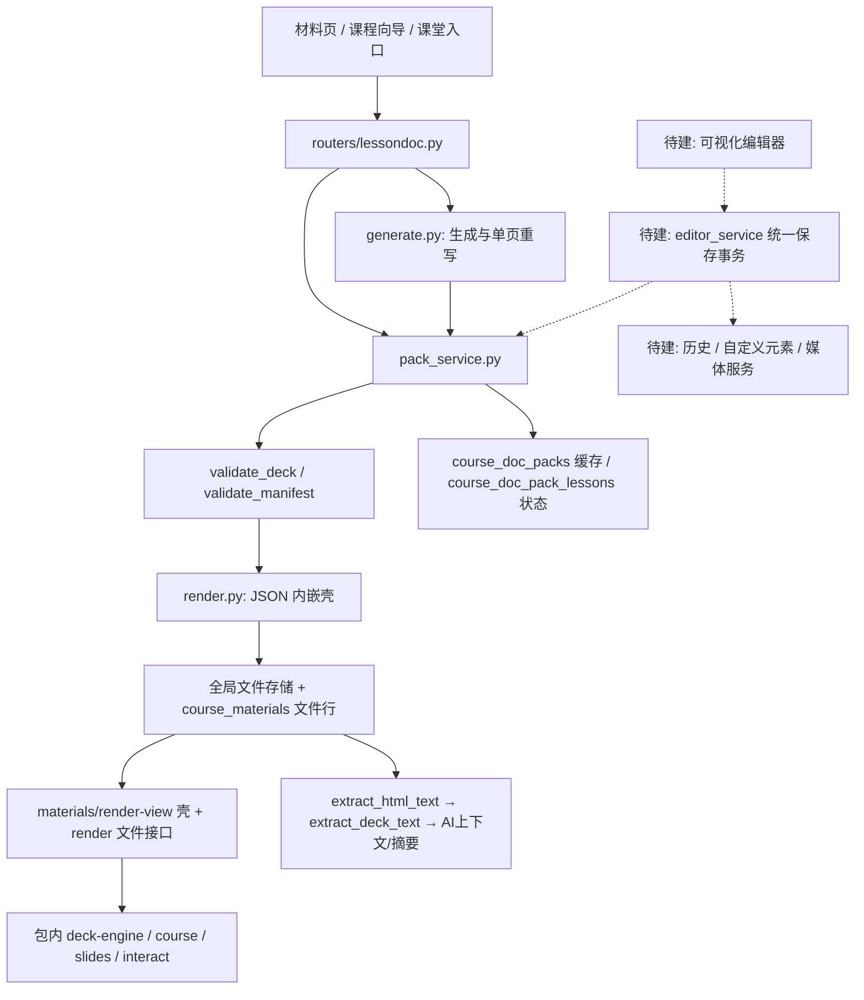
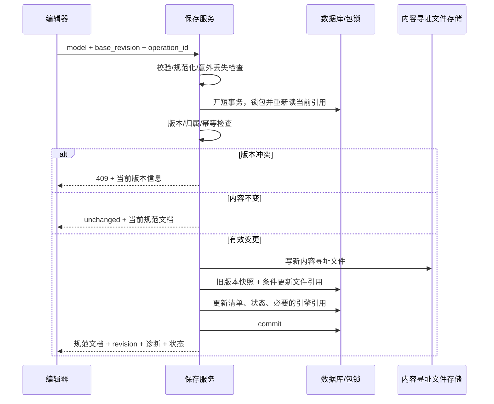

# 学习文档编辑器：现状审计、继续设计与施工方案

审计日期：2026-09-03。代码基线：`5bcee8e9`，加本次调查开始时已有的未提交修改。

本文是对 `lessondoc-editor-2026-09.md` 的实施审计与修订建议。原文仍保留需求来源；正式施工时应将本文确认的契约修订回写原文及 `lessondoc-authoring-guide.md`，避免长期维护两套互相矛盾的规范。

本次完成代码阅读、Git 历史核对、110 项相关单测、隔离浏览器复现和设计整理。没有实施下文功能修改，没有提交、推送或部署。历史文档中的生产、真实 AI、全量测试结论是前次工作的记录，本次未重新验证这些外部状态。

## 1. 核心判断

项目已经有可用的 **LessonDoc 2.0 生成、存储、绑定、阅读、迁移基础**；前一个 AI 又完成了 **编辑器所需的一批模型与渲染运行时扩展**。但完整的可视化编辑器尚未形成。

准确阶段应记为：**E0 已有实现及部分验证，仍需补强；E1—E6 尚未形成产品闭环**。不能按“完全没开始”重新造一遍，也不能按“E0 已完全验收”直接堆编辑器界面。

继续保留以下架构方向：

1. deck JSON 是课次内容真源；HTML 是确定性生成的交付壳。
2. 首页以 `course.json` 为真源，`main.html` 和数据库 manifest 缓存是派生物。
3. 流式版式与自由定位并存；原 AI 内容继续走流式，教师精修使用定位对象。
4. 渲染运行时随包分发、离线可用；编辑器 UI、权限、保存能力留在平台内。
5. 使用现有材料库、文件存储、课堂绑定、AI 调度、解释浮窗和提示词池。

建议先执行 **E0-R 补强阶段**，再按 E1—E6 交付。最先解决 HTML 净化、重复保存一致性、重渲生命周期和多写入者冲突。

## 2. 改进过程与实际完成度

### 2.1 Git 中可追溯的演进

| 时间 | 提交 | 已落地的重点 |
|---|---|---|
| 09-01 18:51 | `f43c7089` | LessonDoc 2.0：配置模型、引擎、生成及平台集成 |
| 09-01 22:40 | `4296e49a` | 长链流程图自动折行 |
| 09-02 07:56 | `63e9b6d8` | 学生侧验证、article 手机适配 |
| 09-02 08:26 | `c76b578d` | R2 单页 AI 重写、R5 引擎指纹治理 |
| 09-02 12:20 | `65c89bed` | 阶段分组、stepper 补全路径、批量生成韧性 |
| 09-02 18:41 | `5f107c50` | 卡死任务回收、阶段重叠去重、评审补丁 |
| 09-02 19:21 | `e007e084` | 多学科内容打磨、溢出修复、SVG 剥壳、测验标题与提示词改进 |
| 当前工作区 | 尚未提交 | 编辑器 E0 模型、样式/HTML 校验、渲染扩展、`interact.js`、24 项模型测试和第 3 课示例 |

这些提交证明改造进入了代码库，不单独证明当前生产正在运行这些版本。当前工作区还包含其他任务的修改和未跟踪文件，后续提交必须按本任务文件清单选择，不能整体提交。

### 2.2 按能力核对

| 能力 | 判定 | 依据与边界 |
|---|---|---|
| 建包、课次状态、顺序生成、重试、过期回收 | 已实现 | `pack_service.py`、`generate.py`、`routers/lessondoc.py`；相关测试通过 |
| 首页/课次壳生成、JSON 反抽取 | 已实现 | `render.py`；原模型可逆链保留 |
| 材料库、课程页、课堂入口与绑定 | 已实现基础入口 | 向导、材料页、课堂接口存在；可视化编辑入口尚未实现 |
| 单页 AI 重写 | 已实现旧路径 | 有页数预检；缺少与人工编辑共存的版本比较、稳定页面身份和统一历史 |
| 旧 HTML 包转换 | 已实现尽力迁移 | 原包保留；stepper 解说词和阶段分组仍有有损情况；R3 提供后续补全手段，不等于迁移器已能无损抽取 |
| 引擎指纹及手动刷新 | 已实现 | 资产清单已扩展为 7 个文件；编辑/AI 写入时自动刷新仍需接线 |
| `canvas/frame/style/bg/globals`、4 类新块 | 已有实现，需补强 | `spec.py` 注册 21 类块、8 种版式；部分组合及往返语义有缺陷 |
| 动作、代码步进、编辑桥接 | 已有实现，需补强 | 常规示例可运行；定位 codewalk、重渲、编辑态、定时器回收存在已复现问题 |
| 首页 `home.sections` 渲染 | 部分完成 | 顺序/显隐/新增区块存在；属性契约、ID 校验及首页编辑桥接不完整 |
| 文本提取覆盖新模型 | 未完成 | `objects/overlays/globals/lines/home.sections/html.body` 未完整进入提取链 |
| E1 编辑器 API、保存、版本、自定义元素、媒体 | 未实现 | 计划中的路由、服务及两张新表未找到 |
| E2—E5 三栏 UI、选择、属性、撤销、页轨、组合、首页编辑 | 未实现 | 未找到 `templates/lessondoc_editor.html` 和 `static/js/lessondoc_editor/` |
| E6 编辑入口、转换对话框、状态回传、端到端验收 | 未实现 | 现有壳只有“改这一页”；没有编辑器专用 e2e |

### 2.3 说明文档需要纠偏的地方

- 调查开始时，编辑器文档第 3 行与主设计文档 R7 写“未动工”，但编辑器文档原第 678 行起已勾选 E0 完成。本轮已校正状态并增加审计入口，保留前轮施工记录。
- 调查开始时，主设计文档顶端仍称“剩 P4 迁移工具与部署”，正文已经记录迁移实现。本轮已校正标题，并明确部署状态需独立核实。
- 编辑器文档 E0 引用了“E0 回归对比”小节，本文件中没有找到相应独立小节。
- `home.style` 设计为 `heroGradient/cardRadius`，校验器却按通用样式处理，引擎只读取其中的 `bgGradient`。
- 文档称桥接不进入编辑态就不执行，而当前 `interact.js` 总会注册动作、初始化播放器；编辑功能由 `mount()` 门控。这是合理分工，但应准确描述。
- 文档“ES5 口径”实际指语法风格；代码使用 `closest/:scope/NodeList.forEach` 等 DOM 能力，不能理解为支持任意旧浏览器。
- 原文的“更新记忆”不属于本轮调查或后续默认施工动作，须有用户直接要求才执行。

## 3. 当前真实链路



关键代码位置：

| 职责 | 文件与位置 |
|---|---|
| 文件写入更新 hash | `classroom_app/services/lessondoc/pack_service.py:57` |
| 清单读取、缓存回退 | 同文件 `:366` |
| course.json / main.html / 缓存一起写 | 同文件 `:389` |
| 课次校验与落盘 | 同文件 `:442` |
| 引擎副本刷新 | 同文件 `:614` |
| 课次文件定位与反抽取 | `classroom_app/services/lessondoc/generate.py:121` |
| 单课生成写回 | 同文件 `:317` |
| 单页重写读—AI—写 | 同文件 `:520` |
| 教师与 owner 检查 | `classroom_app/routers/lessondoc.py:125` |
| 阅读授权与文件服务 | `classroom_app/routers/materials_parts/exports.py:286` |
| 壳页 iframe 及教师重写入口 | `templates/material_render_shell.html`、`static/js/material_render_shell.js:78` |
| Git 材料更新 | `classroom_app/services/materials_git_service.py:769`，文件 hash 更新约 `:932` |

文件内容不是直接覆盖同一个物理文件：现有存储按内容 hash 落文件，再更新材料行的引用。因此新保存流程应围绕“文件引用、首页投影、状态、历史在同一数据库事务里提交”设计；不再造平行存储系统。Git 材料同步有自己的写路径，不能把 `pack_service` 误认为项目中唯一可能修改包文件的入口。

## 4. 必须处理的问题与证据

下表区分“本次运行复现”和“代码分析确认”。优先级中的阻断指阻断编辑器上线，不表示本次已修改这些代码。

### F01：HTML 净化存在可复现绕过【上线阻断】

位置：`validate_html.py:110`；`deck-engine.js:67–83`、`:844`。

`sanitize_html_body()` 在序列化时直接拼接 `root.text`。lxml 已将实体还原，所以输入本来是文字的 `&lt;img src=missing.png onerror=void(0)&gt;`，输出会成为真实 ``。前端正则只移除带引号的事件属性，未移除这个无引号事件。

隔离浏览器结果：`escaped_tag_became_img=true`，事件属性仍为 `void(0)`。这里只用无副作用本地样本，没有读取或发送用户数据。

此外，CSS 净化采用正则黑名单，`u\72l(...)` 形式可通过当前函数；这一项确认了过滤遗漏，没有在真实材料上验证外部资源加载。媒体、背景和 HTML 分别维护路径规则，均应改为统一的协议/路径解析规则，不能只列举少数禁止协议。

施工要求：正确序列化纯文本与子树；净化 HTML/SVG 属性、CSS 声明和选择器；前端预览入口同样拒绝未净化代码；增加实体、无引号事件、CSS 转义、命名空间、非法协议、编码路径测试。保持正常文本和 SVG 内部引用可用。

### F02：HTML CSS 校验不幂等，且与 ID 重排脱节【上线阻断】

位置：`validate_html.py:116`，`validate.py:355`、`:577`。

相同 HTML 块连续校验两次：

```text
第一次：.ld-html-b_h .x{color:red}
第二次：.ld-html-b_h .ld-html-b_h .x{color:red}
```

浏览器计算颜色由 `rgb(255, 0, 0)` 变为 `rgb(30, 41, 59)`。不是仅有文本差异，而是样式实际失效。重复 ID 还会在 CSS 生成后被改成 `b_dup1`，CSS 仍引用旧 ID。

现有写入函数内部再次调用校验；后续“预检→保存→恢复”会反复触发。因此不能靠“少调用一次校验”掩盖。

施工要求：定义并测试 `normalize(normalize(doc)) == normalize(doc)`；先规范 ID，再净化内容和解析引用。建议持久化已净化的局部 CSS，作用域在渲染时按最终逻辑 ID 编译；对已带旧前缀的数据做受控迁移。原始用户 CSS、净化后的局部 CSS、运行时作用域 CSS不能混为一个反复加工的值。

### F03：局部重渲缺少完整的交互生命周期【E0 必补】

位置：`course.js:6–97`、`:143`；`interact.js:277–295`；`deck-engine.js:1044`。

`course.js` 的 tabs、quiz、mindmap、代码复制只在 `DOMContentLoaded` 初始化。`patchSlide()` 替换 DOM 后只重建 slides 与 codewalk。

运行复现：选项卡重渲前可以切换；重渲后点击第 2 个 tab 不再切换。其余同类交互存在相同初始化缺口，仍需逐类回归确认。

施工要求：提供幂等的 `mountInteractions(root)` / `unmountInteractions(root)`；局部更新只针对旧、新子树处理；思维导图不能重复包裹 `.mm-node`，也不能重复绑定 click。stepper、reveal、quiz、tabs、代码复制、媒体错误监听和播放器统一纳入生命周期。

### F04：编辑态不是完整锁定，播放器会残留【E0 必补】

位置：`interact.js:153`、`:200`、`:247`；`slides.css:214`、`:375`。

本次复现三个独立问题：

- `mount()` 之后点击 codewalk 的运行按钮仍开始播放；`preventDefault()` 没有阻止现有 JavaScript 事件处理器。
- `patchSlide()` 删除播放器 DOM 后，旧播放器仍为 `playing=true`，并持有 timer。
- 带 `exitStep` 的内容在编辑态计算透明度仍为 0；`.frag-exited !important` 压过编辑态 fragment 样式。

施工要求：编辑模式和试播模式显式区分；在交互入口统一检查模式；进入编辑、离开页面、替换子树时暂停并销毁相关定时器；编辑态展示全部可编辑内容，退出编辑时根据当前阅读状态恢复。`prefers-reduced-motion` 应移除位移动画，不能把教学步进延迟改为 0，尤其不能让循环播放器高速空转。

### F05：引擎会修改传入模型，不能直接接不可变撤销栈【E0 必补】

位置：`interact.js:277–292`；`deck-engine.js:287`、`:378`。

`edit.render(deck)` 持有父页传入对象；`patchSlide()` 直接写 `deck.slides[index]`。图示布局还会向节点写 `_id/_i/_d/_w/_x/_y` 等临时字段。

本次复现：桥接替换了输入对象的页；首次渲染还污染了输入图示节点。若照原计划让父页与 iframe 共享同一 deck 引用，旧历史、脏标记和请求内容都会不可靠。

施工要求：父页 store 为唯一可写真源；桥接传输边界复制相应文档/页；引擎布局使用局部工作对象。开发测试冻结输入模型，渲染前后必须相等。滑块拖动可有多帧临时预览，但松手只提交一次撤销事务。

### F06：空白页与降级保存规则冲突【E1 前定稿】

位置：`validate.py:491–526`；原方案 §5.11、§7.2。

原方案计划创建“封面＋空白内容页＋结尾”，但当前空 `content/canvas/two-col/grid` 都会被丢弃。`two-col/grid` 即使有合法 overlays、没有流式内容，仍会丢页。

“校验后页数不得少于提交页数”只能拦住整页丢失，不能拦住同页丢块、表格行截断、动作移除、group 子块丢失。

施工要求：区分教师有意删除、教师有意留白和校验器意外丢内容。建议增加显式 `empty:true` 语义，只接受结构确实为空的页面；AI 未声明留白的坏空页继续沿用现有降级行为。编辑保存返回结构化诊断，意外删除和截断必须拒绝或先由教师明确处理，不能保存后才告诉其内容没了。

### F07：新内容脱离文本提取链【E0 必补】

位置：`render.py:138–188`；`html_package_service.py:256`。

提取器没有递归 `objects/overlays/globals/lines/home.sections`，也没有对 HTML body 做可见文本提取。仅有这些新内容的测试 deck 提取结果为空字符串。button 的 label 在旧流式容器内可以被提取，不能笼统说所有新块都失效。

施工要求：通过共用遍历器覆盖新旧容器；收集 codewalk 的 `code/out/note`；HTML 只收集正文文字，忽略 CSS、脚本和结构元数据。全局元素按逻辑对象提取一次。让基于该提取链的 AI 上下文和摘要能看到教师新增内容。

### F08：动作寻址、逻辑 ID 和 DOM ID 需要分层【E0/E4】

位置：`interact.js:42`、`:99`；`deck-engine.js:166`、`:826`；`validate_style.py:50`。

本次复现：定位 codewalk 的逻辑 ID 在外包裹层，而播放器在内部 `.codewalk`；`run/reset` 寻址得到包裹层，不能启动对应播放器。

代码分析还确认：Python 的 `\w` 保留中文，JavaScript 的当前正则会去掉中文，前后端 ID 口径不同；全局 group 子对象克隆缺少完整的逐页 DOM 命名空间；manifest 未执行 deck 同级的 ID 去重与悬空动作检查。

施工要求：逻辑 ID 固定 ASCII 规则，生成后不随排序改变；DOM ID 可带页面命名空间；动作通过“当前页对象注册表→组件控制器”寻址，不能依赖最外层 DOM 偶然挂了哪个属性。复制/分组/自定义元素一次性生成 old→new ID 映射并重写内部引用。

### F09：首页可渲染，不等于首页可编辑【E5】

位置：`validate.py:804`；`deck-engine.js:1131`、`:1165`、`:1378`。

设计字段 `heroGradient/cardRadius` 会被校验器丢弃；当前引擎只用 `home.style.bgGradient`。`collapsedDepth` 虽接受 0–3，引擎仅区分 0 与非 0。`LESSONDOC.edit` 只处理 `.deck > section.slide`，没有首页的 render、区块定位与命中接口；运行读取 `__engine.renderHome` 为 `undefined`。

施工要求：独立定义首页适配器及样式契约，先完成 ID/引用净化；首页区块拥有 `data-ld-home-section` 标识；渲染到明确的容器，支持清理与替换，而不是每次往 body 追加。

### F10：并发保护不能只加在新编辑器 PUT 上【保存设计阻断】

位置：`generate.py:535–587`；`pack_service.py:57`、`:389`；`materials_git_service.py:932`。

代码分析确认：单页重写先读取整课，等待 AI，再把旧整课中的一页替换后写回；没有比较等待期间文件是否变化。整课生成也没有人工编辑基线。普通文件更新使用 `WHERE id=?`，没有条件更新。

因此两个编辑器、编辑器与 AI、首页编辑与另一课生成回填，以及 Git 同步，都可能争用同一内容或清单。先读时间戳再无条件写，不是原子乐观锁。进程内锁不能保护其他 worker。

本次未在真实数据库执行竞态复现；这是从读写时序及 SQL 确认的风险，须在 E1 用双连接屏障测试验证修复。

### F11：引擎升级需要覆盖现有生成路径与首次预览【E1】

新 AI 摘要已经允许 button/codewalk，但现有生成及单页重写不会自动刷新旧包引擎。只在未来编辑器保存时刷新，不能保护旧包直接执行 AI 生成的情况。

还有启动顺序问题：若编辑器首次加载旧包 iframe，包内可能没有新桥接 API；等到“第一次保存”才刷新引擎太迟。

施工要求：平台提供可信的编辑预览壳，使用当前平台运行时；发布内容时统一按指纹/能力需求检查并刷新包内资产。单课、单页、首页、恢复均走同一提交入口。若指纹已一致，不因文档用了 2.1 字段就每次重写 7 个资产文件。

### F12：几何、比例与高频更新仍缺工程约束【E2/E4】

`slides.js` 支持 1280、960、1152 以及 fit 宽度，编辑器方案却以 1280 为固定坐标。当前桥接不会固定编辑尺寸，也没有实际发出计划中的 resize 事件。每次 patch 会让 `SLIDES.reinit()` 扫描、布局整课。

施工要求：编辑器固定 1280×720 模型空间，缩放只改变视图；定位文档阅读时也固定设计坐标并整体等比缩放，原流式文档保留既有比例能力。旋转和组内坐标采用矩阵运算，不能拿旋转后的轴对齐外框直接当 frame。拖动仅预览变换，提交后重渲当前页；结构变化才更新整课导航。

## 5. 继续设计：模型与运行时

### 5.1 统一规范化与编辑保护

保留 `validate_deck()` / `validate_manifest()` 的旧调用兼容层。内部逐步统一为有结构化结果的检查流程，避免另造一套“编辑器校验器”产生分叉。

建议诊断结构：

```json
{
  "code": "BLOCK_DROPPED",
  "path": "slides[2].objects[1]",
  "object_id": "b_example",
  "severity": "error",
  "destructive": true,
  "message": "分组内元素缺少有效位置"
}
```

处理顺序固定为：外层形状与字节/深度上限 → ID 与容器规范化 → 字段与 HTML/CSS 净化 → 引用解析 → 诊断及规范文档。旧调用继续取得 `(clean, warnings)`；编辑 API 取得完整诊断并执行“不可意外丢内容”的策略。

规范化必须确定性、幂等、不修改输入。每页对象限额还必须计算嵌套组的总节点数；只限顶层 40 个对象，不能防止一个组内放入大量子对象。建议新增整课总节点预算及统一递归深度预算，具体阈值以最大合法样本的运行测量确定。

`empty:true` 只表达有意留白。原文件存在但无法解析，应返回可恢复错误，不能当作“文件不存在”创建新骨架覆盖。清单读取回退缓存时，返回恢复状态和真实文件版本，不把旧缓存装成最新文件。

### 5.2 稳定身份与引用

- slide、block 使用不碰撞的逻辑 ID；缺失 ID 在编辑加载时统一补齐，标记为内部规范化，是否持久化由实际保存决定。
- `frame/style/hidden/actions/name` 是通用字段；容器遍历覆盖 tabs/details/areas/group/stepper/overlays/objects/globals/home。
- 新编辑动作内部优先持有 `goto.slideId`，保存时同步生成兼容旧运行时的 `goto.slide` 页码；改序、插页、复制时从稳定 ID 重新求页码。该加法必须同步编写契约。
- `show/hide/move` 的目标必须是可呈现对象；`run/reset` 必须指向 codewalk 控制器；不能因为 ID 在 slide 集里就认定可运行。
- 全局对象在每页拥有不同 DOM ID，但共享逻辑 ID；组子元素及 SVG 内部引用也要重命名，防止重复 DOM ID。
- 复制时只自动重写复制子树内的引用；指向外部对象的引用明确保留、删除或提示重新选择，不能误绑定另一个同名对象。

### 5.3 可信预览与渲染生命周期

保留同源 iframe 架构，但编辑器 iframe 使用平台生成的专用 preview 壳，固定加载平台运行时；不直接执行上传包里的任意壳脚本。资源解析仍通过已有授权的包内文件路由。

建议新增：`GET /materials/lessondoc-editor/{pack_id}/preview?lesson=N`。这里返回的是临时预览，不增加内容真源。初始数据来自统一加载服务；未保存更新通过桥接传递经过检查的模型。

编辑前必须完成 HTML 净化修复。JSON/HTML 代码面板的新内容也要在进入同源 iframe 前完成检查；不能把“保存时服务端才校验”当成预览的保护。可给 HTML 编辑增加防抖的只校验接口，纯内存处理、限制字节数、不写数据库；客户端仍做对应的基础过滤。

运行时公开接口建议分为：

| 接口 | 职责 |
|---|---|
| `renderDocument(model, mode)` | 初始/整文档渲染，mode 明确为 slide/home/article |
| `replaceSlide(slide, slideId)` | 销毁旧页交互，替换 DOM，挂载新页交互 |
| `replaceHome(manifest)` | 替换首页受控根容器，保留壳级事件 |
| `setMode(edit/preview/read)` | 门控所有交互、播放器及系统导航 |
| `destroy(root)` | 清理定时器、监听器、观察器、悬挂 DOM 引用 |
| `getGeometry/getObjects/hitTest` | 返回模型坐标、逻辑对象与祖先链 |
| `on/off` | 明确支持 ready、resize、selection、keydown 等事件及解绑 |

旧的 `LESSONDOC.edit` 可以保留兼容转发。修复应复用原 course.js 交互，不为编辑器另写一套 quiz/tabs/stepper。

### 5.4 文章阅读与内容完整性

article 按明确的阅读顺序呈现 objects/overlays，group 递归展平，globals 不重复输出；隐含答案仍通过对应交互访问。封面与章节页上的 overlays 当前会因提前返回而漏掉，必须定义并测试其正文回退行为。

字体、背景、盒子样式分别设作用对象；文本渐变与盒子渐变不能竞争同一个 background 层。首页建议采用独立白名单 `heroGradient/cardRadius`，兼容读取本轮已产生的 `bgGradient`，规范化只输出一种形式；`collapsedDepth` 实现真正的深度语义。

## 6. 继续设计：保存、数据库与并发

### 6.1 不改变内容真源，新增两类业务记录

继续沿用原计划两张表，先不增加第三份正文或新的文件格式。

| 表 | 保留/补充设计 |
|---|---|
| `lessondoc_doc_revisions` | pack_id、lesson_no（0 为首页）、source、旧 doc_json、summary、created_by、created_at；补 base_hash/result_hash 与客户端 operation_id，便于追踪和幂等重试 |
| `lessondoc_custom_elements` | teacher_id、name、category、payload_json、thumb_svg、created_at、updated_at；payload 内含经过验证的依赖描述，按教师隔离 |

索引：历史按 `(pack_id, lesson_no, id)` 获取最近记录；自定义元素按 `(teacher_id, updated_at, id)` 分页；同一文档的非空 operation_id 唯一，避免网络重试重复产生快照。具体索引语法分别验证 SQLite 与 PostgreSQL。

runtime schema 遵循现有双引擎 ensure/reset 模式，注册 `db/schema.py`、`tests/test_db_postgres_schema.py` 的豁免与测试重置。不要改旧表列，不引入 offering 外键，也不要在高频读取中反复建表。

历史只保留每份文档最近 20 个有效旧版本；当前版本单独来自文件。首建没有旧文档，不插入伪造的“空历史”。整课批量只是调用单课执行器，不在外层再插一次快照。restore 本身是一笔新变更，要先保留恢复前版本。

正文统一按 UTF-8 字节设 2 MiB 预算；超过限额拒绝保存并说明原因，不能出现“保存成功但因过大没有历史保护”。历史内容不包含数据库凭据、服务器路径或无关原始 AI 上下文。

### 6.2 冲突令牌和短事务

用 `lesson_N.html` 的实际文件 `file_hash` 作为课次内容版本；首页用 `course.json.file_hash`，而非会被主题、引擎和其他课次操作碰到的 pack.updated_at。接口返回不透明 `revision`，必要时可组合材料行 ID 与更新时间。首次创建采用显式 `absent` 基线。

提交时必须同时满足：

1. 在数据库中锁定对应 active pack，并复核 owner、目标课次、目标文件归属。PostgreSQL 使用行锁；SQLite 使用适合当前连接封装的短写事务。
2. 从数据库重新读取当前文件引用及清单，不能复用打开页面时的 pack 缓存。
3. 当前版本与客户端 base_revision 相符；文件引用更新使用条件更新，不能只做一次 Python `if`。
4. 历史、课次文件、清单派生文件、状态与引擎引用在同一事务提交。失败统一回滚。

第一版可按 pack 串行化很短的提交段，这能保护不同课次同时更新首页清单；不同 pack 互不阻塞。AI 网络请求、媒体上传接收、复杂净化均放在锁外。检查数据库行更新成功后才释放结果，不跨 AI 请求持有锁。

所有写入者都要纳入同一规范：编辑 PUT、恢复、AI 整课/单页、主题/阶段/排除更新、导入收尾，以及 Git 对已登记 LessonDoc 包的回写钩子。Git 的网络拉取留在锁外，在最终回填材料行时复核基线、获取相同包锁、协调清单缓存和历史。

共享的 `_claim_lesson()` 和 `reclaim_stale_lessons()` 目前内部会 commit，不能在新保存事务中随意调用。需要触发任务回收时，在提交事务之前处理，或明确拆分无提交的底层函数。

### 6.3 保存顺序



`unchanged` 分支也必须结束事务；如果内容不变但引擎确需刷新，可独立刷新资产，不制造正文历史。物理新 hash 文件若在事务失败后未被引用，不在请求内贸然删除共享文件，应使用现有安全清理机制。

保存响应必须返回**实际落盘的规范文档**和 ID 映射；只有 warnings 不够。否则前端仍拿未净化对象继续编辑，下次保存会重复冲突或再次丢字段。

校验意外损失应比较“本次提交模型”与“规范化模型”，不能比较旧文件页数与新页数，否则教师主动删页也会被误判。

### 6.4 状态与首页投影

- ready 课次精修后仍为 ready；首页标题、摘要和相关缓存按规范数据同步，不能只在 pending→ready 时更新。
- pending/failed 从空白创建后，只有已形成有效教学内容才转 ready；仅保存封面与留白页不会把空课自动放入学生导航。
- excluded 保持排除，除非教师执行现有“纳入”动作；编辑内容不能偷偷改变排除选择。
- `course_doc_pack_lessons.gen_status` 与 manifest 的 ready/pending 是不同粒度的状态，统一通过投影函数维护。
- 首页课程信息只改文档展示，不反写 courses。客户端不能任意增删课次编号、伪造 ready、改变 owner/course_id/root_id。
- 清单更新以事务内最新清单为基础，合并允许编辑的字段；保留其他课次刚完成的生成结果。
- 成功保存用明确的空 warnings 列表清除旧告警，不能把 `None` 解释成“沿用上次失败告警”。

### 6.5 AI 共存规则

AI 开始前记录文档基线和稳定 slideId；AI 返回后重新检查。原方案“单元素润色只靠提示词要求其余不动”不可靠，应由服务端只提取并应用指定块的允许字段，不能接收整页并相信模型没改其他对象。

第一版优先采用保守策略：基线变化则不自动写回，将候选结果返回供教师重新应用；正常内容保持完整。可进一步在目标页 hash 未变时，仅替换当前最新文档里的同一 slideId，保留其他页新改动。两种策略都不能再次写回 AI 调用前的整课快照。

AI 等待期间不锁住阅读或其他课程编辑；提交瞬间检查 archived/excluded 与当前版本。对迟到任务返回、取消、失败重试都需测试，防止旧任务重新把已排除内容标成 ready。

### 6.6 建议 API 契约

| API | 核心请求/响应和门禁 |
|---|---|
| `GET /api/lessondoc/editability/{material_id}` | editable、reason_code、kind、pack_id、lesson_no、legacy_convertible；递归定位真实包根并鉴权 |
| `GET .../packs/{id}/lessons/{n}/deck` | model、revision、source=file/skeleton/recovery、assets_outdated、capabilities；n 必须属于该包 |
| `PUT .../packs/{id}/lessons/{n}/deck` | deck、base_revision、operation_id、summary；返回规范 model、revision、diagnostics、unchanged、状态 |
| `GET/PUT .../packs/{id}/manifest` | 与 deck 同一并发协议；只接受文档展示可编辑字段 |
| `POST .../packs/{id}/validate` | 仅预检候选 JSON/HTML；有限额、无数据库写入、返回诊断 |
| `GET .../lessons/{n}/revisions` | 分页元数据，不加载所有 doc_json；n=0 表示首页 |
| `GET .../revisions/{rid}` | 同时检查 rid 的 pack_id/lesson_no/owner |
| `POST .../revisions/{rid}/restore` | 必须带 base_revision 和 operation_id；复用同一保存事务 |
| `GET/POST .../packs/{id}/media` | 查询包内媒体、流式上传；返回作用域明确的资源引用与可用 src |
| `GET/POST/PUT/DELETE /api/lessondoc/custom-elements[/{id}]` | 按 teacher_id 隔离；payload 与缩略图净化；列表分页 |
| `GET /materials/lessondoc-editor/{pack_id}` | 平台编辑器页面；lesson=0 首页；slide 为 1 起显示序号 |
| `GET /materials/lessondoc-editor/{pack_id}/preview` | 使用平台运行时的可信编辑预览壳 |

错误：400 非法对象/路径，401 未登录，403 越权，404 不存在，409 版本冲突，413 过大，422 内容不可安全应用，410 包已归档。沿用项目 API 错误信封，避免再造互不兼容的 `detail` 形状。

`get_current_teacher` 抛出的 HTML 403 会被 `app.py:415` 的全局处理器转为 303 权限页；原文“只抛 403 即返回 403 页”的假设不成立。若编辑器明确需要 403 HTML，应在该页按项目响应机制返回权限模板/HTMLResponse，不全局修改其他页面行为。权限测试关闭重定向并检查响应正文。

## 7. 继续设计：编辑器前端

### 7.1 页面结构与职责拆分

延续原来的三栏：元素栏约 240px、弹性画布、属性栏约 300px；顶栏显示课程/课次/保存状态，页轨在画布底部。教师首先看到“选中谁、在改什么、是否保存”，技术性的 ID 和 JSON 放入高级面板。

| 模块 | 单一职责 |
|---|---|
| `index.js` | 启动、路由参数、加载与返回、顶栏协调 |
| `state.js` | 文档命令、不可变更新、撤销重做、保存基线 |
| `drafts.js` | 有版本信息的本地草稿、恢复及容量异常处理 |
| `registry.js/props_schema.js` | 块默认值、分类、属性能力、多选交集 |
| `bridge.js` | iframe 生命周期、模型复制、坐标与事件边界 |
| `geometry.js` | 仿射变换、旋转框、坐标转换、吸附和边界算法 |
| `canvas_controller.js` | 指针状态机、选择、拖拽、缩放、旋转、流式插入 |
| `props_panel.js/controls/` | 按描述渲染属性控件及混合值，不自己落盘 |
| `element_bar.js/media_picker.js` | 搜索、点击/拖入、资源选择 |
| `page_rail.js/layout_conversion.js` | 页序、页操作、版式迁移命令 |
| `actions_builder.js/clipboard.js` | 动作拾取、试播、引用重映射、跨课复制 |
| `home_editor.js` | 首页适配器，复用 store 和属性控件 |
| `api.js/shortcuts.js` | API 错误适配、键盘和焦点规则 |

使用 `lde-` 样式命名空间和 `--ls-*` 令牌。功能解释接 `LanShareExplanation`；错误、冲突、权限和内容丢失告警保持可见。白板 Popover 当前绑定了 `twb-layer` 和 `twb-popover`，不能简单改文件名后直接复用。先抽取可配置命名空间/挂载层的核心，白板保留兼容包装；不把白板状态、同步或工具条耦合进编辑器。

### 7.2 文档状态与操作事务

store 至少分为三个区域：

```text
document: model、serverRevision、lastSavedModel、pendingSave
history: undo、redo、当前手势事务（上限 100 个语义操作）
ui: currentSlideId、selection、groupPath、tool、panel、previewMode
```

只有文档命令能修改 model。选择、翻页、缩放、试播和打开面板不进入内容历史。一次拖动、一次连续字号输入、一次批量删除分别只形成一次语义操作。

保存发出时记录本次提交的模型和序号。返回后如果用户已继续修改，不能直接覆盖当前 store；更新保存基线，并保留响应之后的本地操作。保存响应中的规范化修订和 ID 映射只能应用到对应版本，必要时提示重新同步。

撤销到 lastSavedModel 时恢复“已保存”状态；复制/组合/版式转换必须可原子撤销，不能产生一半新对象、一半旧引用的中间状态。

### 7.3 拖拽、选择与缩放

指针状态机：`idle → pressed → dragging/resizing/rotating/marquee → commit/cancel`。小于阈值的移动仍当点击；Esc 或失去有效上下文可取消，并恢复手势前模型。

几何只使用模型坐标；父页 client 坐标进入 iframe 时扣除 iframe 外框，再扣画布原点并除视图 scale。组内操作进一步应用父组世界矩阵的逆矩阵。旋转对象使用真实角点/矩阵；轴对齐外框只用于圈选近似和显示外框。

选择层不参与内容 hitTest；可以使用 pointer-events 分层、临时排除编辑覆盖层或显式对象命中算法。否则未来画出的选择层会挡住 `elementFromPoint`，形成“第一次选中后再也选不到下面对象”。系统 chrome 没有逻辑对象 ID，不能进入选择集。

流式块拖动只显示插入位置；two-col 先判左右列，grid 先判区域。自由对象拖动显示位置与吸附线；预览阶段只改显示变换，不每 16ms 重排整课。松手后提交模型并重渲当前页。

组默认均匀缩放，避免非均匀缩放叠加旋转产生当前 frame 无法表达的斜切。拆组通过矩阵分解还原子对象位置、旋转及有效缩放，并按块类型保留视觉尺寸。仅把 `style.size` 乘系数不能保持 padding、描边、行高和其他组件的外观；这一步须有真实渲染对比。不支持无损分解的已有对象应明确提示限制，不能默默近似。

### 7.4 属性能力与代码模式

属性表按“身份/位置/文字/盒子/动作/类型内容”组织；多选取能力交集，不同值展示混合态。对混合态修改某一属性，只更新该属性，不用第一个对象的整份样式覆盖其他对象。

21 种块均应具备有效默认数据。UI 插入的默认元素必须可通过与保存相同的规范化规则；文本暂时删空、表格增删列、quiz 修改答案等编辑中间态留在本地，不能每键自动把半成品发到服务端并降级掉。

JSON 模式区分“当前页、选中对象、整课只读”。解析成功还不等于可应用，必须完成结构与安全预检。错误显示字段路径和可定位对象。HTML 模式先只读参考；启用可写 HTML 前，F01/F02 必须通过验收。

整页转 HTML 只提取可编辑内容，剔除页眉页脚、选择框、翻页控件、播放器运行态和动态监听器。交互块不能靠复制 innerHTML 变成仍可交互的 HTML；转换时明确哪些能力会变为静态。把转换作为单一可撤销命令，JSON 真源始终只有一份。

### 7.5 草稿、快捷键和错误恢复

- 草稿键包含 userId、packId、lessonNo；记录基线 revision、规范版本、更新时间和模型。不能只因本地时间更晚就认定草稿较新，要比较基线与服务端版本。
- 草稿约 10 秒防抖保存；捕获配额不足/隐私模式错误，必要时提供下载 JSON 恢复稿。自动草稿不等于服务端保存。
- 跨标签页保存通知走 BroadcastChannel，pageshow 兜底；通知只刷新状态或提示有新版本，不直接覆盖有未保存内容的标签页。
- 输入框、textarea、contenteditable 与 IME composition 中的 Delete/Backspace/Ctrl+C/V/Z 保持文本编辑语义；画布焦点才使用对象快捷键。
- 剪切必须在复制成功后删除；复制内容包含 schema 版本和 ID 映射所需对象集，不包含教师身份或临时运行态。
- 409 默认允许查看服务端版本、保留本地草稿、重新应用；“覆盖”也必须使用用户刚看到的最新 revision 再提交，不能增加无条件 force 写入后门。
- 预览按钮应能查看未保存模型；若打开已保存阅读壳，应明确显示“已保存版本”，不能让教师误以为刚才的修改丢了。

### 7.6 性能与可访问性

40 页全部生成 DOM 的现有模式可以先保留，但编辑高频路径不允许全量重挂载。缩略图按可见页懒更新，暂停后台页面的播放器；历史按结构共享和语义操作限制内存。

验收建议使用最大合法样本记录：首次可编辑时间、当前页 patch 的 P95、连续拖动的帧间隔、100 次重渲后的 timer/监听器/DOM 数量。以参考机器上常规属性响应不超过约 100ms、拖动不触发整课重排为初始目标，实测后写入基线；不要把开发机一次快照当服务器容量结论。

点击插入是拖拽的等价替代；焦点顺序和可见焦点完整；面板/对话框有标签和焦点归还；颜色之外还有状态文字。小屏使用抽屉，手机先提供阅读预览。文档运行时样式不得污染平台，平台样式也不能假定继承进 iframe。

## 8. 素材、自定义元素与旧包转换

### 8.1 媒体路径必须与文档上下文一致

原方案 shared 素材统一返回 `../assets/media/x.png`，适用于课次目录，却不适用于首页。应持有作用域明确的资源描述，由服务端按当前文档位置解析：

| 文件位置 | 课次中的 src | 首页中的 src |
|---|---|---|
| `lesson_N/media/x.png` | `media/x.png` | 如允许引用则为 `lesson_N/media/x.png` |
| `assets/media/x.png` | `../assets/media/x.png` | `assets/media/x.png` |

图片≤8MiB、音频≤20MiB、视频≤100MiB 可沿用原预算。限制要在读取过程中累计字节执行，不能先一次性读完 100MB 再检查。校验扩展名、内容类型和必要的文件特征；SVG 如果开放，必须单独净化。

复用现有全局文件存储和 `infer_material_profile`。把可共用的落文件逻辑下沉服务层，避免新服务反向依赖 router 私有实现。文件夹/同名资源分配放在短事务并发保护下；列表限制在包资源目录，不递归扫描整个教师材料库。

### 8.2 自定义元素应能跨包真正复用

原文“跨包素材不会复制，教师重新选择”的方案只能复用布局，不能保证自定义元素完整。建议将文本与资源依赖一起处理：

1. 保存模板时复制组模型，保留内部引用的映射信息，移除并列出对组外对象的动作。
2. 收集媒体、背景以及允许的 HTML/SVG 本地资源依赖，验证 owner 和可访问性。
3. 必须长期复用的素材在教师素材目录保留正常 `course_materials` 文件引用；底层按 hash 复用字节。不要只在 JSON 里记一个可能被清理的 hash。
4. 模板插入另一包时，将依赖复制/复用到该包 `assets/media/`，重写 src 和对象 ID，再作为普通 group 插入。
5. 模板删除不影响已插入实例；缺资源在插入前定位并提示，不能生成成功后才显示一堆破图。

缩略图由受控渲染/示意生成器产生，或走独立 SVG 净化；不能把客户端任意 `thumb_svg` 原样拼进材料管理页。

历史快照首先保证正文恢复。恢复前检查引用素材是否仍存在；缺素材需列出诊断，不能承诺“像素完全还原”。若未来要求包括已删除媒体的完整历史恢复，应补资源保留策略及统一引用计数，再扩展承诺范围。

### 8.3 旧包转换与入口

复用 `legacy_import` 的 dry_run 和正式导入，不再写第二个转换器。预检展示结构变化与有损项；正式转换生成新 pack，原文件与原课堂绑定保持不变；切换绑定沿用既有确定性绑定接口。

可编辑性由服务端统一判定。壳页 `nodeId` 可能是包内具体文件，不能只拿它调用 `by-root` 后断言“不是包”；应先得到规范包根。入口和 AI 重写共用一次探测结果。

return URL 只允许本站受支持路径，避免开放跳转。深链优先用稳定 slideId；显示和已有 API 的页号为 1 起，前端数组为 0 起，在 api/bridge 边界各转换一次。进入 article 模式时没有 HUD 页号，不能默认为第 1 页进行 AI 重写；应定位所属 slideId 或明确切回幻灯片。

## 9. 详细施工过程

### E0-R：补强已完成的模型与引擎

**目标：得到可以反复编辑、反复渲染而不丢内容、不失效的运行时。**

步骤：

1. 固定当前工作区清单，保留他人修改；校正原设计文档状态，登记 F01—F12。
2. 为 F01/F02/F06/F07/F08/F09 增加独立回归输入；先让复现成为明确失败断言。
3. 修 HTML 序列化及 CSS 规则解析；统一 URL/本地路径校验；完成 CSS 幂等及旧作用域迁移。
4. 抽取全模型遍历与 ID 规范化，覆盖首页；修新容器文本提取和 codewalk 输出提取。
5. 实现有意留白规则和结构化损失诊断；统一对象/组预算。
6. 给 course.js/interact.js 补 mount/unmount/destroy；修定位 codewalk 控制器寻址、编辑门控、退场元素、定时器回收。
7. 去掉图示渲染对输入模型的修改，断开父 store 与 iframe 的可变引用。
8. 固定编辑坐标与 resize 事件；补首页受控容器及最低限度 render 接口。
9. 同步 7 个 sample assets；保留第 1/2 课旧壳作为兼容样本，补复杂组合样本。

涉及文件：`spec.py`、`validate.py`、`validate_style.py`、`validate_html.py`、`render.py`、7 个引擎资产、模型测试、示例包和三份设计/编写说明。

验收：规范化两遍/十遍文档相同；CSS 计算样式不变；重复 ID 迁移后内部动作仍对；tabs/quiz/stepper/mindmap 在重渲后可用；编辑状态不执行内容动作；旧播放器已销毁；输入模型不变；110 项现有相关测试仍通过。

### E1-A：先完成保存与版本的最小后端闭环

**目标：不依赖编辑器 UI，即可安全读取、修改、恢复一课。**

步骤：

1. 增加 schema 文件、两表及索引，接入启动和测试重置，分别检查 SQLite/PG。
2. 把课次文件定位由 `generate._find_lesson_entry_row` 上收到合适的包服务读取接口，避免多处复制查询。
3. 实现文档加载：真实文件、合法 absent 骨架、损坏文档三种状态分别处理。
4. 实现统一短事务提交服务、条件更新、operation_id 幂等与规范结果返回。
5. 接入 revision 写入、20 条裁剪、列表、预览、restore；restore 走同一提交函数。
6. 实现首页投影与状态更新，明确 pending/failed/ready/excluded 边界。
7. 增加 deck/manifest/validate/revisions API，使用统一错误信封，暂不暴露前端入口。

新增文件建议：`db/schema_lessondoc_editor.py`、`services/lessondoc/editor_service.py`、`revisions.py`、`routers/lessondoc_editor.py`。

验收：双连接同基线写入只允许一笔成功；409/422 时旧文件和历史均不变；首次创建并发不产生重复目录/文件；连续相同内容保存不加历史；恢复后可撤销本次恢复；事务中任一步故障能回滚文件引用/清单/状态。

### E1-B：接入所有写入者、媒体与自定义元素服务

步骤：

1. 整课生成、单页重写、主题/阶段/排除和导入收尾调用统一提交能力；批量外层不重复记历史。
2. AI 记录开始基线及目标身份；返回后不覆盖过期文档。确定首版冲突处理策略并测试。
3. 给 Git 更新已登记包增加最终回写钩子，复核基线、同步派生缓存；保留普通 Git 材料原行为。
4. 内容发布前检查引擎指纹；过期刷新，一致跳过；首次编辑预览固定使用平台引擎。
5. 建媒体服务和自定义元素 CRUD；上传流式限额、相对路径按首页/课次生成、缩略图净化。
6. 实现 editability 及可信 preview route；页面 owner 检查与 API 一致。
7. 注册新 router、更新 P02 路由快照、补权限及双引擎测试。

验收：编辑与 AI 冲突不会丢人工改动；两课同时 ready 后首页同时保留；首页编辑与生成不会互相覆盖；Git 更新可触发版本冲突；旧包直接 AI 生成新块后可阅读；相同指纹的保存不重复改资产；跨教师的包、历史、素材、元素访问均拒绝。

### E2：交付一条可使用的编辑主流程

**目标：打开→选中→改文字/样式→撤销→保存→真实阅读确认。**

步骤：

1. 创建模板和三栏 CSS，接入解释浮窗；明确页面的独立布局、返回导航、加载及无权限状态。
2. 实现 store、命令事务、桥接复制和 API 客户端；先接文字及基本盒子属性。
3. 实现单选、Shift 多选、组层级选择、圈选；再实现位置拖动、缩放、旋转及吸附。
4. 实现流式插入线和重排；不把全部旧页改为绝对定位。
5. 完成保存状态机、规范响应合并、409/422 呈现、草稿、beforeunload 和快捷键焦点规则。
6. 抽出可配置共享 Popover 核心，白板继续通过兼容包装使用；做白板回归。

验收：50%/75%/100% 视图缩放下位置一致；一次拖动只撤销一步；改页过程中保存响应不会抹掉后续输入；教师保存后阅读壳和学生可见文档一致；未保存预览有明确标识；输入法和表单编辑不触发对象删除。

### E3：完成元素、页面和代码编辑

步骤：

1. registry 补齐 21 类块的默认数据、分类、名称/别名和属性能力；默认元素逐类过实际规范化。
2. 元素栏实现搜索、点击插入、拖入；按版式路由到 blocks/left/right/areas/objects/overlays。
3. 类型属性逐类交付：cards/table/quiz/tabs/details/media/diagram/stepper 等；表格编辑和嵌套容器有独立路径。
4. 页轨完成加页、删除、复制、排序、封面/结尾边界；改序同步动作页码映射。
5. 版式转换使用测量后的世界位置；转换前记录完整模型，支持一次撤销。空页不被校验器清掉。
6. JSON 代码编辑先交付；HTML 转换待净化和交互静态化说明通过后接入。

验收：从 pending 课次搭出至少 5 页，保存后导航与状态正确；只留白的草稿不误发布；合法删页能保存、意外丢块被阻止；来回转换主要版式内容不丢；JSON 无效时不污染当前 model。

### E4：完成动作、全局、组合与跨包复用

步骤：

1. 动作构建器接入按类型过滤的目标列表和画布拾取；添加参数校验、目标删除诊断。
2. 试播在隔离运行态进行；复位重建当前页，不把试播的 left/top/hidden 反写模型。
3. codewalk 行编辑器支持源码行与 ref 轨迹；增删行要更新/提示 ref，运行/暂停/单步/重置都走控制器。
4. globals 的迁入/迁出、本页排除、封面跳过使用稳定 ID；从所有页面删除时显示影响范围。
5. 完成分组、均匀缩放、拆组的矩阵变换与外观保持；嵌套深度用服务端相同规则。
6. 剪贴板复制整棵对象子树，内部引用重映射，位置偏移并按整体边界回推；跨包先搬运依赖资源。
7. “我的元素”保存、重命名、删除、插入闭环；验证实例独立于模板生命周期。

验收：按钮显示提示并移动组合；run/reset 可作用于定位 codewalk；循环轨迹高亮正确；复制含 HTML/CSS/媒体/动作的组合到另一包后仍完整；删除模板不损坏实例；article 回退无丢失关键正文；连续切页与重渲无残留播放器。

### E5：完成首页编辑

步骤：

1. 首页 adapter 接入同一 store、保存/历史/草稿能力，使用长页面几何，不假装为 1280×720 slide。
2. 渲染根容器与区块标识到位；完成区块顺序、显隐、标题、统计项、背景和首页样式。
3. 课程说明与 tabs 使用同一流式块编辑器；首页不显示定位和 globals 开关。
4. 课程展示信息和真实课程信息明确边界；阶段文本解析从向导上收到可复用模块。
5. 用最新 manifest 合并展示字段，保护课次状态、编号、绑定与同时生成的内容。

验收：首页保存/重载/恢复一致；无 home 段的旧 manifest 保持原版式；深度折叠设置符合含义；首页 shared 图片路径有效；结尾页回首页正常；首页 ID 与动作引用检查同课次一样严格。

### E6：接入口、整体验收与发布

步骤：

1. 材料卡、向导首页/逐课行和阅读壳接入编辑入口；壳内统一可编辑性探测。
2. 旧包转换流程：预检→展示有损项→新包创建→进入编辑器→按教师选择切换课堂绑定。
3. editor 返回地址、稳定页深链、BroadcastChannel/pageshow 刷新、未保存离开提示闭环。
4. AI 改页/润色由原生 prompt 转为正式输入面板后，按 `docs/prompt-pool-guidelines.md` 接入提示词池；不记录聊天、不泄漏作者身份；跳过共享时不记录。
5. 完成缩略图、响应式抽屉、reduced-motion、键盘访问、溢出提示和缺素材处理。
6. 跑发布相关测试与参考机器性能测量；生成构建产物和路由快照。
7. 在干净的交付分支/工作区列出发布文件；执行 deploy dry run，确认新增净化模块、运行时、模板、JS、编写指南都进入清单，其他任务文件不混入。
8. 正式发布时验证应用健康、教师编辑、学生阅读、旧包刷新和离线包；回写实际版本、测试和部署证据。

部署脚本使用 `git ls-files -co --exclude-standard` 收集文件，会包括未忽略的未跟踪文件；不能以“还没 git add”为由认为它不会被部署。当前工作区尤其需要先隔离交付清单。

回滚预案：功能开关先关闭编辑入口及新写入；保留能读 2.1 内容的运行时。不能简单回滚旧 validator 并让它重新保存新文档，否则新块可能被降级。包内引擎刷新与正文提交要原子化；预发留一套旧包和升级包用于验证回退边界。

### 9.1 依赖与工作量建议

```text
E0-R → E1-A → E1-B → E2 → E3 → E4/E5 → E6
```

E4 与 E5 的部分任务可以在 E3 基础稳定后独立排期；发布必须同时通过保存与读取兼容门槛。每个阶段内部按上述步骤形成小提交，避免 9k 行一次性合并。

估算为单名熟悉项目的工程师约 24–36 个工作日：E0-R 3–5、E1 4–6、E2 4–6、E3 3–5、E4 5–7、E5 2–3、E6 3–4。各项上下限相加约 24–36 天；这是排期参考，受 HTML 净化、并发回写和拆组精度问题影响，不是工期承诺。

可先交付 E0-R＋E1＋E2 的“安全改字、样式、保存与恢复”版本，再扩展复杂对象能力；未完成的入口保持能力检查，不能把按钮全摆出来后留空实现。

## 10. 验收矩阵与可执行检查

### 10.1 本次已完成的验证

| 范围 | 结果 |
|---|---|
| `tests.test_lessondoc_service` | 48 项通过 |
| `tests.test_lessondoc_legacy_import` | 14 项通过 |
| `tests.test_lessondoc_editor_model` | 24 项通过 |
| `tests.test_html_package_service` | 16 项通过 |
| `tests.test_material_render_service` | 8 项通过 |
| 三个改造 JS 的 `node --check` | deck-engine/interact/slides 均通过语法检查 |
| 7 个 static 引擎与 sample assets | 字节完全一致 |
| 旧壳第 1 课 | 浏览器正常显示 15 页导航与封面 |
| 第 3 课示例 | 样式页、提示显隐、分组按钮、代码单步及 article 内容呈现已检查 |
| 隔离故障样本 | 确认 CSS 二次保存失效、HTML 实体问题、tabs 重渲失效、定位 codewalk run 失败、编辑态播放、退场透明、旧 timer 残留、输入模型污染 |

总计 **110 项相关单测通过**。不将前次文档的“全量 1605 项通过”当成本次结果。本次浏览器检查为本地静态样本及计算样式/行为复现，不替代教师/学生登录后的端到端、真实 PG 并发、生产或 `file://` 离线验收。

### 10.2 施工中必须补充的高价值用例

| 类别 | 必须证明的行为 |
|---|---|
| 规范化 | 重复运行结果相同；旧 deck 不凭空新增编辑字段；输入不变；有意留白可保留 |
| 数据保护 | 坏块/超限/坏引用有准确路径；意外损失不提交；合法主动删除可提交 |
| HTML/CSS | 实体仍为文本；无引号事件、危险协议、CSS 转义被处理；选择器作用域不扩散；复制改 ID 后样式有效 |
| 交互生命周期 | tabs/quiz/mindmap/stepper/codewalk 在 100 次 patch 后仍能用，无重复绑定或 timer 残留 |
| 状态与撤销 | 拖动一百帧仅一步撤销；保存返回与继续输入竞态正确；试播不标脏；输入法不删对象 |
| 几何 | 缩放、滚动、旋转、嵌套组、负坐标边界、吸附、复制回折、流式转换可重复验证 |
| 并发 | 两编辑器、编辑与 AI、两课回填、首页与生成、Git 与编辑、首次创建、恢复与编辑 |
| 事务故障 | 文件写后/历史后/清单后/资产后故障，数据库引用没有部分提交 |
| 权限 | 学生、其他教师、伪造 rid、跨包素材、非属课次、归档包均正确拒绝且不泄漏正文 |
| 素材 | 首页/课次路径、超限流式中断、同名并发、跨包模板搬运、缺失资源恢复 |
| 阅读兼容 | 旧手写包、旧 2.0 壳、新 canvas、手机 article、主题、fragment、学习进度和白板 |
| 发布 | 实际清单、运行时版本/指纹、真实登录流程、健康检查、下载解压离线运行 |

### 10.3 检查命令与使用时机

相关后端回归（本次已执行前五个模块）：

```powershell
python -X utf8 -m unittest tests.test_lessondoc_service tests.test_lessondoc_legacy_import tests.test_lessondoc_editor_model tests.test_html_package_service tests.test_material_render_service -q
```

各阶段先运行改动对应的测试；新增保存/并发测试必须用隔离 SQLite 数据库和独立 PG 测试库。不要让开发环境 `.env` 将验收写入真实教学数据库。路由变化后更新并运行 `tests.test_architecture_route_snapshot`；schema 变化后验证 `tests.test_db_postgres_schema` 相关门禁。

前端实施后：

```powershell
npm test -- static/js/lessondoc_editor
npm test -- static/js/whiteboard
npm run typecheck
npm run build
```

其中第一条对应待创建的测试目录；不是现有已通过命令。e2e 新增 `tests/e2e/specs/lessondoc-editor.spec.ts`，复用 `tests/e2e/scripts/start-p03-server.ps1` 的隔离库/mock AI，而不是另造一套登录与数据库准备。原方案记录的 mock AI 单页格式不足需先修 fixture，不能用不断重试真实 AI 掩盖测试环境缺口。

发布候选通过相关验证后，再跑必要的全量门禁；不要求每改一处样式都重跑全库。实际发布阶段再执行：

```powershell
powershell -ExecutionPolicy Bypass -File deployment/deploy_remote.ps1 -DryRun
```

本轮没有运行部署 dry run 或正式部署。

## 11. 建议的首批施工提交

| 顺序 | 提交边界 | 交付价值 |
|---|---|---|
| 1 | HTML/CSS 净化及往返一致性＋针对性测试 | 先消除输入和重复保存阻断 |
| 2 | 统一遍历/ID/留白/文本提取＋契约同步 | 新模型不再脱离数据链 |
| 3 | 交互生命周期/纯渲染/编辑门控/几何基线＋浏览器测试 | 引擎可以被编辑器反复调用 |
| 4 | schema/统一保存/历史/冲突与故障回滚 | 数据提交形成闭环 |
| 5 | AI/Git/清单/资产写入接线 | 多写入者不会互相覆盖 |
| 6 | 最小编辑 UI＋保存/恢复/权限端到端 | 教师首次获得可实际使用的编辑能力 |

每笔提交都同步相关契约与验收证据，再继续完整 E3—E6。这样后续 AI 或工程师接手时，可以明确知道底层哪些能力已经可靠、哪些仍有意限制。

## 附录 A：最小复现配方

以下片段可在项目根目录运行，纯内存验证 CSS 幂等、转义 HTML 和文本提取。安全样本使用 `void(0)`，不执行数据访问。

```python
from classroom_app.services.lessondoc import validate_deck, extract_deck_text
from classroom_app.services.lessondoc.validate_html import sanitize_html_body

deck = {
    "spec": "lessondoc/2.0", "lesson": 1,
    "slides": [{"layout": "canvas", "objects": [{
        "type": "html", "id": "b_h", "body": '<p class="x">hello</p>',
        "css": ".x{color:red}",
        "frame": {"x": 0, "y": 0, "w": 100, "h": 100}
    }]}]
}
once, _ = validate_deck(deck)
twice, _ = validate_deck(once)
print(once == twice)  # 当前 False；修复后应 True
print(sanitize_html_body(
    "&lt;img src=missing.png onerror=void(0)&gt;", [], where="audit"
))  # 当前变为真实标签；修复后应仍为安全文本
print(extract_deck_text(deck))  # 当前空字符串；修复后应包含 hello
```

浏览器运行时复现配方：构造同源隔离父页＋由当前 `render_lesson_html()` 生成的课次 iframe，页面含 tabs、flow、带 exitStep 的 text、流式与定位 codewalk。父页按钮依次：

1. 在阅读态切换 tabs，记录可以切换。
2. 运行 `runActions([{do:'run',target:定位codewalkId}])`，记录当前无法启动。
3. `edit.mount({slide:1})` 后点击 codewalk 运行，记录当前仍可播放；检查退场 text 的 computed opacity 当前为 0。
4. 记录旧播放器，调用 `edit.patchSlide(copyOfSlide,1)`；记录旧 DOM 断开后播放器仍在运行，随后主动 pause 清理。
5. unmount 后再点击新 tabs，记录当前不切换。
6. 记录传入的 deck/slide 引用，检查 patch 修改输入、flow 渲染注入临时字段。

本次输出摘要保存在同目录 `lessondoc-editor-audit-evidence-2026-09-03.json`。临时浏览器页面与两个 HTTP 服务已关闭。临时 fixture 目录 `C:\Users\AngelWei\AppData\Local\Temp\lanshare-lessondoc-audit-29vuevnp` 的清理被自动审批拒绝（仅返回 `blocked by policy`）；验证路径后改为逐文件删除仍被拒绝，因此目录尚存，未报告为已清理。该目录只有本次创建的隔离样本和引擎副本，既有示例和业务代码保持原状。
